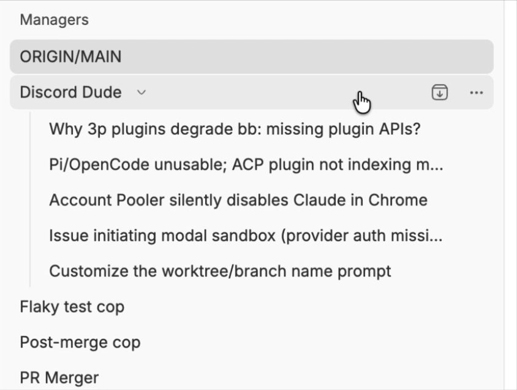
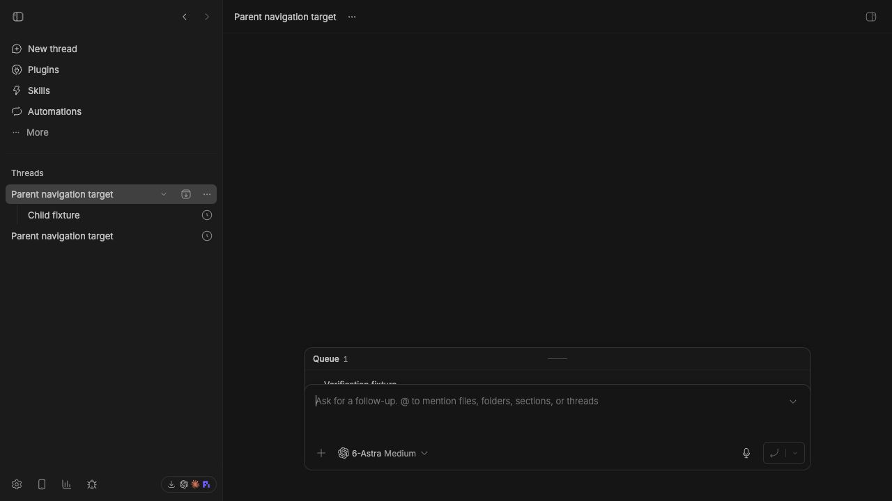

# Parent thread row navigation handoff

## Issue and solution

Clicking the highlighted blank area of a parent thread row did not navigate to the thread. The disclosure-caret separation introduced in #3989 constrained the parent row's anchor to the rendered title width, while the surrounding row continued to show hover and selected states.

The navigation wrapper now fills the available row width in both the bundled `thread-list` plugin and the core fallback implementation. The disclosure caret remains a separate button, so clicking the row opens the parent and clicking the caret only expands or collapses its children. Regression assertions cover both implementations.

## Review links

- PR: [#4077](https://github.com/get-bb/bb/pull/4077)
- Related GitHub issue: none; reported with a screen recording in BB thread `thr_uivddeyuu5`
- Live build: [BB Connect](https://ymichael--23244.getbb.app)
- CI: [running for the current PR head](https://github.com/get-bb/bb/pull/4077/checks)

## Focused verification

- `pnpm exec turbo run test --filter=@bb/app -- --run src/components/sidebar/ThreadRow.test.tsx` — 84 passed
- `pnpm exec turbo run test --filter=bb-plugin-thread-list -- --run app/rows/ThreadRow.test.tsx` — 93 passed
- `pnpm exec turbo run typecheck --filter=bb-plugin-thread-list --filter=@bb/app` — passed
- Production-style `pnpm start:worktree` browser verification — pending final PR HEAD launch
- Verification inventory — blocked by pre-existing unmapped `browser` CLI family drift

## Exact live verification steps

1. Open the live build link above.
2. Find the expanded `Parent navigation target` row with `Child fixture` nested below it.
3. Click the blank portion of the parent row between its title and disclosure caret.
4. Confirm the URL changes to the parent thread route and the parent thread header appears.
5. Click the disclosure caret.
6. Confirm `Child fixture` disappears while the parent thread URL remains unchanged.

## Screenshots

Before — the pointer lands in the highlighted row area outside the title-sized link:

After — the same row area navigates to the parent thread; the caret remains independent:

