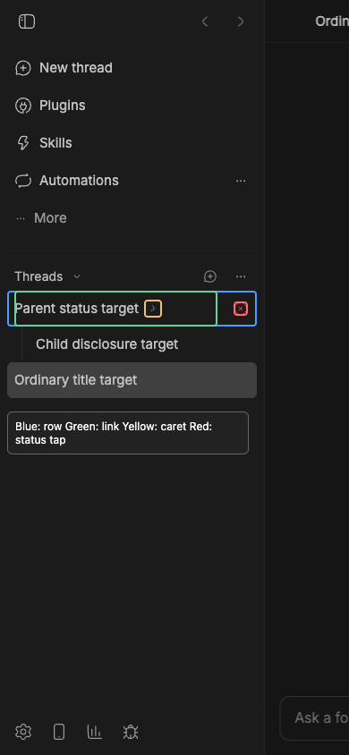

# Mobile thread-row selection handoff

## Cause and change

[PR #3989](https://github.com/get-bb/bb/pull/3989) separated the parent disclosure caret from its navigation link. [PR #4077](https://github.com/get-bb/bb/pull/4077) widened that link, but the compact row's right-side status slot remained outside it. Tapping the status reached a decorative span in the row and did nothing. [PR #4098](https://github.com/get-bb/bb/pull/4098) forwards bare-row and noninteractive trailing clicks to the existing link in both the core fallback and bundled `thread-list` plugin. Buttons and links retain their own actions. [Issue #3195](https://github.com/get-bb/bb/issues/3195) concerns the adjacent disclosure target; no issue tracks this status dead zone.

At 390 × 844, the parent link ends at x=243 while the status tap lands near x=269. Blue outlines the full row, green the link, yellow the separate caret, and red the status tap area.

## Live fixture

[Open the worktree build](https://ymichael--22227.getbb.app/projects/proj_e29xavb58p/threads/thr_w9wvmbzmav). It uses an isolated data store and project `proj_e29xavb58p` (`Mobile row QA`). The fixture has parent `thr_5k93c5ejau` (`Parent status target`), child `thr_cqnhq7fmgg` (`Child disclosure target`), and ordinary thread `thr_w9wvmbzmav` (`Ordinary title target`).

1. At a compact touch viewport, open the sidebar. Tap the parent's right-side status icon. The URL should change to `/projects/proj_e29xavb58p/threads/thr_5k93c5ejau` on one tap. Opening it marks the status read, so reload the fixture after resetting its unread state if repeating this step.
2. Return to the ordinary thread URL above, open the sidebar, and tap its title. It should stay on that ordinary thread route; repeat from the parent route to observe navigation back to it.
3. From the ordinary route, open the sidebar and tap the parent's disclosure caret. The child should hide or show while the route stays on the ordinary thread.
4. Drag a row slightly and release. The drag release must not navigate. A later deliberate title or status tap should navigate.

## Verification

- Core `ThreadRow.test.tsx`: 86 passed; plugin `ThreadRow.test.tsx`: 95 passed. Both include status-area forwarding and drag-click suppression assertions.
- Turbo typecheck for `@bb/app` and `bb-plugin-thread-list`: passed.
- Live `pnpm start:worktree` at 390 × 844: right-side status tap, title tap, disclosure caret, and drag release behaved as above. The app and daemon health endpoints responded.
- The verification inventory check is blocked by the pre-existing unmapped `browser` CLI family. It did not prevent focused tests or live interaction checks.
- Final CI: [PR #4098 checks](https://github.com/get-bb/bb/pull/4098/checks). Required checks passed on the final PR HEAD.
