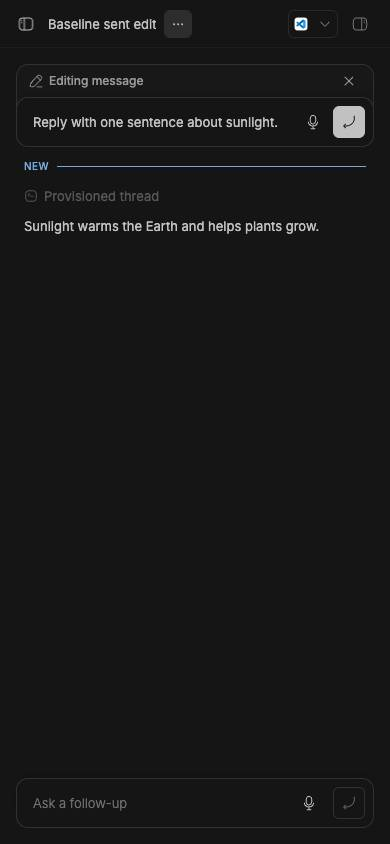
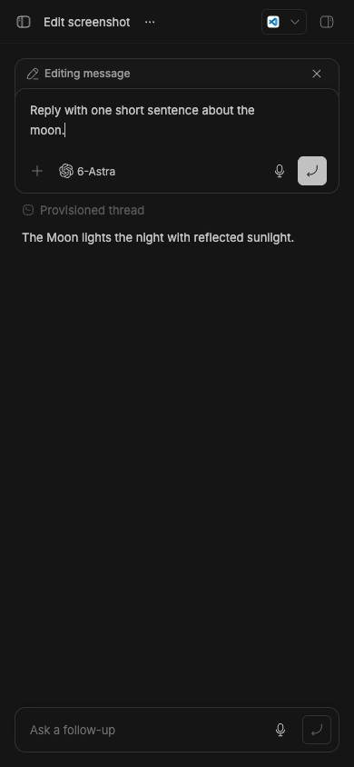
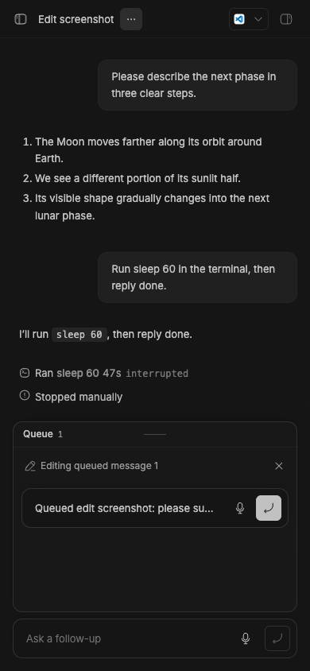
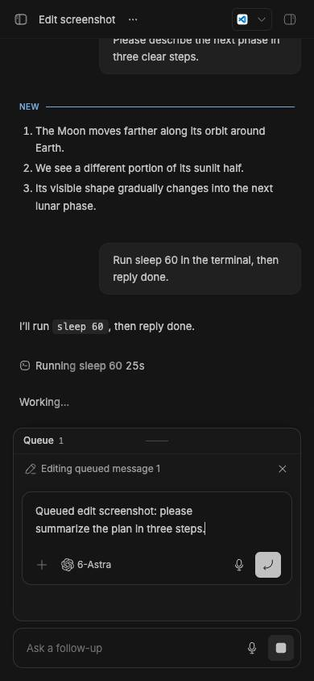

# Message editing layout handoff

## Issue and change

On a narrow viewport, the shared follow-up composer collapses to a single row when focus leaves it. Sent-message and queued-message edits inherited that behavior, hiding most of the draft and the editing controls. There is no dedicated issue for this layout bug. Related queued-editing issues are [#1864](https://github.com/get-bb/bb/issues/1864) and [#2401](https://github.com/get-bb/bb/issues/2401); this PR does not resolve either one.

`FollowUpPromptBox` now accepts `preferExpanded`. The edit composers opt in, and the same derived expanded state controls the compact prop, mobile CSS attribute, and height animation. This covers sent and queued edits in the main thread and queued edits in embedded chat. The ordinary follow-up composer retains its compact mobile default.

PR: [#4097](https://github.com/get-bb/bb/pull/4097)

Live build: [BB Connect](https://ymichael--23784.getbb.app)

## Screenshots

These synthetic-data captures use a 390 × 844 viewport. The before state uses the previous edit-composer default after focus leaves the editor; the after state uses the fix. The DOM checks read `compact: true, expanded: false` before and `compact: false, expanded: true` after.

| Edit | Before: compact | After: expanded |
| --- | --- | --- |
| Sent message |  |  |
| Queued message |  |  |

## Focused verification

- `pnpm exec turbo run test typecheck --filter=@bb/app`: passed (5,077 tests; 6 skipped).
- `pnpm exec turbo run lint --filter=@bb/app`: passed (0 errors; 195 existing warnings).
- Source-browser checks: open a sent edit and a queued edit at 390 px, then move focus to the thread actions menu and close it. Both edited drafts must remain expanded. Before the fix, both collapse to one row.
- Embedded chat uses the same `FollowUpPromptBox` opt-in at `EmbeddedThreadChat.tsx`; the app test suite includes its existing editing tests. A separate embedded-chat screenshot was not captured.
- Final CI: [PR checks](https://github.com/get-bb/bb/pull/4097/checks).

## Live fixture and reset

This checkout's production-style dev instance uses app port `15784`, server port `23784`, and data directory `/Users/michael/.bb-dev/bb-plugins-environment-git-worktree-host-data-worktrees-thr_fcymk26x7e-1-bb-6daa89303b82`. Run `pnpm start:worktree` from this checkout. The synthetic project is `proj_47ikihvqyh` on the local QA root `/tmp/bb-edit-message-screenshot-fixture`.

1. Open the sent fixture at `/projects/proj_47ikihvqyh/threads/thr_sb528p4d5r`. Open **Edit message** on the initial user prompt. Move focus to **Thread actions**, dismiss the menu, and verify the edit stays expanded.
2. Open the queued fixture at `/projects/proj_47ikihvqyh/threads/thr_c27jxu7khi`. Open **Queued message 1 actions**, then **Edit queued message 1**. Move focus to **Thread actions**, dismiss the menu, and verify the edit stays expanded. The queued item is `qmsg_krgctdi8ev`.
3. At 390 px, inspect the editing frame: `[data-follow-up-composer-expanded]` must be present and `[data-promptbox-compact]` absent. Do this after focus leaves the editor as well as immediately after opening it.

To reset only this synthetic fixture, run this while the local QA app is serving, then stop the app:

```sh
env -u BB_THREAD_ID -u BB_ENVIRONMENT_ID -u BB_THREAD_STORAGE -u BB_PROJECT_ID -u BB_CLI -u BB_CLI_REEXEC BB_SERVER_URL=http://127.0.0.1:23784 node apps/cli/dist/index.js project delete proj_47ikihvqyh --yes --json
rm -r /tmp/bb-edit-message-screenshot-fixture
```

For a fresh fixture, create a new local project with `bb project create --name 'Editor screenshot QA' --root <empty-directory> --machine <local-host-id> --json`, spawn a Codex thread with a short prompt, wait for it to become idle, and queue a second prompt with `bb thread tell <thread-id> --mode queue --send-at 7d 'Queued edit screenshot' --json`. Record the returned IDs before opening the two edit actions. Use the source CLI against the checkout's server URL, with inherited production thread context cleared as in the reset command.
