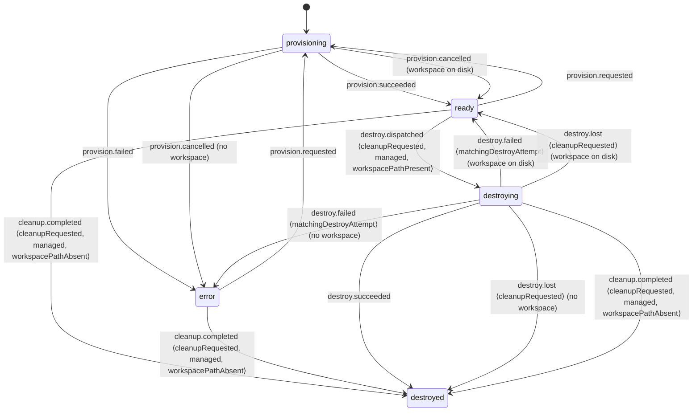

<!-- GENERATED FILE — do not edit by hand.
     Source: packages/domain/src/thread-lifecycle.ts and
     packages/domain/src/environment-lifecycle.ts.
     Regenerate: pnpm --filter @bb/domain exec vitest run test/lifecycle-diagram.test.ts -u -->

# Lifecycle state machines

Rendered from `THREAD_LIFECYCLE` and `ENVIRONMENT_LIFECYCLE` — the
transition tables consumed by the CAS single-writers in `@bb/db`
(`applyThreadLifecycleEvent` / `applyEnvironmentLifecycleEvent`).

How to read these: an edge label is `event ⟨supersession predicates⟩`;
the predicates are checked against the loaded row inside the writer's
transaction, and a failing predicate makes the event a logged no-op.
An **absent** edge means the event is a no-op in that status (the
writer returns `illegal-transition`). The tables are behavior-neutral
with the pre-table code; questionable-but-preserved transitions are
annotated `// observed:` in the source files, and the per-call-site
inventory lives in the headers of
`packages/domain/test/thread-lifecycle.test.ts` and
`packages/domain/test/environment-lifecycle.test.ts`.

## Thread

```mermaid
stateDiagram-v2
    [*] --> created
    created --> active : turn.started
    created --> idle : turn.completed
    created --> error : turn.failed
    created --> idle : turn.interrupted
    created --> error : runtime.exited
    created --> active : start.succeeded ⟨notArchived, notDeleted⟩
    created --> error : command.failed ⟨notDeleted⟩
    created --> error : provision.failed ⟨notDeleted⟩
    created --> error : workspace.lost ⟨notArchived, notDeleted⟩
    created --> stopping : stop.requested
    created --> error : session.lost
    created --> active : runtime.observed-active ⟨notDeleted⟩
    provisioning --> active : turn.started
    provisioning --> idle : turn.completed
    provisioning --> error : turn.failed
    provisioning --> idle : turn.interrupted
    provisioning --> error : runtime.exited
    provisioning --> active : start.succeeded ⟨notArchived, notDeleted⟩
    provisioning --> error : command.failed ⟨notDeleted⟩
    provisioning --> error : provision.failed ⟨notDeleted⟩
    provisioning --> error : workspace.lost ⟨notArchived, notDeleted⟩
    provisioning --> stopping : stop.requested
    provisioning --> error : session.lost
    provisioning --> active : runtime.observed-active ⟨notDeleted⟩
    idle --> active : turn.started
    idle --> error : turn.failed
    idle --> error : runtime.exited
    idle --> active : turn.dispatched
    idle --> provisioning : reprovision.started
    idle --> active : start.succeeded ⟨notArchived, notDeleted⟩
    idle --> error : command.failed ⟨notDeleted⟩
    idle --> error : provision.failed ⟨notDeleted⟩
    idle --> error : workspace.lost ⟨notArchived, notDeleted⟩
    idle --> active : runtime.observed-active ⟨notDeleted⟩
    active --> idle : turn.completed
    active --> error : turn.failed
    active --> idle : turn.interrupted
    active --> error : runtime.exited
    active --> error : command.failed ⟨notDeleted⟩
    active --> error : provision.failed ⟨notDeleted⟩
    active --> error : workspace.lost ⟨notArchived, notDeleted⟩
    active --> stopping : stop.requested
    active --> error : session.lost
    stopping --> idle : stop.completed
    stopping --> idle : turn.completed
    stopping --> idle : turn.interrupted
    stopping --> error : turn.failed
    stopping --> error : runtime.exited
    stopping --> error : provision.failed ⟨notDeleted⟩
    stopping --> error : workspace.lost ⟨notArchived, notDeleted⟩
    stopping --> error : command.failed ⟨notDeleted⟩
    stopping --> idle : session.lost
    error --> active : turn.started
    error --> idle : turn.completed
    error --> idle : turn.interrupted
    error --> active : turn.dispatched
    error --> provisioning : reprovision.started
    error --> active : start.succeeded ⟨notArchived, notDeleted⟩
    error --> active : runtime.observed-active ⟨notDeleted⟩
```

## Environment

