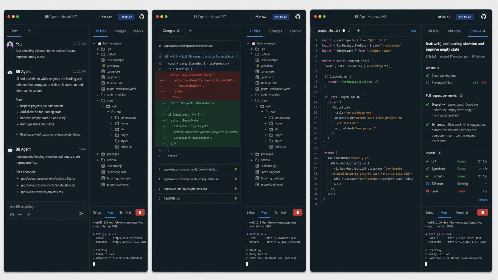
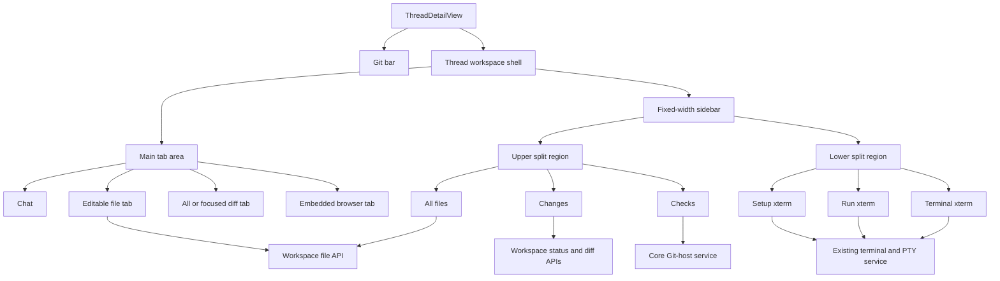
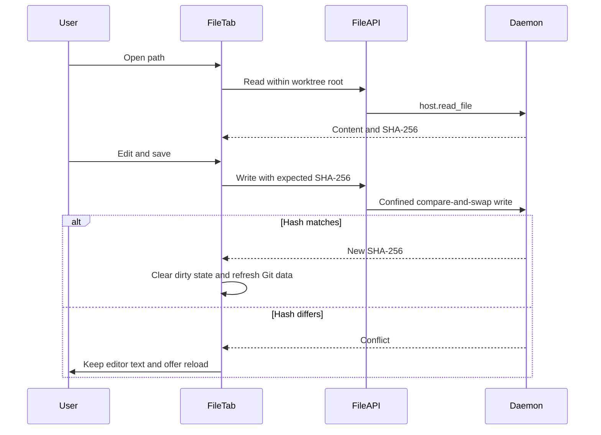
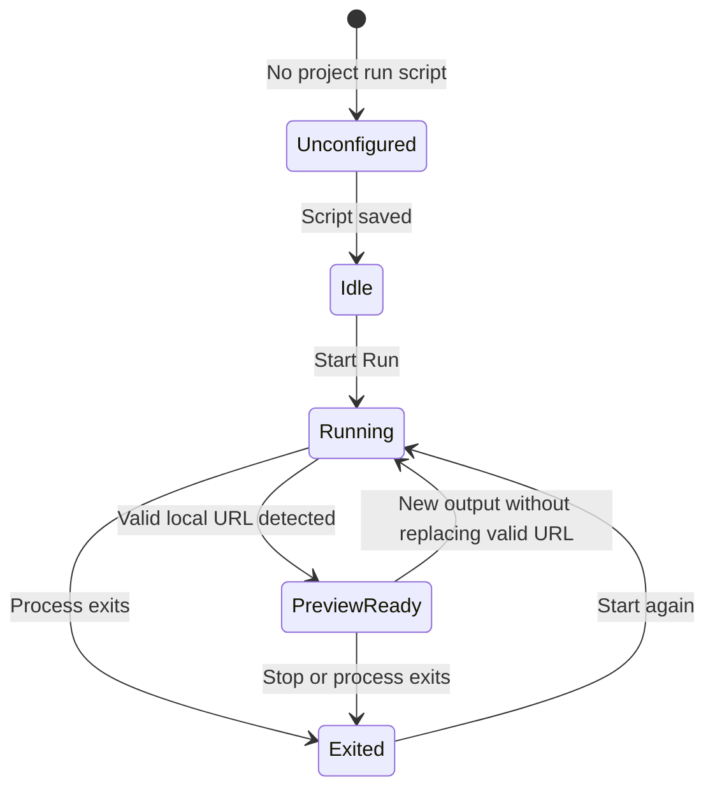
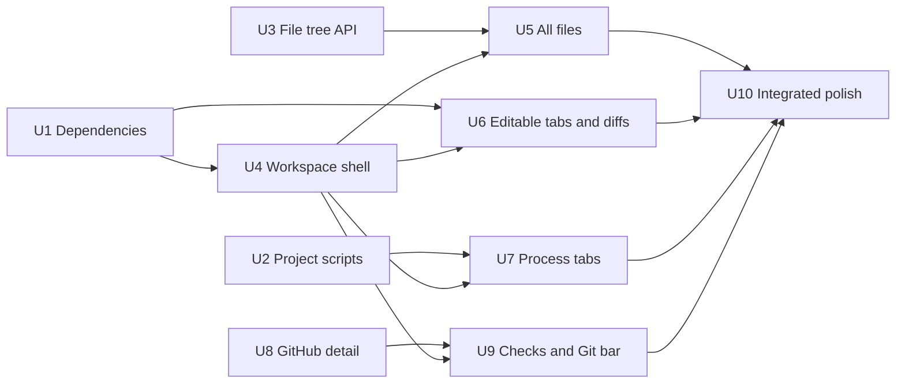

# Agent Thread Workspace Sidebar - Plan

## Goal Capsule

- **Objective:** Turn each agent thread into a local development workspace with a tabbed main area and a compact, split sidebar for files, changes, checks, setup, run, and terminal work.
- **Authority:** The Product Contract owns user-visible behaviour. The Planning Contract owns implementation mechanisms. Existing BB security and workspace-confinement rules remain mandatory.
- **Execution profile:** Implement the work as staged vertical slices across the app, server, host daemon, database, and Git host integration.
- **Stop conditions:** Stop if Pierre Diffs cannot provide stable React 19 editing, if literal workspace traversal cannot remain confined to the worktree, or if automatic setup cannot preserve the current provisioning rollback guarantee.
- **Tail ownership:** The implementation owner runs the Verification Contract, removes abandoned code, updates the mock-up only if the final structure changes, and prepares the branch for review.

The mock-up fixes the region boundaries. The terminal tabs and terminal content belong only to the lower half of the sidebar. They must not extend under the main content area.

---

## Product Contract

### Summary

The thread view will become a focused local development workspace. The main area will keep the conversation and open file, diff, and browser tabs. A fixed-width sidebar will combine repository context in its upper half with three worktree terminals in its lower half.

### Problem Frame

BB already has file previews, Git diffs, terminals, an embedded browser, worktree provisioning, and GitHub pull-request summaries. These features are separated across the current secondary panel and supporting views. The user must move between tools instead of seeing the worktree as one coherent workspace.

The new workspace must support direct file tweaks without becoming a full IDE. It must also make project setup and the development server predictable for each worktree.

### Actors

- A1. A developer works with an agent in a BB thread and inspects or adjusts the same worktree.
- A2. A project maintainer configures the setup and run scripts for all new worktrees in a project.
- A3. BB executes workspace and Git operations through the existing local host daemon and server boundaries.

### Requirements

**Thread workspace and navigation**

- R1. An agent thread must show a compact Git bar above the thread workspace with the current commit hash, pull-request number when one exists, and a GitHub link that opens in BB's embedded browser.
- R2. The main content area must have a persistent Chat tab and closable tabs for files, all changes, individual diffs, and existing browser content.
- R3. The right sidebar must keep its upper and lower regions inside one fixed-width column. No sidebar terminal or terminal tab may extend under the main content area.
- R4. The sidebar split must be resizable, must start at a 50/50 height division, and must preserve useful minimum heights for both regions.

**Repository browser and editing**

- R5. The All files tab must expose every directory entry inside the worktree, including dotfiles, `.git`, `node_modules`, generated output, and cache directories.
- R6. All files must load directory contents on demand so the first render does not scan the complete worktree. Loaded directories must refresh after relevant workspace changes or an explicit user refresh.
- R7. A file selected from All files must open in a main-area tab that uses Pierre Diffs edit mode for supported text files.
- R8. A user must be able to save a small text edit with an explicit Save action or the platform save shortcut. BB must detect and report an external-write conflict before it overwrites newer content.
- R9. Binary files, text files above 2 MiB, unreadable files, and unsafe paths must remain visible in the tree but must open an informative read-only or error state. Supported text files above 2 MiB may use the existing read-only preview up to the host read limit.

**Changes and checks**

- R10. The Changes tab must list only changed worktree paths. Added and untracked files use a green indicator, modified, renamed, and copied files use yellow, and deleted files use red.
- R11. Selecting the Changes heading must open one main-area tab that shows all current diffs. Selecting a changed file must open its focused diff or editable file tab.
- R12. The Checks tab must show the current commit subject as its heading, the worktree Git status, pull-request comments, and individual CI/CD checks.
- R13. A pull-request comment must use one compact first line in the form `[avatar] Author  short comment`. Only overflow text may continue on an indented second line.
- R14. GitHub-backed UI must show `Offline` when GitHub is unavailable or unauthorised. It must distinguish that state from a repository that has no pull request.

**Worktree processes**

- R15. The lower sidebar must provide exactly three tabs named Setup, Run, and Terminal. The selected terminal viewport must remain fully constrained to the lower sidebar region.
- R16. Each project must support its own optional setup script and run script. Project settings and the core API must expose both values.
- R17. BB must run the effective setup script once during each new managed-worktree provisioning flow. The configured project script takes precedence, and `.bb-env-setup.sh` remains the fallback.
- R18. The Setup tab must show the initial setup result and must let the user rerun the setup script in the current worktree.
- R19. The Run tab must start the configured run script only after a user action. It must use the same command-terminal implementation as Setup.
- R20. The Run tab bar must show a Stop action while the run process is active. It must show an Open preview action after BB detects a valid local HTTP or HTTPS URL in the run output.
- R21. Open preview must open the detected worktree development server in BB's embedded browser. Stop must end the associated run terminal and its process.
- R22. The Terminal tab must provide a normal interactive xterm shell with its initial working directory set to the current worktree.
- R23. Setup, Run, and Terminal sessions must reattach to the correct environment after a view remount or application restart when their backing process still exists.

**Quality and parity**

- R24. The desktop layout must provide the complete workspace. Narrow layouts must keep the existing drawer behaviour and must not render an unusable split sidebar.
- R25. Tabs, file rows, change indicators, checks, terminal controls, dirty states, and offline states must have keyboard and screen-reader labels that do not depend on colour alone.
- R26. Core server contracts and SDK areas must expose project script configuration, workspace file access, terminal lifecycle actions, and Git/check data so the UI is not the only client that can perform or inspect these operations.

### Key Flows

- F1. Inspect and edit a file
  - **Trigger:** A1 expands a directory in All files and selects a text file.
  - **Steps:** BB loads only the requested directory, opens a main-area file tab, creates a Pierre editor, tracks the dirty state, and saves with the file's original content hash.
  - **Outcome:** The file is saved inside the worktree, or BB shows a clear conflict without overwriting external changes.
  - **Covered by:** R2, R5-R9, R25

- F2. Review current changes
  - **Trigger:** A1 selects Changes or one changed path.
  - **Steps:** BB uses the current workspace status, maps Git states to accessible indicators, and opens either the all-diff tab or the selected file tab in the main area.
  - **Outcome:** The developer can review all changes without replacing the sidebar or the chat state.
  - **Covered by:** R2, R10-R11, R25

- F3. Start and preview the project
  - **Trigger:** A1 selects Run and starts the configured script.
  - **Steps:** BB creates or reattaches to the environment's Run terminal, watches its output for a valid local URL, and reveals Open preview when a URL is available.
  - **Outcome:** The development server remains visible in the lower sidebar and its preview opens in a main-area embedded-browser tab.
  - **Covered by:** R15-R16, R19-R23

- F4. Inspect pull-request health
  - **Trigger:** A1 selects Checks.
  - **Steps:** BB combines local workspace status with normalised pull-request comments and checks. It renders compact comment rows and an explicit Offline state for failed GitHub access.
  - **Outcome:** The developer can see local and remote review state without leaving the thread.
  - **Covered by:** R1, R12-R14

### Acceptance Examples

- AE1. **Covers R5-R6.** Given a worktree that contains `.git`, `.env`, `node_modules`, and a build cache, when the user expands each parent directory, then every direct child appears and no name-based exclusion removes it.
- AE2. **Covers R8.** Given an open file that another process changed after BB loaded it, when the user saves, then BB reports a conflict and does not overwrite the newer file.
- AE3. **Covers R10.** Given one new file, one modified file, and one deleted file, when the user opens Changes, then the rows show green, yellow, and red indicators with accessible Added, Modified, and Deleted labels.
- AE4. **Covers R13.** Given a short pull-request comment, when Checks renders it, then the avatar, author, and comment stay on one line. Given a longer comment, only the overflow continues on an indented second line.
- AE5. **Covers R14.** Given that `gh` cannot reach GitHub, when the Git bar and Checks load, then they show Offline. Given a successful lookup with no pull request, they show No pull request instead.
- AE6. **Covers R17-R18.** Given a project setup script, when BB provisions a new worktree, then it runs once. When the user later selects Rerun, BB starts a separate Setup terminal without changing the recorded initial setup result.
- AE7. **Covers R20-R21.** Given a Run terminal that prints `http://localhost:3000`, when the URL is validated, then Open preview appears and opens that URL in BB's embedded browser. When Stop is selected, the Run process ends.
- AE8. **Covers R3 and R15.** Given any upper or lower sidebar tab, when it is selected or resized, then its content remains clipped to the right sidebar and never occupies the main content width.

### Success Criteria

- A developer can inspect the complete worktree, review all changes, make and save a small text edit, run the project, and open its preview without leaving the thread workspace.
- A newly provisioned worktree runs one deterministic project setup path and retains the current rollback behaviour when initial setup fails.
- Local Git information remains useful when GitHub is offline.
- Existing browser tabs, terminal persistence, file security, and worktree confinement do not regress.

### Scope Boundaries

**Included**

- A redesign of the agent-thread workspace and its secondary panel.
- Core BB integration for repository files, project scripts, terminals, GitHub comments, and checks.
- Small UTF-8 text edits through Pierre Diffs edit mode.
- Literal worktree visibility, including normally ignored directories.

**Deferred**

- File creation, deletion, rename, drag-and-drop, and bulk operations from the tree.
- Git staging, commit creation, branch switching, merge conflict resolution, and pull-request comment writing.
- Language-server features, autocomplete, refactoring, formatting, and multi-file editing.
- Cloud execution and remote development-server tunnelling beyond BB's existing environment-aware browser path.

**Excluded**

- A replacement for xterm or the current PTY service.
- A required GitHub plugin. The feature extends BB's core Git-host path.
- Name-based exclusions from All files.

### Dependencies

- `@pierre/diffs` with its native editor export and React edit integration.
- `@pierre/trees` with mutation support for progressively adding loaded paths.
- The installed GitHub CLI for remote pull-request data.
- Existing BB host-daemon, terminal, file, browser, and provisioning services.

---

## Planning Contract

### Key Technical Decisions

- KTD1. **Use a thread workspace shell with main tabs and one fixed-width split sidebar.** (session-settled: user-directed — chosen over keeping file, diff, and terminal content in the existing wide secondary panel: the user wants a Conductor-style agent workspace.) The main region owns Chat, file, diff, and browser tabs. The sidebar owns only the upper repository tabs and lower terminal tabs. Governs R1-R4, R15, and R24.
- KTD2. **Use Pierre Diffs native editing and upgrade `@pierre/diffs` to `1.3.4`.** (session-settled: user-directed — chosen over a separate editor such as CodeMirror: the user asked for Pierre Diffs edit mode.) Use its `Editor` and `EditProvider` state, but keep persistence in BB's file API. Pierre does not write files. Limit editing to UTF-8 files of 2 MiB or less so a small-tweak feature cannot lock the renderer on a large generated file. Governs R7-R9.
- KTD3. **Keep xterm and the existing persistent PTY lifecycle.** (session-settled: user-directed — chosen over libghostty or a new terminal engine: the existing BB terminal already supplies the required local workflow.) Setup and Run are command-mode terminals. Terminal is shell mode. The only implementation distinction is purpose metadata and lifecycle controls. Governs R15 and R18-R23.
- KTD4. **List directories on demand through a new worktree-confined directory contract.** (session-settled: user-directed — chosen over hiding expensive directories: the user requires every file.) The daemon returns one directory page at a time in stable lexical order. It includes hidden names and ignored paths, reports file type and pagination state, and does not follow directory symlinks. A page cursor is eventually consistent: the client de-duplicates paths and refreshes the directory if it changes during pagination. Governs R5-R6 and R9.
- KTD5. **Use `@pierre/trees` `1.0.0-beta.6` as a progressively populated view model.** Add each loaded directory batch to one model through its mutation API. Its public React API has no directory-load callback, so the BB adapter must subscribe to the model, detect a newly expanded unresolved directory, and request its children. A collapsed directory has no loaded children until the user expands it. Debounce workspace invalidations, refresh only loaded affected directories, and provide an explicit refresh control. Governs R5-R6 and R25.
- KTD6. **Use compare-and-swap for file saves.** Retain the SHA-256 returned by `host.read_file` and pass it as `expectedSha256` to `host.write_file`. After a successful write, replace the baseline hash and invalidate workspace status and diff queries. Governs R8.
- KTD7. **Persist setup and run scripts as project workspace settings.** (session-settled: user-directed — chosen over one global environment script: projects need different setup and run commands.) Store nullable setup and run script text in a one-row-per-project table or equivalent project-owned record. An unset setup script falls back to `.bb-env-setup.sh`; an unset run script leaves Run unconfigured. Governs R16-R19 and R26.
- KTD8. **Record terminal purpose as data, not as a display-title convention.** Add an optional `setup`, `run`, or `shell` purpose to an environment terminal session. Reattach to the newest live session for the selected purpose and prevent duplicate live reserved sessions. Existing sessions without a purpose stay compatible. Governs R18-R23 and R26.
- KTD9. **Detect preview URLs only from the Run terminal and validate them through BB's existing browser URL rules.** Accept HTTP and HTTPS loopback URLs, strip terminal control sequences before parsing, prefer the latest valid URL, and clear the action when the backing Run session ends. Governs R20-R21.
- KTD10. **Extend the core Git-host projection with bounded comments and individual checks.** (session-settled: user-directed — chosen over a GitHub plugin dependency: Git status and review health are core thread context.) Preserve the current `absent` and `unavailable` outcomes. Map unavailable or unauthorised access to Offline in the UI. Governs R1 and R12-R14.
- KTD11. **Keep agent and external-client parity at the contract layer.** New project workspace settings, directory listing, terminal purpose, and Git detail fields belong in core server contracts and SDK areas. Tab selection and visual panel resizing remain local UI concerns. Governs R26.

### High-Level Technical Design

The diagrams show responsibilities and data movement. They do not prescribe component names beyond the named repository entry points.

### Data and Lifecycle Rules

- The tree API accepts an environment, a worktree-relative directory path, a cursor, and a bounded page size. The server resolves the environment once and sends its absolute root only across the trusted daemon boundary.
- The daemon uses `lstat` semantics. It returns symlinks as entries but never follows directory symlinks during traversal.
- Workspace invalidations identify the nearest loaded parent directory. The client debounces refreshes so installs and generated output do not cause one request per file.
- A file tab owns one editor instance and one saved baseline. Closing a dirty tab, changing threads, or reloading requires a discard confirmation.
- Initial setup remains part of provisioning. A failed initial setup keeps the current rollback result. A manual rerun is an ordinary command terminal and does not rewrite provisioning history.
- Reserved terminal purposes are environment-scoped because the worktree belongs to the environment. Chat thread changes must not move a terminal to another working directory.
- Pull-request comments are bounded and sorted newest first. The full body remains available through the GitHub link; the sidebar renders a short, sanitised projection.

### Sequencing

### System-Wide Impact

- **Persistent data:** Project workspace scripts and terminal purpose require additive SQLite migrations. Existing projects and terminal rows use nullable defaults.
- **Host boundary:** Literal directory listing increases the visible filesystem surface. Root confinement, symlink handling, pagination, and request cancellation are security and performance requirements.
- **GitHub boundary:** The Git-host adapter returns more remote content. The server must bound comment count and body length and must keep offline classification stable.
- **Browser layout:** Native `WebContentsView` bounds must follow the main tab region after the secondary-panel refactor. Browser content must never render behind the sidebar.
- **Cache invalidation:** File saves affect file content, workspace status, diff patches, Changes, Checks, and the Git bar.
- **Agent parity:** New mutations and read models remain available through the SDK. No critical workspace action exists only as an on-click component closure.

### Risks and Mitigations

| Risk                                                               | Impact                                         | Mitigation                                                                                                              |
| ------------------------------------------------------------------ | ---------------------------------------------- | ----------------------------------------------------------------------------------------------------------------------- |
| Literal `.git` and `node_modules` access creates very large trees. | Slow rendering or excess memory use.           | Load one directory page on expansion, virtualise visible rows, cancel stale requests, and never pre-scan the full tree. |
| A symlink points outside the worktree or creates a cycle.          | Data exposure or an infinite traversal.        | Display the symlink entry, do not follow directory symlinks, and enforce `rootPath` on read and write.                  |
| Pierre editor state and server content diverge.                    | Lost edits.                                    | Use one editor per tab, a 2 MiB editing cap, dirty-state guards, and SHA-256 compare-and-swap writes.                   |
| A dependency install emits thousands of file events.               | The tree refetches continuously.               | Debounce workspace invalidations, refresh only loaded directories, and keep manual refresh available.                   |
| Setup runs twice after a retry or server restart.                  | Non-idempotent project changes.                | Persist initial setup completion with provisioning state and separate manual reruns from the initial result.            |
| Two UI mounts create duplicate Run processes.                      | Port conflicts and confusing output.           | Use environment-scoped terminal purpose and an idempotent create-or-reattach server path.                               |
| Terminal output contains an unsafe or misleading URL.              | Wrong content opens in the embedded browser.   | Strip ANSI data, accept only validated HTTP(S) loopback URLs, and open through the existing browser routing code.       |
| GitHub is offline.                                                 | Checks appear empty and suggest false success. | Preserve `unavailable` as a first-class outcome and render Offline separately from no pull request.                     |
| The workspace refactor breaks browser and compact layouts.         | Regressed core navigation.                     | Keep BrowserTabDeck ownership in ThreadDetailView, test native view bounds, and preserve the current drawer fallback.   |

### Sources and Repository Anchors

- Pierre Diffs edit-mode product documentation: <https://diffs.com/edit>
- Pierre Diffs package and exported editor types: <https://www.npmjs.com/package/@pierre/diffs>
- Pierre Trees package: <https://www.npmjs.com/package/@pierre/trees>
- Conductor workspace concepts: <https://www.conductor.build/docs/first-workspace>
- `apps/app/src/views/thread-detail/ThreadDetailView.tsx`
- `apps/app/src/components/secondary-panel/ThreadSecondaryPanel.tsx`
- `apps/app/src/components/secondary-panel/ThreadSecondaryPanelTabContent.tsx`
- `apps/app/src/components/thread/terminal/useThreadTerminalController.ts`
- `packages/server-contract/src/api/files.ts`
- `packages/host-workspace/src/provisioning.ts`
- `packages/host-workspace/src/git-host.ts`
- `packages/domain/src/thread.ts`

---

## Implementation Units

| Unit | Outcome                            | Primary files                                                                                                                                   | Depends on     |
| ---- | ---------------------------------- | ----------------------------------------------------------------------------------------------------------------------------------------------- | -------------- |
| U1   | Compatible Pierre adapters         | `apps/app/package.json`, `apps/app/src/components/workspace/`                                                                                   | None           |
| U2   | Project setup and run settings     | `packages/db/src/schema.ts`, `packages/server-contract/src/api/projects.ts`, `apps/app/src/views/ProjectSettingsView.tsx`                       | None           |
| U3   | Literal paged directory API        | `packages/host-daemon-contract/src/commands.ts`, `apps/host-daemon/src/command-handlers/file-list.ts`, `apps/server/src/routes/environments.ts` | None           |
| U4   | Thread workspace shell             | `apps/app/src/views/thread-detail/ThreadDetailView.tsx`, `apps/app/src/components/workspace/`                                                   | U1             |
| U5   | Progressive All files tree         | `apps/app/src/components/workspace/file-tree/`                                                                                                  | U3, U4         |
| U6   | Editable files and all changes     | `apps/app/src/components/secondary-panel/FilePreview.tsx`, `apps/app/src/components/secondary-panel/git-diff/`                                  | U1, U4         |
| U7   | Setup, Run, and Terminal lifecycle | `packages/server-contract/src/api/terminals.ts`, `apps/app/src/components/workspace/terminals/`                                                 | U2, U4         |
| U8   | Detailed core pull-request data    | `packages/host-workspace/src/git-host.ts`, `packages/domain/src/thread.ts`                                                                      | None           |
| U9   | Git bar, Changes, and Checks       | `apps/app/src/components/workspace/`                                                                                                            | U4, U8         |
| U10  | Integrated hardening               | Thread workspace integration tests and documentation                                                                                            | U5, U6, U7, U9 |

### U1. Upgrade and contain the Pierre integrations

- **Goal:** Establish compatible Pierre Diffs edit mode and progressive Pierre Trees updates before the workspace refactor depends on them.
- **Requirements:** R5-R9
- **Files:** `apps/app/package.json`, `pnpm-lock.yaml`, `apps/app/src/components/secondary-panel/FilePreview.tsx`, `apps/app/src/components/secondary-panel/FilePreview.test.tsx`, and a small new Pierre adapter under `apps/app/src/components/workspace/`.
- **Approach:** Upgrade `@pierre/diffs` from `1.2.9` to `1.3.4` and `@pierre/trees` from `1.0.0-beta.3` to `1.0.0-beta.6`. Put theme, worker, editor creation, and tree mutation details behind BB-owned adapters so later library changes do not spread across the workspace components.
- **Test scenarios:** Render existing read-only previews after the upgrade. Create two editor instances for two paths and confirm their undo and dirty states remain separate. Add a new directory batch to the Trees model without rebuilding the complete tree. Expand an unresolved directory and confirm the BB adapter observes the model change and requests that directory once.
- **Verification:** Existing file-preview tests pass, and the adapters demonstrate React 19 compatibility without changing current preview behaviour.
- **Dependencies:** None.

### U2. Add project workspace scripts

- **Goal:** Persist and expose project-specific setup and run scripts.
- **Requirements:** R16-R19, R26
- **Files:** `packages/db/src/schema.ts`, `packages/db/src/data/project-workspace-settings.ts`, `packages/db/src/index.ts`, `packages/db/drizzle/0086_project_workspace_settings.sql`, `packages/db/test/migrate.test.ts`, `packages/domain/src/project.ts`, `packages/server-contract/src/api/projects.ts`, `apps/server/src/routes/projects.ts`, `apps/app/src/hooks/queries/project-queries.ts`, `apps/app/src/hooks/mutations/project-mutations.ts`, `apps/app/src/views/ProjectSettingsView.tsx`, and focused project settings tests.
- **Approach:** Add a one-row-per-project workspace settings record with nullable setup and run scripts. Return it with project settings data and add a validated update operation. Present two multiline script fields with the effective `.bb-env-setup.sh` fallback explained beside Setup.
- **Test scenarios:** Read a project with no settings. Save setup only, run only, both, and blank values. Reject scripts above the contract limit. Delete a project and confirm the settings row is removed. Confirm another project keeps independent values.
- **Verification:** Migration tests cover upgrade from the latest schema, route tests prove validation and persistence, and the settings view preserves unsaved-error feedback.
- **Dependencies:** None.

### U3. Add a literal, paged worktree directory API

- **Goal:** Return every direct worktree entry without an eager recursive scan.
- **Requirements:** R5-R6, R9, R26
- **Files:** `packages/host-daemon-contract/src/commands.ts`, `packages/host-daemon-contract/test/contract.test.ts`, `apps/host-daemon/src/command-handlers/file-list.ts`, `apps/host-daemon/src/command-handlers/file-list.test.ts`, `apps/host-daemon/src/command-dispatch.ts`, `packages/server-contract/src/api/environments.ts`, `apps/server/src/routes/environments.ts`, `apps/server/test/public/public-environments.test.ts`, and `packages/sdk/src/areas/environments.ts` or the matching files area.
- **Approach:** Add a workspace-relative, single-directory listing command and server endpoint. Include dotfiles and ignored paths. Return entry kind, relative path, display name, and pagination cursor in lexical order. Include symlinks but do not traverse them. Reuse the file API's root-confinement rules and reject absolute, parent-traversal, and escaped paths.
- **Test scenarios:** List a root with `.git`, `.env`, `node_modules`, ordinary files, and an empty directory. Page a directory that exceeds the limit without gaps or duplicates. Display an outbound symlink without traversing it. Reject `../`, absolute paths, and a directory removed between pages. Report host offline separately from an empty directory.
- **Verification:** Contract, daemon, and public route tests prove complete direct-child listing and workspace confinement.
- **Dependencies:** None.

### U4. Introduce the thread workspace shell and main tab model

- **Goal:** Establish the main-content tabs and the fixed-width, vertically split sidebar.
- **Requirements:** R1-R4, R15, R24-R25
- **Files:** `apps/app/src/views/thread-detail/ThreadDetailView.tsx`, `apps/app/src/views/thread-detail/ThreadDetailSecondaryContent.tsx`, `apps/app/src/components/secondary-panel/ThreadSecondaryPanel.tsx`, `apps/app/src/lib/fixed-panel-tabs-state.ts`, `apps/app/src/lib/fixed-panel-tabs.ts`, `apps/app/src/components/secondary-panel/SecondaryPanelTabStrip.tsx`, new components under `apps/app/src/components/workspace/`, and their focused tests and stories.
- **Approach:** Move Chat and existing file, diff, browser, plugin, and new-tab surfaces into a thread-scoped main tab model. Render a sibling fixed-width sidebar with an upper and lower region separated by a horizontal divider. Keep both terminal tab chrome and terminal content inside the lower region. Retain the current compact drawer behaviour instead of forcing the desktop split onto narrow screens.
- **Test scenarios:** Switch between Chat, file, diff, and browser tabs without losing state. Resize the sidebar split to both minimums. Confirm terminal DOM and native browser bounds never cross region boundaries. Remount the thread and restore tab selection. Enter compact mode and confirm the drawer remains operable.
- **Verification:** Workspace-shell tests cover tab ownership, clipping, resizing, persistence, and keyboard navigation. Existing browser deck and secondary-panel tests are updated without reducing coverage.
- **Dependencies:** U1.

### U5. Build All files with progressive Pierre Trees loading

- **Goal:** Show the literal worktree tree in the upper sidebar.
- **Requirements:** R5-R7, R9, R25
- **Files:** `apps/app/src/hooks/queries/environment-queries.ts`, new tree query and controller files under `apps/app/src/components/workspace/file-tree/`, `apps/app/src/components/workspace/WorkspaceUpperTabs.tsx`, and focused tests and stories.
- **Approach:** Load the root page when All files first becomes visible. Load child pages only when a directory expands and append them to the Pierre Trees model in batches. Keep per-directory loading, error, loaded, and continuation state. Do not filter names. Use stable relative paths as row identities. Debounce invalidations and refresh only loaded affected directories. Open file tabs through the main tab controller from U4.
- **Test scenarios:** Expand hidden, dependency, cache, and `.git` directories. Continue a paged directory and de-duplicate an entry after a concurrent change. Collapse during a request and ignore stale results. Coalesce a burst of workspace events into bounded directory refreshes. Use manual refresh. Retry one failed directory without resetting others. Open a supported file, a binary file, and a removed file. Navigate rows and expand directories with the keyboard.
- **Verification:** Component tests prove on-demand loading, no name exclusions, stable selection, and accessible loading and error states.
- **Dependencies:** U3, U4.

### U6. Add editable file tabs and the all-changes tab

- **Goal:** Let users inspect all diffs and make conflict-safe small text edits in the main area.
- **Requirements:** R2, R7-R11, R25
- **Files:** `apps/app/src/components/secondary-panel/FilePreview.tsx`, `apps/app/src/components/secondary-panel/ThreadSecondaryPanelTabContent.tsx`, `apps/app/src/components/secondary-panel/git-diff/DiffFilesPanel.tsx`, `apps/app/src/components/secondary-panel/GitDiffToolbar.tsx`, `apps/app/src/components/secondary-panel/useThreadFileTabs.ts`, `apps/app/src/hooks/queries/use-environment-diff-patches.ts`, `apps/app/src/hooks/mutations/environment-mutations.ts`, `apps/app/src/lib/fixed-panel-tabs-state.ts`, and focused tests.
- **Approach:** Add main tab variants for editable workspace files, focused diffs, and one all-changes view. Use Pierre `EditProvider` and a per-tab editor. Preserve the read hash, save through `sdk.files.write`, and invalidate content, workspace status, and diff queries on success. Keep dirty editor text on conflict and offer reload. Map Git status to green Added, yellow Modified, and red Deleted indicators with text labels.
- **Test scenarios:** Open the same file once from All files and Changes. Save by button and keyboard shortcut. Detect a compare-and-swap conflict. Confirm a failed write keeps the dirty buffer. Guard closing and thread navigation with unsaved text. Edit a UTF-8 file at the 2 MiB boundary. Render larger text, new, modified, renamed, deleted, binary, and removed files safely. Open all diffs and retain sidebar selection.
- **Verification:** File and diff tests prove editor isolation, safe saving, conflict handling, status mapping, query invalidation, and main-tab reuse.
- **Dependencies:** U1, U4.

### U7. Implement Setup, Run, and Terminal as reserved sidebar terminals

- **Goal:** Provide stable worktree process tabs and preview controls without changing the terminal engine.
- **Requirements:** R15-R23, R26
- **Files:** `packages/db/src/schema.ts`, `packages/db/src/data/terminal-sessions.ts`, `packages/db/drizzle/0087_terminal_session_purpose.sql`, `packages/server-contract/src/api/terminals.ts`, `apps/server/src/routes/terminals.ts`, `apps/server/src/services/terminals/terminal-session-lifecycle.ts`, `packages/sdk/src/areas/terminals.ts`, `packages/host-workspace/src/provisioning.ts`, `apps/server/src/services/environments/environment-provisioning-internal.ts`, `apps/app/src/components/thread/terminal/useThreadTerminalController.ts`, new process-tab components under `apps/app/src/components/workspace/terminals/`, and focused database, route, terminal-manager, provisioning, and component tests.
- **Approach:** Add nullable environment-terminal purpose metadata and an idempotent create-or-reattach path for reserved purposes. Resolve the effective setup script during provisioning, retain rollback on initial failure, and expose its transcript in Setup. Manual Setup and Run start command-mode PTYs in the worktree. Terminal starts shell mode. Parse sanitised Run output for validated loopback URLs, then route Open preview through the existing embedded-browser tab controller. Force-close only the reserved Run session when Stop is selected.
- **Test scenarios:** Provision with a configured setup script, fallback hook, and no setup. Fail initial setup and confirm rollback. Rerun Setup without changing provisioning history. Start Run twice from two mounts and retain one live reserved session. Reattach after remount. Detect ANSI-wrapped loopback URLs, reject non-HTTP and non-loopback URLs, open a preview, stop Run, confirm no child server process remains, and start it again. Confirm all xterm viewports stay clipped to the lower sidebar.
- **Verification:** Cross-layer tests prove once-only initial setup, purpose persistence, correct working directories, URL detection, embedded preview routing, stop behaviour, and unchanged xterm/PTTY semantics.
- **Dependencies:** U2, U4.

### U8. Extend core pull-request details

- **Goal:** Supply the Git bar and Checks tab with normalised comments, checks, and explicit availability.
- **Requirements:** R1, R12-R14, R26
- **Files:** `packages/domain/src/thread.ts`, `packages/host-workspace/src/git-host.ts`, `packages/host-daemon-contract/src/commands.ts`, `apps/host-daemon/src/command-dispatch.ts`, `packages/server-contract/src/api/environments.ts`, `apps/server/src/services/environments/pull-request.ts`, `apps/server/src/services/environments/pull-request.test.ts`, and contract and Git-host tests.
- **Approach:** Extend `ThreadPullRequest` with bounded individual checks and recent comment projections. Keep URL, author login, avatar URL, body summary, timestamp, status, conclusion, and check URL where available. Preserve `present`, `absent`, and `unavailable` outcomes from the Git-host adapter. Limit remote payload size before it crosses into the app.
- **Test scenarios:** Normalise successful, pending, failed, cancelled, and skipped checks. Return short and long comments with missing avatars. Handle no PR, missing `gh`, unauthorised `gh`, malformed JSON, rate limit, and network failure without confusing absent and unavailable.
- **Verification:** Domain, daemon-contract, Git-host, and server service tests prove the enriched shape and outcome classification.
- **Dependencies:** None.

### U9. Build the Git bar, Changes list, and Checks view

- **Goal:** Present compact local and remote repository status in the thread workspace.
- **Requirements:** R1, R10-R14, R25
- **Files:** `apps/app/src/views/thread-detail/ThreadDetailHeader.tsx`, `apps/app/src/components/workspace/GitBar.tsx`, `apps/app/src/components/workspace/changes/`, `apps/app/src/components/workspace/checks/`, `apps/app/src/hooks/queries/environment-queries.ts`, and focused tests and stories.
- **Approach:** Reuse `workspaceStatus` for commit and file states and the U8 projection for remote details. The Git bar opens a PR URL when present and otherwise an appropriate repository or commit URL when available. Render Offline only for unavailable GitHub data. Render each comment as one compact avatar, author, and first-line summary row; place only overflow on an indented second line. Keep CI rows equally compact and expose full details through links or labels.
- **Test scenarios:** Render branch, detached, unborn, clean, and dirty states. Render loading, no comments, no checks, no PR, open PR, closed PR, and Offline states. Truncate a comment on the first line and continue only overflow on an indented second line. Render each check conclusion. Open GitHub and check links in an embedded browser tab. Confirm status colours have text or icons.
- **Verification:** Component tests and stories cover every state, compact comment layout, accessibility names, and embedded-link routing.
- **Dependencies:** U4, U8.

### U10. Integrate, harden, and document the workspace

- **Goal:** Verify the complete workflow and remove obsolete secondary-panel paths.
- **Requirements:** R1-R26
- **Files:** Thread workspace integration tests and stories under `apps/app/src/`, `docs/system-overview.md`, `docs/worktrees.md`, and obsolete secondary-panel files proven unused after U4-U9.
- **Approach:** Exercise the flows as one workspace, preserve existing plugin and browser tabs, document project scripts and once-only setup, and remove dead layout paths only after parity is demonstrated. Use the mock-up as a structure reference, not as pixel-level authority.
- **Test scenarios:** Complete F1-F4 in a desktop build. Repeat them with GitHub offline. Use a worktree with large hidden and dependency directories. Restart BB with live Run and Terminal sessions. Test the compact drawer. Test keyboard-only navigation and screen-reader names. Confirm plugin tabs and native browser view bounds still work. Use the SDK to read project scripts, page the same file tree, inspect Git details, and start or stop a reserved terminal without the UI.
- **Verification:** Targeted integration tests pass, the desktop workflow matches the Product Contract, and no abandoned layout or duplicate terminal implementation remains.
- **Dependencies:** U5, U6, U7, U9.

---

## Verification Contract

| Gate                      | Command or method                                                                                                                                   | Proves                                                                                                                                  |
| ------------------------- | --------------------------------------------------------------------------------------------------------------------------------------------------- | --------------------------------------------------------------------------------------------------------------------------------------- |
| Formatting                | `corepack pnpm format:check`                                                                                                                        | Changed source and plan files follow repository formatting.                                                                             |
| Static types              | `corepack pnpm typecheck`                                                                                                                           | Cross-package contracts, React tab state, and SDK changes agree.                                                                        |
| App tests                 | `corepack pnpm --filter @bb/app test`                                                                                                               | Workspace layout, Pierre integration, tabs, accessibility, and terminal controls work.                                                  |
| Domain and contract tests | `corepack pnpm --filter @bb/domain test && corepack pnpm --filter @bb/host-daemon-contract test && corepack pnpm --filter @bb/server-contract test` | Shared schemas accept intended data and reject unsafe input.                                                                            |
| Database tests            | `corepack pnpm --filter @bb/db test`                                                                                                                | Additive migrations and project or terminal persistence work from supported prior schemas.                                              |
| Host tests                | `corepack pnpm --filter @bb/host-daemon test`                                                                                                       | Directory confinement, file operations, Git-host projection, and PTY behaviour remain correct.                                          |
| Server tests              | `corepack pnpm --filter @bb/server test`                                                                                                            | Public routes, provisioning, GitHub outcomes, and terminal lifecycle work across boundaries.                                            |
| Full regression           | `corepack pnpm test`                                                                                                                                | The monorepo remains coherent after targeted tests pass.                                                                                |
| Desktop browser QA        | Run BB in development and complete AE1-AE8 in an agent thread.                                                                                      | Native browser bounds, sidebar clipping, xterm fit, embedded GitHub or preview navigation, and real interaction quality match the plan. |
| Performance check         | Expand `.git`, `node_modules`, and a generated cache in a representative large repository while recording render responsiveness and request count.  | The app performs one bounded request per expanded page and does not eagerly scan the full worktree.                                     |

The implementation must add or update the exact focused tests named by each unit. A green full suite does not replace the acceptance examples or desktop QA.

---

## Definition of Done

- R1-R26 are implemented and traceable to passing unit tests or acceptance evidence.
- AE1-AE8 pass in a local desktop thread backed by a managed worktree.
- The final layout keeps all three terminal tabs and their content within the lower sidebar at every supported desktop size.
- All files exposes hidden, ignored, dependency, generated, and cache entries through on-demand expansion without following directory symlinks.
- File saves use compare-and-swap, protect dirty tabs, and refresh Git and diff state.
- Setup runs once during new-worktree provisioning, supports manual rerun, and preserves rollback on failure.
- Run can start, reattach, detect a valid local preview, open it inside BB, and stop its own process.
- GitHub unavailable states show Offline, while repositories with no pull request show a distinct state.
- Checks comments use one compact avatar, author, and summary line, with only overflow on an indented continuation line.
- The app uses Pierre Diffs edit mode, Pierre Trees, xterm, and the existing embedded browser; it does not introduce parallel editor, terminal, or browser implementations.
- Core contracts and SDKs preserve non-UI access to the new project, file, terminal, and Git data.
- Relevant documentation is updated, generated migration metadata is committed, and abandoned experiments or superseded secondary-panel code are removed.
- Formatting, type checks, targeted tests, the full regression suite, and desktop QA all pass.
