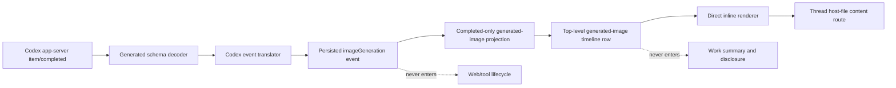

# Codex Imagegen Inline Output Remediation - Plan

## Goal Capsule

- **Objective:** Render every successfully saved Codex Imagegen result as a first-class inline assistant output while reducing the implementation's lifecycle, summary, and contract-generation complexity.
- **Authority:** The Product Contract owns visible behaviour. The Planning Contract owns projection and contract-generation mechanisms. The official Codex app-server schema remains the provider protocol source of truth.
- **Execution profile:** Refactor the uncommitted Imagegen implementation in three units: deterministic provider contracts, a completed-only output projection, and a direct inline renderer with regression coverage.
- **Stop conditions:** Stop if the minimum supported Codex version cannot validate through the generated boundary without an explicit compatibility decision, or if a generated file cannot be resolved through the thread's owning host without changing the agreed persistence model.
- **Tail ownership:** The implementation owner removes the false lifecycle branches, regenerates derived declarations, runs the full Verification Contract, and confirms the flow with two images in one real Codex turn.

---

## Product Contract

### Summary

Codex Imagegen results are assistant output, not tool activity. Each successfully saved result must appear inline in source order without requiring the user to open the “Worked for” disclosure. The implementation must retain bb's existing `imageView` work event and historical persisted events.

### Problem Frame

The current change correctly decodes Codex `imageGeneration` items and persists a path, but it projects the completed result through the web/tool lifecycle. That model invents pending and interrupted states which bb never receives, makes image output eligible for work summaries, adds auto-expansion exceptions, and spreads a single completed event across many work-only switches. Multiple adjacent images can therefore collapse into the “Worked for” summary instead of remaining visible.

Contract generation has a separate reproducibility problem. The generator invokes whichever `codex` binary is on `PATH`, although official Codex documentation states that generated app-server artifacts are exact to the Codex version which produced them. bb also supports Codex versions from `0.136.0`, so generation must be deterministic and compatibility with the supported floor must be proved.

### Actors

- A1. A user asks Codex to generate one or more images and reviews every result in the bb chat.
- A2. An agent or external client reads the same thread timeline and receives the generated-image path as structured data.
- A3. A maintainer refreshes Codex app-server contracts from a known CLI version and can see whether the supported version range remains compatible.

### Requirements

- R1. A completed Codex `imageGeneration` item with `savedPath` must produce one top-level generated-image timeline row, including when a delegated agent produced it.
- R2. A started item, a completed item without `savedPath`, and base64 output must not produce an empty, pending, or broken generated-image row.
- R3. Multiple generated images must remain separate and in provider source order relative to assistant text and ordinary work across turn summaries, pagination, and live timeline deltas.
- R4. Generated-image rows must render their preview directly. They must not enter work activity, work counts, completed-turn summaries, step bundles, disclosure state, interruption logic, or auto-expansion policy.
- R5. The UI must load a generated image through a thread-scoped generated-image content route using the source event's persisted path and environment, not client-supplied file authority or the thread's current environment. It must provide an accessible preview and lightbox and show a clear unavailable state if loading fails.
- R6. The structured timeline, SDK, and CLI text projection must expose every generated image path. The UI must not be the only usable surface.
- R7. Existing `imageView` behaviour must remain unchanged. Persisted event records require no migration; existing `imageGeneration` events replay through the new projection.
- R8. Codex contract generation must refuse an unexpected local Codex version, record the exact generation version, and prove every handled item shape across the supported structural schema eras decodes correctly.
- R9. Required schema defaults must be normalised at the runtime boundary before a value is returned as an internal `CodexThreadItem`; internal translation must not receive `undefined` where the inferred type promises an array.
- R10. The unshipped host-daemon wire change remains protocol version 79, and its regression test must state that Imagegen output is the reason for the bump.

### Key Flows

- F1. **Render generated output.** Codex completes an `imageGeneration` item with `savedPath`; the adapter validates and translates it; thread projection creates one completed-only generated-image row; the app identifies the source event and loads the server-authorised file through the thread's generated-image content route.
- F2. **Render multiple outputs.** Codex completes two image items in one turn; bb retains two distinct rows in source order, even after the turn completes and ordinary work is summarised.
- F3. **Ignore non-output lifecycle notifications.** Codex starts an image item or completes one without a saved file; bb creates no generated-image row and does not invent pending or interrupted UI.
- F4. **Regenerate contracts.** A maintainer runs the package generator; it checks `codex --version` against committed compatibility metadata before writing official TypeScript and JSON Schema closures; tests then validate minimum-version and generation-version fixtures.
- F5. **Hoist delegated output.** A nested Imagegen completion is extracted from its delegation projection and emitted once in the root timeline at its global source position; collapsing the delegation does not hide or duplicate the image.

### Acceptance Examples

- AE1. **Covers R1, R4-R5.** Given one completed item with `/host/path/a.png`, when the timeline renders, then one inline preview is visible outside “Worked for”, its source identifies the source event through the thread's generated-image content route, and selecting it opens the lightbox.
- AE2. **Covers R2.** Given an `item/started`, a completed item with only base64 content, or a completed item without `savedPath`, when each event is translated, then no generated-image row appears.
- AE3. **Covers R3-R4.** Given assistant text, two adjacent completed generated images, one command, and final assistant text, when the turn completes, then both images remain separate top-level rows in source order and only the command can enter the work summary.
- AE4. **Covers R5.** Given a saved path whose content request fails, when the preview loads, then the row shows an accessible unavailable state and the path without breaking the rest of the timeline.
- AE5. **Covers R6.** Given two generated-image rows, when a client reads the JSON timeline or CLI text timeline, then it receives or prints both paths separately.
- AE6. **Covers R7.** Given an existing `imageView` event, when the same turn is rendered, then it retains its existing work-row title, disclosure, and image body behaviour.
- AE7. **Covers R8-R9.** Given representative Codex `0.136.0` and generation-version payloads, including reasoning fields which rely on schema defaults, when the runtime decoder succeeds, then returned internal values contain explicit arrays and translate without `undefined` fields.
- AE8. **Covers R8.** Given a local Codex version which differs from committed generation metadata, when the generator starts, then it fails before changing generated files and reports the expected and actual versions.
- AE9. **Covers R1, R3-R4.** Given an Imagegen completion inside a delegation, when the root timeline renders with the delegation collapsed, then the image appears once at the root in global source order and does not also appear in `childRows`.
- AE10. **Covers R3.** Given generated images on an older page followed by a live delta, when pages merge, then stable row identities prevent duplication or reordering.
- AE11. **Covers R5.** Given an image generated while the source event belonged to host A and a thread later attached to an environment on host B, when the image loads, then the server targets host A. A source-event identity from another thread is rejected, and an offline source host shows the normal unavailable state without reading the same path from host B.

### Success Criteria

- A real turn which generates two images shows both previews inline without opening “Worked for”.
- The generated-image path remains available in the typed timeline and CLI projection.
- Imagegen-specific additions are absent from the web/tool lifecycle, work summaries, work titles, and auto-expansion code.
- `timeline-view.ts` returns below 1,000 lines after the Imagegen summary branches are removed.
- Contract generation is tied to an explicit Codex version and compatibility fixtures protect bb's supported floor.

### Scope Boundaries

**Included**

- The Codex item decoder and translator for completed `imageGeneration` output.
- A concrete top-level generated-image projection and renderer.
- Contract generator version checks, generated provenance, default normalisation, and compatibility fixtures.
- SDK/CLI parity through the existing timeline contract and text formatter.

**Excluded**

- A generic artifact/output framework for future media types.
- Reclassifying `imageView`, web search, web fetch, or ordinary tool calls.
- Copying generated files into `BB_THREAD_STORAGE` or promising survival after Codex deletes its saved file.
- A migration of existing persisted events.
- A broad split or rewrite of `ThreadTimelineRows.tsx`; this fix may extract only the generated-image renderer.

### Dependencies

- Codex app-server `generate-ts` and `generate-json-schema` output from the committed generation version.
- The existing daemon file-response primitive, thread event storage, and image lightbox.
- The existing server-contract, SDK declaration, and CLI timeline derivation paths.

### Sources

- Official Codex manual: generated app-server artifacts are specific to the Codex version which produced them, and `item/completed` is the authoritative final item state. Source pages are included in the locally cached Codex manual under “App server”.
- Official Codex image-generation guidance treats generated images as chat outputs and supports multiple images in the same conversation.
- Repository research: `TimelineConversationAttachments` is user/project attachment data and feeds project resolution plus “Add to chat”; it is not a suitable host-file output model.

---

## Planning Contract

### Key Technical Decisions

- KTD1. **Use a concrete top-level `generated-image` row.** (session-settled: user-approved — chosen over assistant attachments and `TimelineWorkRow`.) The row is a completed assistant output with `itemId` and `path`. A concrete row avoids a speculative generic artifact framework and makes work-summary exclusion structural instead of conditional. Governs R1-R7.
- KTD2. **Keep provider lifecycle handling narrow and hoist nested output.** Ignore `item/started` for Imagegen and translate only an authoritative completed item with `savedPath`. Retain source ancestry during event projection, then extract generated-image output from delegation children and emit it once at the root in global source order. Do not model pending, interruption, active cells, or completion timestamps for an event that bb only emits after completion. Governs R1-R4.
- KTD3. **Make the persisted source event the only file authority.** The row carries its source sequence and machine-readable path for clients, but the derived browser URL sends only the source-event identity. The server verifies that the event belongs to the thread and is a persisted `imageGeneration` completion, then derives both `savedPath` and `environment_id` from that record. Do not trust a client path or host ID, fall back to the thread's current host, or use `file://`. Adding durable file staging is outside this remediation. Governs R5-R7.
- KTD4. **Pin generation and prove handled-shape compatibility separately.** Store one exact schema-generation version and one minimum-supported version in committed compatibility metadata. The generator checks the former; provider health consumes the latter. Maintain a provenance-labelled fixture for every structural Codex schema era between those versions which changes a `ThreadItem` variant bb handles, and cover every field shape the adapter consumes. A contract refresh must compare handled variant shapes, add a fixture and deliberate normaliser for each new era, or raise the minimum in the same protocol-aware change. Unknown variants remain provider-unhandled instead of crashing. Governs R8-R10.
- KTD5. **Materialise schema defaults with one explicit normaliser.** Validate against the official generated schema, then explicitly normalise every official default which the internal `CodexThreadItem` type treats as required. Do not rely on Ajv `useDefaults` inside the generated union. Keep downstream translation typed and free of repeated fallback logic. Governs R9.
- KTD6. **Keep protocol version 79 for the complete unshipped change.** The Imagegen domain event alters daemon/server traffic, so version 79 remains required. The final regression test description must name Imagegen rather than the older pull-request feature. Governs R10.

### High-Level Technical Design



### Data and Lifecycle Rules

- `item/started` creates no output row.
- `item/completed` creates one output only when validation succeeds and `savedPath` is present.
- Base64 result data is not persisted or exposed in the timeline.
- Replayed persisted events follow stable source-sequence row identity; pagination and live deltas do not merge or duplicate adjacent image items.
- The row retains thread, turn, source sequence, and scope from its source event. Parent-tool ancestry is used to hoist nested output once, then is not exposed as a disclosure relationship.
- Generated-image rows do not contribute to “Worked for” duration, counts, concepts, bundles, or expansion state.
- The generated-image content route permits only supported raster MIME types and a bounded response size. It derives the path from the event, rejects HTML, SVG, MIME mismatches, and oversized data, and responds with `X-Content-Type-Options: nosniff` plus `Cache-Control: no-store`.
- A missing host, unreadable source file, rejected response, or oversized response produces a preview-unavailable state; it does not change the persisted event or retry against another host.

### System-Wide Impact

- **Contracts:** The domain event and server timeline contract remain agent-readable. Derived plugin SDK and template declarations must be regenerated after the final union shape settles.
- **Host boundary:** Protocol 79 remains the compatibility gate for the new daemon/server event. File bytes use a narrow thread-scoped generated-image route which authorises both host and path from the persisted source event.
- **CLI and SDK:** The new timeline row must be exhaustive in JSON and text projections. Each path stays independently observable.
- **UI:** The direct renderer is a small component. `ThreadTimelineRows.tsx` only dispatches to it; it does not own Imagegen expansion policy.
- **Persistence:** No schema or data migration is required. Existing events replay through the new projection.

### Sequencing

1. U1 locks down provider contract provenance and decoder semantics.
2. U2 replaces the false work lifecycle with the completed-only output contract and removes dead branches.
3. U3 adds the direct renderer, parity projections, and end-to-end regression coverage.

### Risks and Mitigations

- **Supported-version drift:** An exact generated schema can change while bb still supports an older Codex. Versioned fixtures make this visible before regeneration lands; incompatibility requires an explicit normaliser or minimum-version decision.
- **Exhaustive union growth:** A top-level row touches exhaustive switches. Limit additions to source-row identity, text formatting, row signature, and direct rendering; do not add it to work-only concepts.
- **Remote host routing:** A bare browser file path is invalid and the thread's current host can be wrong. Test source-event ownership, cross-host environment changes, and offline-host failure without fallback.
- **Nested output placement:** Leaving generated images inside delegation `childRows` violates the no-disclosure contract. Hoist them once by source identity and test both placement and deduplication.
- **Generated-file noise:** Regeneration can update unrelated reachable official types. Review generated diffs, keep only the reachable closure, and never hand-edit generated schemas.

---

## Implementation Units

### U1. Make Codex contracts deterministic and correctly defaulted

- **Goal:** Make the provider boundary reproducible and safe across bb's supported Codex range.
- **Requirements:** R8-R10
- **Dependencies:** None
- **Files:**
  - `packages/agent-runtime/scripts/generate-codex-contracts.mjs`
  - `packages/agent-runtime/src/codex/runtime-contracts.ts`
  - `packages/agent-runtime/src/codex/generated/codex-app-server/README.md`
  - `packages/agent-runtime/src/codex/generated/codex-app-server/runtime/ThreadItem.schema.ts`
  - `packages/agent-runtime/src/codex/__fixtures__/`
  - `packages/agent-runtime/src/codex/adapter.test.ts`
  - `apps/host-daemon/src/provider-cli-health.ts`
  - `packages/host-daemon-contract/test/contract.test.ts`
- **Approach:**
  1. Add committed compatibility metadata with exact `schemaGenerationVersion` and `minimumSupportedVersion`. Use one machine-readable source which both the generator and host health code can consume without duplicating values.
  2. Before creating or replacing generated output, run `codex --version`, parse the result, and fail on a mismatch. Generate into a temporary tree, reconcile the complete reachable closure only after both official commands succeed, remove stale closure files, and stamp the generation version into generated headers and the regeneration README.
  3. Keep official `generate-ts` and `generate-json-schema` as the source. Continue copying only the `ThreadItem` TypeScript closure and the `ItemCompletedNotification` JSON Schema definition closure.
  4. Explicitly normalise every official default which the internal type treats as required after validation. Assert that the returned `CodexThreadItem` matches its inferred required fields and do not enable Ajv union defaulting.
  5. Add provenance-labelled raw fixtures for Codex `0.136.0`, the committed generation version, and each intervening structural schema era which changed a handled item variant. Cover every handled variant shape and include a reasoning item with omitted defaulted arrays.
  6. Update the protocol regression test wording to name version 79 and the Codex Imagegen wire event.
- **Test scenarios:**
  - A mismatched local Codex version fails before generated files change.
  - Matching version generation stamps the expected provenance, removes an obsolete reachable-closure fixture, and is stable across two runs.
  - Minimum-version and generation-version fixtures validate and translate.
  - Fixtures for every identified handled-shape schema era validate; unknown variants become provider-unhandled without terminating the turn.
  - A reasoning item which omits defaulted fields returns explicit arrays.
  - Invalid provider data remains rejected at the boundary.
- **Verification:** Run the agent-runtime and host-daemon-contract tests from the Verification Contract. Regenerate twice with the expected Codex CLI and confirm the second run has no diff.

### U2. Replace the false Imagegen work lifecycle with completed output

- **Goal:** Make generated images structurally unable to enter work summaries or disclosure policy.
- **Requirements:** R1-R4, R7, R10
- **Dependencies:** U1
- **Files:**
  - `packages/agent-runtime/src/codex/event-translation.ts`
  - `packages/domain/src/provider-event.ts`
  - `packages/thread-view/src/build-event-projection.ts`
  - `packages/thread-view/src/event-projection-message.ts`
  - `packages/thread-view/src/event-projection-types.ts`
  - `packages/thread-view/src/timeline-message-helpers.ts`
  - `packages/thread-view/src/build-thread-timeline.ts`
  - `packages/server-contract/src/thread-timeline.ts`
  - `packages/thread-view/src/format-timeline-text.ts`
  - `packages/thread-view/src/web-activity-lifecycle.ts`
  - `packages/thread-view/src/tool-activity-web-projection.ts`
  - `packages/thread-view/src/tool-activity-cells.ts`
  - `packages/thread-view/src/tool-activity-projection.ts`
  - `packages/thread-view/src/timeline-view.ts`
  - `packages/thread-view/src/timeline-row-title.ts`
  - `packages/thread-view/test/build-thread-timeline.test.ts`
  - `packages/thread-view/test/completed-turn-grouping.test.ts`
  - `apps/app/src/components/thread/timeline/timeline-auto-expand.ts`
- **Approach:**
  1. Retain the small persisted `imageGeneration` event with item identity and saved path. Keep the adapter tests for started ignored, saved completion translated, base64 excluded, and unsaved completion ignored.
  2. Replace `EventProjectionImageGenerationMessage` lifecycle fields with a completed-only `generated-image` projection which preserves source metadata long enough to hoist nested output.
  3. Add a concrete `TimelineGeneratedImageRow` to `TimelineSourceRow`, with `kind: "generated-image"`, `itemId`, and `path`. Do not add a generic output union unless another real output type requires it.
  4. Extract generated-image projections from nested delegation children, de-duplicate them by stable source identity, and merge them into the root source sequence. Make them ungroupable before completed-turn summarisation, then map one source event to one row. Ensure they are not summary items or work concept counts.
  5. Add exhaustive CLI text formatting such as `Generated image: <path>` while JSON consumers receive the typed row unchanged.
  6. Delete all Imagegen additions from `web-activity-lifecycle.ts`, `tool-activity-web-projection.ts`, `tool-activity-cells.ts`, `tool-activity-projection.ts`, `timeline-view.ts`, `timeline-row-title.ts`, and `timeline-auto-expand.ts`. Keep the corresponding `imageView` cases.
- **Test scenarios:**
  - Two consecutive completion events create two separate top-level rows.
  - Text-image-image-work-text ordering remains stable after completed-turn grouping.
  - Nested Imagegen output appears once at the root while its delegation remains collapsed.
  - Summary-detail mode, older-page loading, and live delta merge retain stable order without duplicates.
  - Generated images never increment work counts or appear inside a work summary.
  - CLI text and structured timeline output expose each path.
  - Existing image-view fixtures retain their work-row projection.
- **Verification:** Run domain, server-contract, thread-view, CLI/SDK-related tests from the Verification Contract. Confirm `timeline-view.ts` is below 1,000 lines and has no `image-generation` case.

### U3. Render generated images directly and verify the user flow

- **Goal:** Show every generated result inline with accessible preview behaviour and no disclosure.
- **Requirements:** R1, R3-R7
- **Dependencies:** U2
- **Files:**
  - `apps/app/src/components/thread/timeline/GeneratedImageTimelineRow.tsx` (new)
  - `apps/app/src/components/thread/timeline/ThreadTimelineRows.tsx`
  - `apps/app/src/components/thread/timeline/TimelineRowDetails.tsx`
  - `apps/app/src/components/thread/timeline/timelineRowSignatures.ts`
  - `apps/app/src/components/thread/timeline/ThreadTimelineRows.actions.test.tsx`
  - `apps/app/src/test/fixtures/thread-timeline-rows.ts`
  - `apps/app/src/lib/file-content-urls.ts`
  - `packages/server-contract/src/public-api.ts`
  - `apps/server/src/routes/threads/data.ts`
  - `apps/server/test/public/public-thread-data.test.ts`
  - `packages/db/src/data/events.ts`
  - the focused event data-access test beside `packages/db/src/data/events.ts`
  - `packages/plugin-sdk/bundled-types/bb-plugin-sdk.d.ts`
  - `packages/templates/src/generated/plugin-sdk-dts.generated.ts`
- **Approach:**
  1. Add a narrow generated-image content route which sends only thread ID and source-event identity. Reuse the existing daemon file-response primitive, but use a targeted database lookup to require that the event belongs to the thread and is a saved `imageGeneration` completion, then derive its path, persisted environment, and host from stored data. Reject missing, wrong-kind, and cross-thread identities without using client path data or the current environment as a fallback. Leave the general host-file route unchanged for existing consumers such as `imageView`.
  2. Enforce supported raster MIME types, bounded bytes, `X-Content-Type-Options: nosniff`, and `Cache-Control: no-store` on this generated-image response. Test HTML, SVG, oversized, and MIME-mismatched content.
  3. Extract a focused generated-image renderer which derives its source from thread ID and source sequence, reuses the lightbox, resets load state when identity changes, and exposes an accessible unavailable state. Reserve the existing responsive image-view frame while loading, mark it busy for assistive technology, and transition to the image or unavailable panel without layout collapse.
  4. Reuse the existing ImageView responsive geometry: available width up to the established small and `sm` maxima, automatic height, and contained aspect ratio. Use a native preview button with a file-derived accessible name and keyboard activation. The shared lightbox must provide meaningful title/alternative text, Escape closure, and focus return.
  5. Dispatch the concrete row directly from `ThreadTimelineRows.tsx`, before expandable work rendering. Do not give it a disclosure, expanded state, or work-row title.
  6. Leave `TimelineRowDetails.tsx` responsible only for the existing `imageView` work body after removing Imagegen unions and labels.
  7. Add the required stable row-signature case so memoisation notices path and identity changes without introducing Imagegen expansion logic.
  8. Regenerate plugin SDK and template declarations from the final domain/server contract shape.
  9. Test the real browser flow with two outputs in one turn, including loading, lightbox, load failure, and visibility after turn completion.
- **Test scenarios:**
  - One row renders one lazy image through the generated-image route and opens the lightbox.
  - Loading reserves responsive space, exposes a busy state, and does not collapse or jump the row.
  - Two rows render two image elements without clicking “Worked for”.
  - A failed image request renders the unavailable state and path.
  - The row has no disclosure control and remains visible when ordinary work is collapsed.
  - `imageView` continues to render inside its existing expandable work row.
  - Keyboard activation opens the lightbox; Escape closes it and restores focus to the preview button.
  - A cross-host environment-change test proves the server content route selects the source event's owning host, derives the saved path, and rejects an event from another thread.
- **Verification:** Run the app, server host-file route, plugin SDK/template generation, and browser checks from the Verification Contract.

---

## Verification Contract

### Targeted automated checks

```bash
pnpm exec turbo run test --filter=@bb/agent-runtime --filter=@bb/domain --filter=@bb/db --filter=@bb/host-daemon-contract --filter=@bb/server-contract --filter=@bb/thread-view --filter=@bb/app --filter=@bb/server --filter=@bb/cli --filter=@bb/plugin-sdk --filter=@bb/templates --force
pnpm exec turbo run typecheck --filter=@bb/agent-runtime --filter=@bb/domain --filter=@bb/db --filter=@bb/host-daemon-contract --filter=@bb/server-contract --filter=@bb/thread-view --filter=@bb/app --filter=@bb/server --filter=@bb/cli --filter=@bb/plugin-sdk --filter=@bb/templates --force
```

Run the repository's existing SDK/template declaration generator after the contract settles, then verify its owning packages through Turbo. Do not edit generated declarations by hand.

### Contract generation checks

1. Run the generator with a deliberately mismatched version seam and confirm it fails before writes.
2. Run the generator with Codex `0.147.0-alpha.1.2`, or the generation version recorded when implementation begins.
3. Run it a second time and confirm no generated diff appears.
4. Inspect the official generated diff for reachable contract changes only.

### Static quality checks

```bash
git diff --check
rg -n "image-generation|imageGeneration" packages/thread-view/src apps/app/src/components/thread/timeline
wc -l packages/thread-view/src/timeline-view.ts apps/app/src/components/thread/timeline/ThreadTimelineRows.tsx
```

The search must find only the dedicated completed-output path and intentional tests. It must not find Imagegen in web activity, tool activity, work titles, work concepts, or auto-expansion policy.

### Browser and real-provider QA

1. Start the existing bb development launcher and open a Codex thread.
2. Ask Imagegen for two distinct images in one turn.
3. Confirm both images render inline in source order before opening “Worked for”.
4. Open each lightbox and confirm the correct full image appears.
5. Collapse ordinary work and confirm both images stay visible.
6. Inspect the thread through CLI JSON/text output and confirm both paths are present.
7. Reopen the known historical thread and confirm `imageView` rows and prior persisted events still render.

### Review gates

- Run the standard correctness, maintainability, project-standards, testing, and API-contract review lenses on the final diff.
- Re-run the thermo-nuclear maintainability review. It must find no false Imagegen lifecycle, summary-policy exception, or new generic artifact framework.
- Confirm the host-daemon protocol regression names version 79 and Imagegen.

---

## Definition of Done

- U1 is done when generation is version-checked and reproducible, supported-floor/current fixtures pass, and decoded defaults match internal types.
- U2 is done when generated images are concrete top-level rows and all Imagegen work-lifecycle and summary branches are deleted.
- U3 is done when one and multiple images render inline through the thread host route, lightbox and failure states work, and CLI/SDK parity is proved.
- The complete Turbo test and typecheck matrix passes.
- Protocol version 79 and its regression test are correct for the final wire event.
- Derived SDK/template declarations match the final contracts.
- `timeline-view.ts` is below 1,000 lines, and `ThreadTimelineRows.tsx` contains only the dispatch needed for the extracted generated-image renderer.
- No abandoned lifecycle code, unused dependency, dead fixture, or experimental output abstraction remains in the diff.
- Real-provider browser QA passes with two generated images in one turn.
