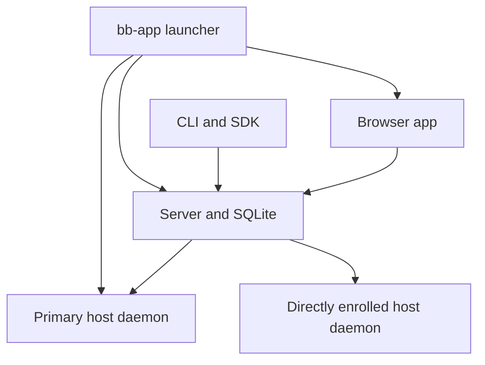
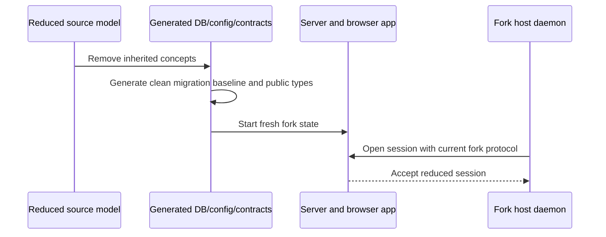

# Remove Non-Core Applications - Plan

## Goal Capsule

- **Objective:** Reduce the repository to the browser app, server, host daemon, CLI, and their local-first runtime while erasing every current-tree artifact of the desktop shell, native mobile client, hosted website, and bb Connect product.
- **Authority:** This plan and the confirmed scope govern the removal; repository instructions and protocol/versioning rules govern implementation details.
- **Execution profile:** Deep, cross-cutting removal that establishes a clean fork baseline and deliberately drops upstream bb compatibility.
- **Stop conditions:** Stop if removing a candidate breaks local browser operation, direct host enrollment, generic plugin/marketplace support, or the `bb-app` distribution path in a way not covered here.
- **Tail ownership:** The implementation owns code, tests, generated artifacts, lockfile, documentation, and the final tracked-tree trace audit. External service decommissioning remains a separate operator task.

---

## Product Contract

### Summary

The repository will retain `apps/app`, `apps/server`, `apps/host-daemon`, `apps/cli`, and `packages/bb-app` as a coherent local-first agent harness. The four removed applications and their product-specific support stacks will leave no current-tree code, configuration, dependency, workflow, test, asset, documentation, or generated artifact behind.

### Problem Frame

The repository currently carries four product surfaces that are not part of the intended custom harness: an Electron shell, an Expo client, two hosted Cloudflare applications, and the cloud tunneling/account system that connects them. Deleting only their app directories would leave live protocol fields, plugin APIs, daemon tunnel code, package dependencies, release automation, persisted state, agent instructions, and product documentation that either fail at runtime or describe capabilities that no longer exist.

The cleanup must therefore remove capabilities vertically across client, server, daemon, shared contracts, storage, release infrastructure, and documentation. This fork does not support upgrading upstream bb installations: databases, managed configuration, browser state, clients, and daemons from the removed product are disposable rather than compatibility inputs.

### Requirements

#### Retained harness

- R1. The supported product consists of the browser app, server, host daemon, CLI, and `bb-app` launcher only.
- R2. Local loopback use remains the default and must support project creation, thread execution, realtime events, files, terminals, plugins, skills, and automations.
- R3. Generic directly reachable multi-host operation remains supported through join codes, enroll keys, explicit server URLs, and selected-host execution.
- R4. Private-network browser access through trusted direct URLs or a reverse proxy remains supported without weakening bind defaults, request-origin checks, or authentication warnings.
- R5. Generic custom marketplaces and direct plugin installation remain supported, but the removed hosted marketplace has no built-in URL, schema host, author link, or curated default.

#### Product removal

- R6. Remove `apps/desktop`, `apps/mobile`, `apps/connect`, and `apps/web` in full.
- R7. Remove the end-to-end bb Connect capability, including its plugin, cloud database, clients, tunnel transport, host/server protocol fields, shared-port control plane, machine credentials, pairing flows, commands, settings, and documentation.
- R8. Remove the desktop contract and every Electron-only browser, updater, native-window, native-theme, native-menu, and desktop-only keybinding path from the retained browser app and shared packages.
- R9. Remove the mobile experiment, pairing/deep-link state, native test infrastructure, Expo patching, and mobile-specific fixtures or assets from retained packages and tooling.
- R10. Remove hosted website concerns, including account authentication, landing/blog/changelog/download surfaces, hosted schemas, hosted marketplace endpoints, analytics, and Cloudflare deploy configuration.

#### Fork baseline and completeness

- R11. Upstream bb databases, managed configuration, browser state, clients, daemons, plugins, and deployment artifacts are unsupported; the retained fork starts from its clean current schemas without compatibility shims or bridge migrations.
- R12. The server/daemon wire contract must remove Connect fields and commands and increment `HOST_DAEMON_PROTOCOL_VERSION` to identify the fork's reduced protocol; older upstream daemon payloads need not parse, migrate, self-update, or reconnect.
- R13. Root scripts, Turbo tasks, CI/release workflows, package manifests, generated modules, migration baseline, and `pnpm-lock.yaml` must describe only the retained repository.
- R14. Current-tree documentation, skills, templates, historical plans, changelog entries, screenshots, comments, examples, and issue forms must not mention or imply the removed products.
- R15. The final trace audit must distinguish removed product identifiers from legitimate generic platform terms such as “web,” “connect,” “desktop directory,” iOS-related browser behavior, or socket connection state.
- R16. Git history remains intact; removal applies to the current tree and newly produced artifacts.

### Key Flows

- F1. **Fresh local start**
  - **Trigger:** A user installs or builds the retained harness.
  - **Actors:** Browser user, `bb-app`, server, primary host daemon.
  - **Steps:** `bb-app` starts the server and daemon; the browser app loads on loopback; the user creates and runs a thread.
  - **Outcome:** Core work completes without any removed app, package, credential, or cloud endpoint.
  - **Covered by:** R1, R2, R6-R10, R13.

- F2. **Clean fork bootstrap**
  - **Trigger:** A developer installs the fork from a clean checkout or initializes fresh local state.
  - **Actors:** Migration baseline, launcher/config parser, browser app.
  - **Steps:** The retained schema and configuration initialize directly without removed columns, fields, variants, migrations, or fallback parsers.
  - **Outcome:** The fork has one supported state model and no upstream compatibility path.
  - **Covered by:** R11, R13.

- F3. **Direct secondary-machine enrollment**
  - **Trigger:** A user adds a directly reachable machine without the removed cloud service.
  - **Actors:** Browser or CLI user, server, secondary host daemon.
  - **Steps:** The server mints a join code; the daemon joins with explicit server URL and host ID; the user selects that host for work.
  - **Outcome:** Multi-host execution succeeds without Connect credentials or tunnel transport.
  - **Covered by:** R3, R4, R7.

- F4. **Custom marketplace use**
  - **Trigger:** A user adds an HTTPS, Git, or local-path marketplace.
  - **Actors:** Browser or CLI user, server plugin catalog.
  - **Steps:** The explicit source is validated, cached, listed, and used for plugin installation.
  - **Outcome:** Generic marketplace capability remains available without a hosted default.
  - **Covered by:** R5, R10.

### Acceptance Examples

- AE1. **Fresh checkout:** Given a clean checkout, when dependencies are installed and the retained runtime starts, then the browser app loads and completes an agent thread with only retained workspaces present.
- AE2. **Clean database:** Given a fresh data directory, when migrations run, then the resulting schema contains only retained fork concepts and no historical migration mentions a removed product.
- AE3. **Strict configuration:** Given a clean managed config, when `bb-app` starts, then only retained keys are accepted and no obsolete alias or ignored field exists.
- AE4. **Current daemon contract:** Given a daemon built from the same fork revision, when it opens a session, then the reduced protocol validates and no removed command or field is available.
- AE5. **Direct host:** Given a trusted directly reachable server URL, when a second machine joins with the generic join flow, then it becomes selectable and successfully executes a thread.
- AE6. **Browser-only state:** Given fresh browser storage, when the app opens file and terminal tabs, then no native-browser tab kind or desktop preference exists in the state contract.
- AE7. **Custom catalog:** Given no configured default marketplace, when a user adds a valid custom HTTPS, Git, or path source, then catalog browsing and installation work without any removed hosted URL.
- AE8. **Trace gate:** Given the completed change, when the tracked tree and generated artifacts are scanned for the defined removed-product identifiers, then no unexplained match remains outside Git history.

### Scope Boundaries

#### Included

- Current-tree source, packages, plugins, database schema, migrations, runtime contracts, configuration, tests, workflows, release tooling, generated artifacts, lockfile, docs, skills, templates, assets, and historical planning files.
- Replacement of inherited database migration history with a generated clean baseline for fresh fork state.
- Strict removal of inherited config, state, and protocol variants without upgrade adapters.
- A final self-cleanup step that removes this plan file after it has served as the execution contract, because retaining it would violate R14.

#### Outside the repository change

- Rewriting Git history.
- Supporting or migrating databases, managed config, browser state, clients, daemons, plugins, or data directories created by upstream bb.
- Deleting deployed Cloudflare Workers, D1 databases, R2 buckets, DNS records, domains, secrets, analytics data, app-store records, published npm versions, or existing GitHub release assets.
- Replacing removed cloud access with a new hosted service.
- Expanding direct-network exposure or weakening the server’s security posture.

#### Deferred to Follow-Up Work

- An operator-owned external retirement checklist for deployed resources. It should be delivered outside the repository, because a checked-in retirement document would itself preserve the removed product history.

---

## Planning Contract

### Key Technical Decisions

- KTD1. **Remove Connect vertically, not as four leaf apps.** The cleanup deletes `plugins/connect`, `packages/connect-client`, `packages/connect-db`, `packages/tunnel-client`, `packages/tunnel-contract`, the server shared-port control plane, daemon tunnel code, Connect configuration, and all related SDK/contract surfaces. Keeping any layer would leave an unsupported or unusable product path. (session-settled: user-approved — chosen over deleting only app directories: the requested end state has no current-tree trace.)
- KTD2. **Preserve direct multi-host primitives.** Join codes, enroll keys, explicit server URLs, host selection, daemon identity, and generic host credentials remain; code is removed based on ownership, not broad words such as “machine,” “credential,” or “connection.”
- KTD3. **Delete the desktop abstraction rather than retaining permanent browser fallbacks.** Remove `packages/desktop-contract`, `window.bbDesktop`, native-browser tabs, desktop update/window/theme hooks, and desktop-only keybinding metadata. The new state contract contains only retained browser features and does not parse upstream desktop state.
- KTD4. **Regenerate a clean database baseline.** Remove inherited Drizzle migrations and snapshots, then generate a fresh baseline from the reduced schema. Do not add a drop-column bridge or preserve migration-runner branches for upstream databases. (session-settled: user-directed — chosen over seamless upgrades: this fork does not care about backwards compatibility with old bb state.)
- KTD5. **Bump the daemon protocol in the same unit as wire removal.** Increment the current protocol value when the reduced wire shape lands and update its exact-current assertion. The bump identifies the fork contract; it does not promise that an older upstream daemon can update or reconnect.
- KTD6. **Keep `bb-app`; make application release tooling single-artifact.** `packages/bb-app`, its tarball smoke, npm publication, server/daemon supervision, and package update path remain. Desktop version lockstep, Electron packaging, signing, feeds, and release channels disappear.
- KTD7. **Keep marketplace mechanics but remove the first-party hosted default.** Configuration represents “no default marketplace” explicitly while preserving custom HTTPS, Git, and path sources, catalog validation, and bundled plugins.
- KTD8. **Treat documentation and generated agent guidance as feature-bearing code.** Builtin skills, generated guides, templates, CLI help, SDK/public types, examples, changelog, historical plans, and screenshots are cleaned in the same change and covered by static trace gates.
- KTD9. **Use a bounded forbidden-trace manifest.** The final audit targets product identifiers, package names, paths, URLs, protocol fields, workflow/task names, and known feature symbols. Generic platform vocabulary remains where semantically correct.
- KTD10. **The plan is transient.** Keep this file throughout execution and review, then remove it in the final trace unit after all requirements and verification gates have been satisfied.
- KTD11. **Keep the plugin SDK release path independent.** Removing experimental shared-port members is a breaking fork API change, so regenerate bundled declarations, bump the SDK package as required by the fork's release policy, update plugin scaffolds, and retain its build/test/publish path. `bb-app` becoming the sole packaged application does not make the SDK an internal artifact.

### High-Level Technical Design

#### Target runtime topology

The removed cloud gate, account site, native clients, Electron shell, tunnel transport, and shared-port control plane do not have replacement nodes. Remote operation uses an operator-provided trusted network path into the existing server.

#### Clean-baseline sequence

### Sequencing

1. Honor the fork policy already recorded in `AGENTS.md` and remove Connect wire/API behavior as one vertical protocol change.
2. Preserve direct multi-host behavior and remove desktop/mobile-only behavior from retained modules.
3. Delete app/package/plugin trees and specialized automation.
4. Remove hosted defaults and regenerate the database, config, browser-state, SDK, and dependency baselines from the reduced model.
5. Rewrite retained distribution and discoverability surfaces.
6. Run full verification and the final trace audit; remove this plan only at the tail.

Implementation-unit dependency order is `U2 -> U3/U4 -> U5 -> U6 -> U1 -> U7 -> U8`; U-IDs remain stable even though U1 now runs after structural removal. Behavior deletion is owned by U2/U3/U4/U6; U1 revisits shared config, launcher, and state paths only to regenerate their final strict baselines.

### System-Wide Impact

- **Data:** The fork ships a newly generated migration baseline and does not open upstream bb databases or persisted state.
- **Wire protocol:** Server and daemon session payloads, daemon messages, and command registries shrink and require a protocol version bump.
- **Public plugin API:** Shared-port/tunnel members are removed from `@get-bb/plugin-sdk`, its fake host, generated types, tests, and authoring guidance.
- **Agent parity:** The CLI, SDK, builtin skill, and generated guides continue to expose local and direct multi-host work; deleted capabilities disappear from every agent-facing surface.
- **Operations:** npm `bb-app` becomes the only first-party packaged distribution path. Cloud and native release workflows disappear from the repository.
- **Security:** Loopback remains the default. Existing trusted-network warnings and origin protections remain authoritative.

### Risks and Mitigations

- **Accidental compatibility residue:** A drop migration, stale parser branch, alias, or fixture would preserve the removed product in the current tree. Generate fresh baselines and reject upstream state rather than adapting it.
- **Unsupported state confusion:** Existing upstream bb data directories will not open. State this fork boundary in `AGENTS.md` and retained setup documentation without adding product-specific migration instructions.
- **Protocol drift:** Server and daemon built from different fork revisions may be incompatible. Keep the mandatory version bump and exact-current contract tests, but do not add upstream update adapters.
- **Over-deletion of multi-host support:** Connect-specific credentials and generic daemon enrollment coexist in host code. Prove direct secondary-host execution before declaring removal complete.
- **Zombie SDK surface:** Removing the plugin without removing `declareSharedPorts` and tunnel identity APIs leaves public types with no backend. Change SDK, server runtime, fake host, generated declarations, and docs atomically.
- **Marketplace regression:** Removing the hosted default can accidentally remove all marketplace support. Keep explicit-source tests for HTTPS, Git, and path catalogs.
- **False trace failures:** Generic terms such as “web,” “connect,” “mobile layout,” or platform test fixtures may be valid. Require each final match to map to a removed product identifier or named symbol.
- **Plugin ecosystem break:** Removing public experimental SDK members changes third-party plugin types. Regenerate declarations and scaffolds, preserve the SDK release path, and verify representative plugins against the new fork SDK.
- **Unreviewable change size:** The removal deletes roughly 197,000 lines before retained-code edits. Use dependency-ordered commits or stacked PRs that remain buildable, but finish on one branch before claiming the trace gate.

### Sources and Research

- `docs/system-overview.md` defines the retained server/daemon/app/CLI boundary.
- `AGENTS.md` requires protocol version bumps for server/daemon wire changes, Turbo for builds/typechecks, generated Drizzle migrations, and CLI/SDK parity.
- `packages/host-daemon-contract/src/session.ts` and `packages/host-daemon-contract/src/commands.ts` show Connect data on the daemon wire.
- `apps/server/src/ws/host-shared-ports.ts`, `apps/server/src/services/plugins/plugin-runtime.ts`, and `packages/plugin-sdk/src/backend-contract.ts` show the cross-layer shared-port API.
- `apps/cli/src/commands/machine.ts`, `packages/sdk/src/areas/hosts.ts`, and `packages/bb-app/src/launcher.ts` establish the direct multi-host path to preserve.
- No `CONCEPTS.md` or `docs/solutions/` institutional-learning corpus exists in this repository.
- External research was skipped because this is a repository-defined removal with authoritative local contracts and no unsettled external technology choice.

---

## Implementation Units

### U1. Regenerate clean persistence and state baselines

- **Goal:** Replace inherited database, configuration, experiment, and browser-state history with strict schemas for the supported fork only.
- **Requirements:** R11, R13; covers F2 and AE2, AE3, AE6.
- **Dependencies:** U2, U4, U6.
- **Files:**
  - `packages/db/src/schema.ts`
  - `packages/db/src/data/hosts.ts`
  - `packages/db/src/migrate.ts`
  - `packages/db/drizzle/`
  - `packages/db/test/migrate.test.ts`
  - `packages/db/test/data/hosts.test.ts`
  - `packages/config/src/bb-app-managed-config.ts`
  - `packages/config/src/host-daemon-entrypoint.ts`
  - `packages/config/test/`
  - `packages/bb-app/src/launcher.ts`
  - `packages/bb-app/test/index.test.ts`
  - `apps/app/src/lib/fixed-panel-tabs-state.ts`
  - `apps/app/src/lib/fixed-panel-tabs-state.test.ts`
  - `packages/domain/src/experiments.ts`
  - `apps/server/test/system/experiments.test.ts`
- **Approach:**
  1. Remove inherited Drizzle SQL, journals, snapshots, and migration-runner compatibility branches after the reduced schema is final.
  2. Generate one clean baseline with Drizzle; never hand-edit snapshot JSON or add a bridge migration for upstream databases.
  3. Remove obsolete managed-config and host-daemon entrypoint fields from strict schemas and launcher wiring with no aliases or normalization pass.
  4. Remove `mobileApp` from the experiment contract and fixtures without accepting stale serialized input.
  5. Remove native-browser tab variants from fixed-panel state while retaining clean file and terminal state behavior.
- **Execution note:** This unit intentionally breaks upstream data directories. Test only clean initialization and current fork state; do not add upgrade fixtures.
- **Patterns to follow:** Drizzle generation through `packages/db` tasks; strict boundary schemas in `packages/config`; retained fixed-panel file/terminal state.
- **Test scenarios:**
  - Covers AE2. Initialize an empty database from the new baseline and assert the resulting schema contains only retained fork tables and columns.
  - Verify migration SQL, journals, snapshots, and `packages/db/src/migrate.ts` contain no removed identifier or compatibility branch.
  - Covers AE3. Parse a clean managed config and reject unknown removed keys rather than ignoring or rewriting them.
  - Verify the experiment schema exposes only retained keys.
  - Covers AE6. Create, serialize, and parse file and terminal tabs with no browser tab variant in the type or runtime schema.
- **Verification:** Fresh database, config, experiment, and browser-state tests pass, and the trace manifest is clean across their generated baselines.

### U2. Remove the Connect protocol and shared-port control plane

- **Goal:** Delete all server/daemon/SDK wire behavior owned by Connect while preserving generic daemon enrollment and execution.
- **Requirements:** R3, R7, R12; covers F3 and AE4, AE5.
- **Dependencies:** None.
- **Files:**
  - `packages/host-daemon-contract/src/commands.ts`
  - `packages/host-daemon-contract/src/session.ts`
  - `packages/host-daemon-contract/src/protocol.ts`
  - `packages/host-daemon-contract/test/contract.test.ts`
  - `apps/server/src/internal/hosts.ts`
  - `apps/server/src/internal/session.ts`
  - `apps/server/src/internal/session-owner-side-effects.ts`
  - `apps/server/src/routes/hosts.ts`
  - `apps/server/src/ws/daemon-protocol.ts`
  - `apps/server/src/ws/host-shared-ports.ts`
  - `apps/server/src/server.ts`
  - `apps/server/src/start-server.ts`
  - `apps/server/src/types.ts`
  - `apps/server/package.json`
  - `apps/server/test/helpers/test-app.ts`
  - `apps/server/test/helpers/seed.ts`
  - `apps/server/test/app/host-shared-ports.test.ts`
  - `apps/server/test/internal/internal-session-protocol-version.test.ts`
  - `apps/host-daemon/src/connect-tunnel/`
  - `apps/host-daemon/src/app.ts`
  - `apps/host-daemon/src/index.ts`
  - `apps/host-daemon/src/start-host-daemon.ts`
  - `apps/host-daemon/src/server-client.ts`
  - `apps/host-daemon/src/server-connection.ts`
  - `apps/host-daemon/src/server-connection-support.ts`
  - `apps/host-daemon/src/enroll.ts`
  - `apps/host-daemon/src/protocol-self-update.ts`
  - `apps/host-daemon/src/protocol-self-update.test.ts`
  - `apps/host-daemon/package.json`
  - `packages/plugin-sdk/src/backend-contract.ts`
  - `packages/plugin-sdk/src/testing/fake-plugin-host.ts`
  - `packages/plugin-sdk/src/testing/__tests__/fake-plugin-host.test.ts`
  - `packages/plugin-sdk/src/__tests__/public-types.test.ts`
  - `packages/plugin-sdk/package.json`
  - `apps/server/src/services/plugins/plugin-api.ts`
  - `apps/server/src/services/plugins/plugin-runtime.ts`
  - `apps/server/src/services/plugins/plugin-service-internal.ts`
  - `apps/server/test/services/plugins/plugin-sdk.test.ts`
  - `tests/integration/helpers/harness.ts`
- **Approach:**
  1. Remove Connect machine IDs, share sets, tunnel identities, and tunnel commands from the host-daemon contract and both runtime implementations.
  2. Increment `HOST_DAEMON_PROTOCOL_VERSION` and update current-version assertions; do not add a parser or update path for upstream daemon payloads.
  3. Remove the server shared-port coordinator and its lifecycle hooks.
  4. Remove shared-port and tunnel-identity members from the public plugin API, fake host, runtime bridge, generated type inputs, and authoring guidance. No matching `docs/api_to_audit.md` entry exists today, so the trace gate—not a fabricated audit edit—proves cleanup.
  5. Simplify host deletion and session-open behavior to generic host semantics only.
- **Execution note:** Keep server, daemon, contracts, and plugin SDK in one atomic protocol change; no intermediate state may accept a payload it cannot process.
- **Patterns to follow:** Current-version assertions around `HOST_DAEMON_PROTOCOL_VERSION`; plugin SDK bundled-type generation and public-type tests.
- **Test scenarios:**
  - Covers AE4. A server and daemon built from the same fork revision open a reduced session with no Connect field or command.
  - A daemon built against a different protocol version is rejected as unsupported; no upstream self-update outcome is required.
  - A current daemon session receives no share-replacement messages.
  - Current schemas reject removed commands and fields rather than accepting ignored data.
  - Covers AE5. Generic enroll-key and join-code paths still enroll a second daemon.
  - A plugin fixture has no shared-port API and all remaining plugin host methods continue to work.
- **Verification:** Contract, server, daemon, plugin SDK, and integration harness tests pass with no Connect wire types or shared-port coordinator references.

### U3. Preserve and clarify direct local and multi-host operation

- **Goal:** Ensure the retained harness has complete local and directly reachable machine flows after Connect removal.
- **Requirements:** R1-R4; covers F1, F3 and AE1, AE5.
- **Dependencies:** U2.
- **Files:**
  - `apps/cli/src/commands/machine.ts`
  - `apps/cli/src/index.ts`
  - `packages/sdk/src/areas/hosts.ts`
  - `packages/server-contract/src/public-api.ts`
  - `apps/server/src/assets/install-machine.sh`
  - `apps/server/test/app/install-machine-script.test.ts`
  - `apps/app/src/components/dialogs/AddMachineDialog.tsx`
  - `apps/app/src/components/dialogs/AddMachineDialog.test.tsx`
  - `packages/bb-app/src/launcher.ts`
  - `packages/bb-app/test/index.test.ts`
  - `apps/server/test/public/public-host-management.test.ts`
  - `apps/server/test/security/api-origin-guard.test.ts`
  - `tests/integration/fake/direct-multi-host.test.ts` (create or extend the nearest existing two-daemon integration fixture)
- **Approach:**
  1. Remove machine-code, pairing-plugin, remote dashboard, and Connect credential branches from add-machine and installer flows.
  2. Keep join-code creation, explicit server URL, host ID, generic enroll key, service installation, and selected-host execution.
  3. Make loopback versus trusted direct URL behavior clear in UI/CLI output without broadening default listeners.
  4. Replace Connect-shaped fixtures with neutral directly reachable test origins.
- **Patterns to follow:** Current `bb machine join-code`, host SDK, and `bb-app host-daemon join` behavior.
- **Test scenarios:**
  - Covers AE1. Local `bb-app` start exposes the browser app and primary daemon without any removed configuration.
  - Covers AE5. A two-daemon integration test mints a join code, enrolls the second daemon against an explicit URL, selects that host, executes a thread there, and observes completion.
  - The add-machine dialog produces the same direct join command for a trusted reachable URL and never calls plugin RPC.
  - A loopback-only server explains that another machine needs a directly reachable trusted URL without suggesting a removed service.
  - Host removal deletes generic enrollment state without attempting cloud credential revocation.
  - Existing origin guards and `0.0.0.0` warnings remain unchanged.
- **Verification:** Local and two-host integration smokes pass using only direct server URLs and generic host credentials.

### U4. Remove desktop-only behavior from the browser app

- **Goal:** Make `apps/app` a browser-only client with no Electron contract, native browser, native updater, desktop window, or desktop-only command behavior.
- **Requirements:** R1, R8, R14; covers AE1 and AE6.
- **Dependencies:** None.
- **Files:**
  - `packages/desktop-contract/`
  - `apps/app/package.json`
  - `apps/app/.ladle/story-desktop.tsx`
  - `apps/app/src/lib/bb-desktop.ts`
  - `apps/app/src/types/bb-desktop.d.ts`
  - `apps/app/src/hooks/useDesktopThemeSync.ts`
  - `apps/app/src/hooks/useDesktopUpdateInfo.ts`
  - `apps/app/src/hooks/useDesktopWindowState.ts`
  - `apps/app/src/components/secondary-panel/BrowserTabContent.tsx`
  - `apps/app/src/components/secondary-panel/BrowserTabDeck.tsx`
  - `apps/app/src/components/secondary-panel/browserViewVisibilityCoordinator.ts`
  - `apps/app/src/components/secondary-panel/useThreadFileTabs.ts`
  - `apps/app/src/components/secondary-panel/ThreadSecondaryPanel.tsx`
  - `apps/app/src/lib/url-open-routing.tsx`
  - `apps/app/src/hooks/useUpdateInventory.ts`
  - `apps/app/src/views/RootComposeView.tsx`
  - `apps/app/src/views/RootComposeSecondaryContent.tsx`
  - `apps/app/src/views/thread-detail/ThreadDetailView.tsx`
  - `apps/app/src/components/plugin/PluginPanelRightPanelHost.tsx`
  - `apps/app/src/components/settings/UpdatesSettingsSection.tsx`
  - `apps/app/src/components/settings/KeyboardSettingsSection.tsx`
  - `apps/server/src/services/system/app-keybindings.ts`
  - `packages/domain/src/app-keybindings.ts`
  - `packages/client-core/src/panel/fixed-panel-tabs-state.ts`
  - `packages/client-core/src/index.ts`
  - `packages/client-core/package.json`
  - `apps/app/src/lib/fixed-panel-tabs-state.test.ts`
  - `apps/app/src/components/secondary-panel/useThreadFileTabs.test.ts`
  - `apps/app/src/components/settings/UpdatesSettingsSection.test.tsx`
  - `apps/app/src/components/settings/KeyboardSettingsSection.test.tsx`
  - `apps/server/test/system/app-keybindings.test.ts`
  - desktop-specific `*.test.ts`, `*.test.tsx`, and `*.stories.tsx` files discovered by the unit trace scan
- **Approach:**
  1. Delete the desktop contract and global bridge declarations.
  2. Remove native browser tab state, rendering, URL-routing preferences, plugin hooks, and commands while keeping file and terminal secondary-panel behavior.
  3. Remove desktop update/window/theme hooks and reduce Updates settings to retained server, daemon, provider, plugin, and CLI update inventory.
  4. Remove `desktopOnly` from the keybinding contract and delete commands whose only implementation was native; keep browser-valid commands with ordinary availability rules.
  5. Delete desktop-named stories/test helpers where behavior disappears; replace them with browser fixtures only when a retained behavior still needs coverage.
  6. Remove desktop-specific package dependencies and barrel exports from `apps/app` and `packages/client-core`.
- **Execution note:** Treat this as behavior deletion, not a rename; do not create no-op compatibility shims for `window.bbDesktop`.
- **Patterns to follow:** Browser fallbacks already used when `window.bbDesktop` is absent; fixed-panel file/terminal tab patterns.
- **Test scenarios:**
  - Covers AE6. Fresh state can represent file and terminal tabs but has no browser-tab variant, parser, fixture, or migration path.
  - The app renders and navigates without defining or mocking `window.bbDesktop`.
  - External links use the normal browser route and no in-app native browser preference remains.
  - Update settings show retained runtime components and never request Electron update state.
  - Browser-valid shortcuts still dispatch; removed native commands and `desktopOnly` metadata are absent from server and app contracts.
- **Verification:** App, server keybinding, domain, and client-core tests pass with no dependency on `@bb/desktop-contract`.

### U5. Delete removed applications, plugins, packages, and specialized automation

- **Goal:** Remove all physical workspaces and repository automation dedicated to the four products.
- **Requirements:** R6-R10, R13.
- **Dependencies:** U2, U3, U4.
- **Files:**
  - `apps/desktop/`
  - `apps/mobile/`
  - `apps/connect/`
  - `apps/web/`
  - `plugins/connect/`
  - `packages/connect-client/`
  - `packages/connect-db/`
  - `packages/tunnel-client/`
  - `packages/tunnel-contract/`
  - `tests/integration/mobile-e2e/`
  - `tests/integration/package.json`
  - `patches/expo-modules-jsi@57.0.4.patch`
  - `.github/workflows/build-desktop.yml`
  - `.github/workflows/deploy-connect.yml`
  - `.github/workflows/deploy-web.yml`
  - `.github/workflows/mobile-e2e.yml`
  - `.github/workflows/mobile-runner-probe.yml`
  - `.github/workflows/version-lockstep.yml`
  - `.github/workflows/check-version-lockstep.mjs`
  - `turbo.json`
  - `package.json`
  - `scripts/bb-cloud-dev.mjs`
  - `scripts/bb-dev-app`
  - `scripts/build-package.mjs`
  - `scripts/bump-version.mjs`
  - `scripts/prepare-nightly-version.mjs`
  - `scripts/lib/semver.mjs`
  - `packages/scripts/test/bump-version.test.mjs`
  - `packages/scripts/test/cloud-dev-proxy.test.mjs`
  - `packages/scripts/test/cloud-dev-readiness.test.mjs`
  - `packages/bb-app/scripts/smoke-tarball.mjs`
  - `eslint.config.mjs`
- **Approach:**
  1. Delete the app, plugin, package, patch, and mobile integration-test trees after their retained consumers have been removed.
  2. Remove dedicated deploy/build/E2E/version-lockstep workflows and Turbo tasks.
  3. Remove cloud-dev and desktop launcher modes; simplify `scripts/bb-dev-app` to browser development only.
  4. Make application version bump and nightly preparation operate on `bb-app` alone while preserving the separately versioned plugin SDK release path from KTD11.
  5. Remove the Connect plugin from official-plugin packaging, lint configuration, and tarball smoke expectations.
- **Patterns to follow:** Existing root build filter already names the retained runtime; `publish-bb-app.yml` and `smoke:tarball` remain authoritative for distribution.
- **Test scenarios:**
  - Root development launcher starts the browser dev loop and rejects removed desktop/cloud options as unknown.
  - Version bump and nightly scripts update only `packages/bb-app/package.json` and preserve dry-run/validation behavior.
  - `bb-app` tarball contains retained bundled plugins and no Connect plugin.
  - Turbo resolves no task for a removed workspace and still generates required templates/plugin artifacts.
- **Verification:** Workspace discovery, Turbo graph, release-script tests, and `bb-app` tarball smoke contain only retained packages and workflows.

### U6. Remove hosted defaults and simplify retained configuration

- **Goal:** Eliminate product-specific URLs, app-surface variants, telemetry dimensions, and hosted defaults while preserving generic configuration and marketplace behavior.
- **Requirements:** R5, R7-R10, R13; covers F4 and AE7.
- **Dependencies:** U2, U4, U5.
- **Files:**
  - `packages/config/src/app-surface.ts`
  - `packages/config/src/env-vars.ts`
  - `packages/config/src/server.ts`
  - `packages/config/src/runtime.ts`
  - `packages/config/test/`
  - `apps/app/src/lib/app-surface.ts`
  - `apps/app/src/lib/api.ts`
  - `apps/app/src/hooks/queries/plugin-client.ts`
  - `apps/server/src/request-context.ts`
  - `apps/server/src/services/system/telemetry.ts`
  - `apps/server/src/services/plugin-catalog/plugin-catalog-service.ts`
  - `apps/server/src/services/plugin-catalog/marketplace-manifest.ts`
  - `apps/server/src/services/plugins/collection-manifest.ts`
  - `apps/server/src/services/plugin-catalog/marketplace-source.ts`
  - `apps/server/src/services/plugins/plugin-state-snapshot.ts`
  - `apps/server/test/services/plugin-catalog/`
  - `apps/server/test/services/plugins/plugin-update.test.ts`
  - `apps/app/src/components/settings/MarketplacesSettingsSection.test.tsx`
  - `apps/cli/src/__tests__/command-output/marketplace.test.ts`
  - `packages/sdk/src/areas/plugins.ts`
  - `packages/plugin-sdk/package.json`
  - `packages/plugin-sdk/scripts/`
  - `packages/templates/src/templates/plugin-starter/` (or the current generated scaffold source)
- **Approach:**
  1. Collapse or remove app-surface plumbing now that the browser is the only graphical client; remove desktop/mobile values and telemetry branches rather than sending a meaningless discriminator.
  2. Remove Connect environment variables and server/daemon managed configuration that survived structural deletion.
  3. Change the default marketplace from a hosted URL to explicit absence, preserving user-configured sources and bundled plugins.
  4. Remove only first-party hosted schema and author/homepage literals; preserve third-party marketplace metadata fields and validation.
  5. Remove reserved hosted-marketplace grouping and provenance assumptions while keeping bundled plugins as an internal source distinct from user-added catalogs.
  6. Regenerate plugin SDK declarations and scaffolds, update the SDK version/release guidance as required, and replace product-domain fixtures with neutral `.test` origins.
- **Patterns to follow:** Optional configuration fields only where omission has real semantics; boundary defaults are filled once per `AGENTS.md`.
- **Test scenarios:**
  - Covers AE7. With no configured default marketplace, catalog endpoints and settings render a valid empty/custom state with no reserved hosted row; U1 later regenerates the same final database baseline.
  - Bundled plugins retain their internal source and do not masquerade as a removed curated marketplace.
  - Explicit HTTPS, Git, and path marketplaces remain addable through CLI, SDK, and app.
  - Server and app requests work without desktop/mobile app-surface values or removed headers.
  - Telemetry events retain supported fields but do not emit removed surface values.
  - Config parsing rejects removed environment variables where strict configuration applies and documents no ignored values.
- **Verification:** Config, telemetry, marketplace service, app settings, CLI, and SDK tests pass without hosted defaults or removed surface enums.

### U7. Rewrite discoverability and erase historical current-tree traces

- **Goal:** Ensure users, agents, and contributors encounter only the retained harness and valid local/direct workflows.
- **Requirements:** R1-R16, especially R14; covers AE8.
- **Dependencies:** U1-U6.
- **Files:**
  - `AGENTS.md`
  - `README.md`
  - `CHANGELOG.md`
  - `.github/ISSUE_TEMPLATE/bug.yml`
  - `.prettierignore`
  - `docs/VISION.md`
  - `docs/system-overview.md`
  - `docs/repository-overview.md`
  - `docs/platform-support.md`
  - `docs/multiple-devices.md`
  - `docs/configuration.md`
  - `docs/debugging-and-qa.md`
  - `docs/bb-release-process.md`
  - `docs/plugin-marketplace-plan.md`
  - `docs/api_to_audit.md` (scrub only if the unit trace scan finds a removed reference; do not add a deletion-only audit entry)
  - `docs/assets/github-plugin-mobile-before.png`
  - `docs/assets/github-plugin-mobile-after.png`
  - `qa/manual-runbook.md`
  - `apps/server/src/services/skills/builtin-skills/bb-cli/SKILL.md`
  - `apps/server/src/services/skills/builtin-skills/bb-cli/references/app-settings.md`
  - `apps/server/src/services/skills/builtin-skills/bb-plugin-authoring/SKILL.md`
  - `packages/templates/src/templates/bb-guide-customization.md`
  - `packages/templates/src/templates/bb-guide-environments.md`
  - `packages/templates/src/templates/bb-guide-machines.md`
  - `packages/templates/src/templates/bb-guide-plugins.md`
  - `plans/bb-mobile-expo.md`
  - `plans/bb-mobile-progress.md`
  - `plans/bb-mobile-research/`
  - `plans/bb-browser.md`
  - `plans/in-app-browser-open-behavior-improvements.md`
  - other tracked docs, plans, examples, comments, fixtures, and assets matched by the trace manifest
- **Approach:**
  1. Preserve the `AGENTS.md` fork policy established with this plan: upstream bb compatibility is not required, and inherited features are erased end to end rather than shimmed.
  2. Rewrite current product, architecture, platform, configuration, debugging, multi-device, and release docs around browser + `bb-app` + direct multi-host use.
  3. Rewrite agent-facing CLI/SDK/plugin guidance and regenerate templates so removed commands, settings, schema hosts, and URLs cannot be rediscovered.
  4. Delete historical plans, screenshots, and changelog material whose only purpose is a removed product; rewrite mixed documents to preserve unrelated current guidance.
  5. Remove removed platform options from issue forms, examples, comments, and QA fixtures.
  6. Keep external retirement inventory out of the tracked tree.
- **Execution note:** Treat prose and generated skills as acceptance surfaces; do not defer them after code removal.
- **Patterns to follow:** `docs/cli-guide-and-skill.md` discoverability matrix; generated template tasks in `turbo.json`.
- **Test scenarios:**
  - Generated guides contain local start, direct trusted access, machine join, and custom marketplace instructions but no removed command or URL.
  - Builtin CLI skill exposes the same retained actions as the CLI and SDK.
  - Documentation links resolve after deleted pages/assets/plans are removed.
  - Issue form platform choices describe only supported environments.
  - Covers AE8. The trace manifest finds no product-specific identifier in docs, skills, templates, plans, comments, or assets.
- **Verification:** Documentation/link checks, template generation/tests, builtin-skill tests, and static trace gates pass against tracked and generated files.

### U8. Regenerate dependency state and enforce the final clean-tree gate

- **Goal:** Prove the reduced repository installs, builds, runs, and contains no current-tree trace of removed products.
- **Requirements:** R1-R16, with R15 owning trace false-positive classification; covers all acceptance examples.
- **Dependencies:** U1-U7.
- **Files:**
  - `pnpm-lock.yaml`
  - `pnpm-workspace.yaml`
  - `turbo.json`
  - generated files under repository-defined generated paths
  - `docs/plans/2026-08-20-001-refactor-remove-noncore-apps-plan.md` (delete only after all other gates pass)
- **Approach:**
  1. Regenerate the lockfile and generated modules from the reduced workspace; do not hand-edit generated outputs or Drizzle snapshots.
  2. Run retained-package checks first, then full unfiltered Turbo checks and `bb-app` tarball smoke.
  3. Run fresh-install, clean-baseline, current-protocol, local runtime, direct secondary-host, custom marketplace, and agent-thread smokes.
  4. Build the forbidden-pattern alternation from the Verification Contract in an ephemeral implementation artifact, run it with binary-safe tracked-file search, then scan generated/untracked outputs listed by repository status separately. Record the command, exclusions, raw matches, and disposition outside the repository before deleting the plan.
  5. Remove this plan file and rerun the trace gate and repository status checks.
- **Execution note:** This is the release gate; do not remove the plan until its requirements, unit verification, and Definition of Done have been checked off externally.
- **Patterns to follow:** Turbo-only build/typecheck policy, generated-module policy, and `bb-app` smoke workflow.
- **Test scenarios:**
  - Covers AE1. A fresh dependency install and local `bb-app` smoke complete without removed workspace importers.
  - Covers AE2-AE4. Fresh baseline and same-revision protocol tests pass without any pre-removal fixture or adapter.
  - Covers AE5. A directly enrolled second host runs selected-host work.
  - Covers AE7. Custom marketplace sources and bundled plugins remain operational.
  - Covers AE8 and R15. Every forbidden-trace match is zero or an approved generic false positive with no product meaning; no removed package is present in `pnpm-lock.yaml`.
- **Verification:** The complete Verification Contract passes after plan deletion, and `git status` shows only intended retained-harness changes.

---

## Verification Contract

| Gate | Command or method | Proves |
| --- | --- | --- |
| Generated artifacts | `pnpm exec turbo run generate:templates generate:plugin-scaffold generate build:types --filter=@bb/templates --filter=@bb/plugin-build --filter=@get-bb/plugin-sdk` | Skills, guides, plugin runtime exports, and public types reflect the reduced surface. |
| Focused typecheck | `pnpm exec turbo run typecheck --filter=@bb/app --filter=@bb/server --filter=@bb/host-daemon --filter=@bb/cli --filter=bb-app --filter=@bb/db --filter=@bb/config --filter=@bb/domain --filter=@bb/client-core --filter=@bb/server-contract --filter=@bb/host-daemon-contract --filter=@bb/sdk --filter=@bb/templates --filter=@bb/plugin-build --filter=@get-bb/plugin-sdk` | Core retained packages and every changed contract/config/generator are internally consistent. |
| Focused tests | `pnpm exec turbo run test --filter=@bb/app --filter=@bb/server --filter=@bb/host-daemon --filter=@bb/cli --filter=bb-app --filter=@bb/db --filter=@bb/config --filter=@bb/domain --filter=@bb/client-core --filter=@bb/server-contract --filter=@bb/host-daemon-contract --filter=@bb/sdk --filter=@bb/templates --filter=@bb/plugin-build --filter=@get-bb/plugin-sdk --force` | Baseline, protocol, browser, CLI, launcher, generator, and SDK scenarios pass. |
| Full repository checks | `pnpm exec turbo run build typecheck lint test --force` with slow output captured to a file | No orphaned workspace, generated dependency, or hidden package regression remains. |
| Distribution smoke | `pnpm exec turbo run smoke:tarball --filter=bb-app --force` | The surviving packaged harness includes app/server/daemon and retained bundled plugins only. |
| Fresh dependency state | Clean install using the committed lockfile, followed by `pnpm install --frozen-lockfile` | Lockfile and workspace graph contain no deleted importer or transitive dependency retained only by removed products. |
| Clean baseline | Real SQLite tests in `packages/db/test/migrate.test.ts` | A fresh database initializes directly to the reduced schema and tracked migration history has no removed concept. |
| Protocol matrix | Contract + server/daemon integration tests | Same-revision server/daemon sessions work and mismatched fork protocol versions are rejected without upstream adapters. |
| Direct multi-host integration | `pnpm exec turbo run test --filter=@bb/integration-tests --force` including `tests/integration/fake/direct-multi-host.test.ts` | A real second daemon joins by direct URL, receives selected-host work, and completes it. |
| Product smoke | Local `bb-app`; CLI/SDK thread run; direct second-host join and run; custom marketplace install | Retained user and agent flows work end to end. |
| Trace audit | Ephemeral binary-safe forbidden-pattern scan over `git ls-files`, followed by generated/untracked output, package graph, lockfile, workflows, docs, and assets; preserve command and dispositions outside the repo | R15 is enforced and no current-tree removed-product identifier or structural artifact remains. |

The trace manifest must include at least:

- Removed paths and package/plugin names: the four app workspaces, `plugins/connect`, `@bb/connect-*`, `@bb/tunnel-*`, and `@bb/desktop-contract`.
- Removed product symbols: `connectMachineId`, `connect_machine_id`, `connectShares`, Connect tunnel identities/commands, shared-port plugin methods, `mobileApp`, `bbDesktop`, `desktopOnly`, and native browser bridge types.
- Removed product URLs and commands: the first-party hosted domain, dashboard/pairing endpoints, `bb connect`, cloud-dev, desktop-dev, mobile E2E, and desktop release task names.
- Removed automation/config: Electron/Expo/Cloudflare app-specific environment variables, workflow names, release channels, update feeds, bundle IDs, and schema hosts.

Generic matches such as WebSocket “connect” events, responsive mobile layout, browser platform support, or generic web terminology are not failures unless they still encode a removed product capability.

---

## Definition of Done

- [ ] Only `apps/app`, `apps/server`, `apps/host-daemon`, and `apps/cli` remain under `apps/`.
- [ ] `plugins/connect`, Connect/tunnel packages, `packages/desktop-contract`, and mobile integration infrastructure are absent.
- [ ] The database, managed config, browser state, and experiment contracts are regenerated for clean fork state with no upstream migration or normalization path.
- [ ] The server/daemon protocol is bumped, same-revision behavior is verified, and mismatched versions are unsupported.
- [ ] Local browser use and direct multi-host execution pass end to end.
- [ ] The browser app contains no Electron bridge, native browser, native updater/window/theme, desktop-only command, or mobile experiment behavior.
- [ ] `bb-app` remains buildable, publishable, and smoke-tested as the sole packaged distribution.
- [ ] Generic marketplaces and bundled plugins work with no hosted default or first-party schema URL.
- [ ] Root scripts, Turbo, CI, release workflows, lockfile, generated artifacts, and package metadata contain only retained workspaces and tasks.
- [ ] CLI, SDK, builtin skills, generated guides, docs, examples, issue forms, changelog, plans, comments, and assets describe only the retained harness.
- [ ] Full Turbo checks and the product smoke matrix pass.
- [ ] The bounded trace audit reports no unexplained current-tree match.
- [ ] External deployed resources and Git history were not mutated.
- [ ] No upstream compatibility shim, bridge migration, deprecated alias, ignored field, temporary fixture, or dead-end code remains.
- [ ] This plan file is deleted at the final tail and the trace audit is rerun successfully.
