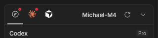
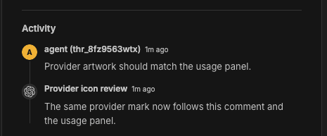
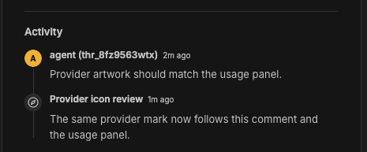
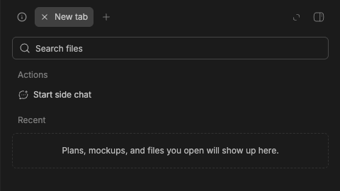
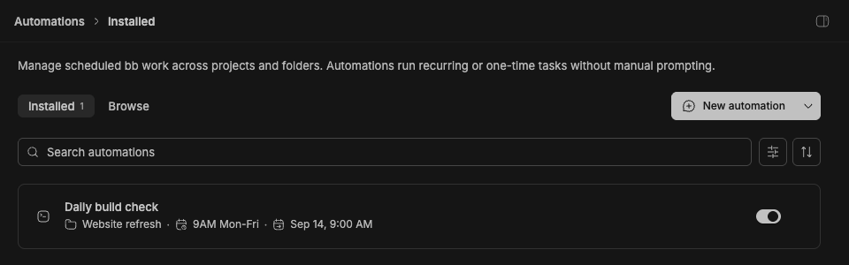
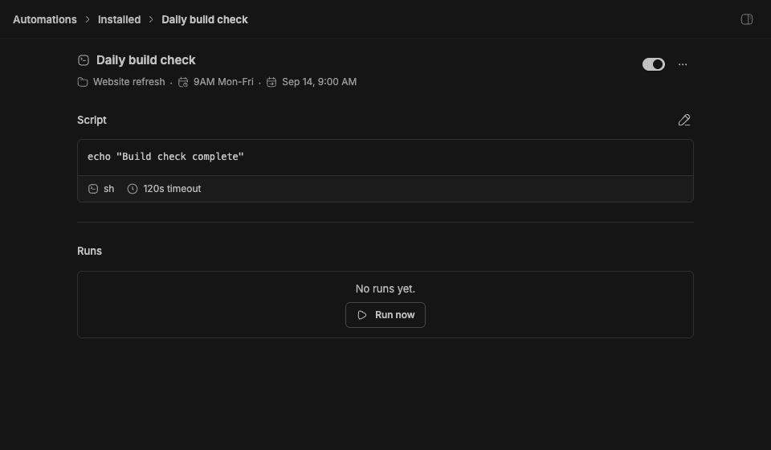

# Built-in plugin icon usage audit

The existing built-in icon list and artwork are retained. The new app registry
lets plugins add or override icons without adding entries to the built-in list.
No plugin artwork changes are included in this change.

This audits current source usage, not the historical reason a glyph entered the
registry. The manifest API remains unchanged. Individual plugins can use the
existing `branding.icon` SVG path support for their own branding assets; being
built-in is not required to use either named host glyphs or those assets.

| Icon | Current use | Decision |
| --- | --- | --- |
| `SideChat` | Side chat branding/actions and the host's side-chat context banner | Keep the original artwork. |
| `CalendarCheckOut02` | Automation next-run metadata | Keep the original artwork; the proposed replacement did not offer a clear improvement. |
| `DateTime` | Automation schedule metadata | Keep the existing date/time glyph. |
| `Coffee` | Keep Awake manifest branding | Keep the existing built-in entry. A plugin-owned branding SVG would also work, including while the plugin is disabled. |
| `BellDot` | Push Notifications manifest branding | Keep the existing built-in entry. A plugin-owned branding SVG is also supported. |
| `Github` | GitHub plugin branding/navigation | Keep the existing brand glyph. This is distinct from `GithubLogo`, which core community settings also use. |

Shared glyphs such as `Palette`, `SquareUnlock02`, `GitBranch`, `GithubLogo`,
and `DiscordLogo` have core-app uses and remain in the host registry.
Tasks already has purpose-specific status and priority artwork in its list and
board views; those local components do not need registry references just to
continue rendering locally.

## Provider artwork consumers

| Consumer | Before | Change |
| --- | --- | --- |
| Provider Usage | Local logo-mask/glyph/tint renderer; ignored provider slots | Shared SDK `experimental_ProviderIcon`, preserving `Bot` fallback |
| Tasks comment avatars | Local logo mask or generic bot; ignored glyphs, tints and provider slots | Shared SDK provider renderer, with glyph/tint included in computed comment data |
| BB provider controls, settings, recent threads and skill collections | Internal provider helper | Helper delegates to the same renderer; late registrations work even when initially no artwork exists |
| Environment provider marks | Internal helper plus separate glyph fallback | Same shared renderer, preserving `Zap` fallback |

Other built-in plugin frontend sources have no provider-logo renderer to migrate.
Manifest plugin branding and local purpose-specific artwork stay separate.
The change preserves existing declared logos; visible changes occur for provider
slot overrides and Tasks providers with declared glyphs/tints.

## Provider icon behavior in the actual UI

These captures are from the source app with synthetic task/thread data. The
first image in each pair uses Codex's declared logo. The second shows a temporary
QA plugin registering a compass icon by name and assigning it to the `codex`
provider slot. The compass is verification artwork, not a replacement shipped
by this branch. Previously these two plugin surfaces ignored that slot.

**Provider Usage:** the first provider tab changes from the declared logo to the
registered compass. Other providers keep their own artwork.

**Tasks:** the avatar beside “Provider icon review” changes to the same compass.

Both screens remained mounted during registration and removal. Disabling the
fixture restored the declared logos in both screens and the host update badge,
with no page reload. The fixture registration and synthetic instance were removed
after verification. Unit tests additionally cover declared glyph/tint forwarding,
missing artwork, reload generations, render errors, recursion and environment
provider overrides. The narrow web layout also rendered the registered Tasks
avatar correctly; native iOS was not tested.

## Retained user-facing artwork

These screenshots show the actual BB screens with local test data and the
original artwork, which remains in use. The rejected replacements have been
removed from both the implementation and this audit.

### Side chat: New tab launcher

**New tab → Start side chat** keeps its original add-message glyph.

### Automations: installed list

The icon immediately before **Sep 14, 9:00 AM** keeps the existing next-run glyph.

### Automations: detail screen

The same existing glyph appears below **Daily build check**, before the next-run date.

