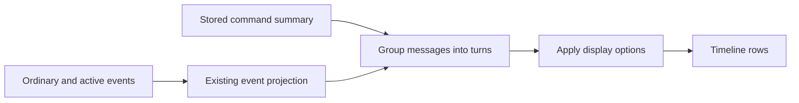

# Direct projection of settled commands

This is an executable prototype alternative to closed PR #3815. It does not
install a migration, emit summary rows in a running app, or enable automatic
cleanup. Only the explicitly invoked experiment rewrites a new disposable copy.
The app's production readers do not yet accept the experimental `item/summary`
record. Do not start BB against an experiment database.

## Storage and read path

A settled command becomes one versioned `item/summary` record whose payload is a
normalized command message. It retains the completion's physical row ID and
creation timestamp, and moves to the first lifecycle sequence. The payload
contains the original source-sequence span, start/completion times, command,
parsed intents, final status, output, scope and parent relationship.

This is the item-level input to `thread-view`, before display-specific turn
collapse, nested-child selection, path formatting and row titles. It is not a
serialized final UI row. The existing completion payload is replaced, not kept
as a second representation. Output appears once, in `message.output`.



Summaries never expand into starts, deltas or synthetic completion events.
The prototype adds no reconstruction cache, metadata column, table or index.
It preserves canonical output ownership by retaining the completion row ID;
production output adapters must learn the new payload location before rollout.

The codec deliberately versions the command-message schema. It validates the
stored boundary and rejects pending commands, invalid sequence spans and
unknown versions. Future changes to stored semantics require a deliberate
version/migration policy rather than silently changing old summaries when
presentation code changes.

## Scope and eligibility

The first prototype handles command executions. Other item kinds remain ordinary.
It derives candidates from the complete source projection, then accepts only
unique compatible command lifecycles with a retained later turn completion.
Reused IDs, reopened turns, late output, user/context-boundary crossings,
ambiguous projection bounds, and output not represented by the completion stay
ordinary. Discovery is capped at 500 lifecycle records and 256,000 characters of
non-output command details. These are conservative prototype eligibility rules,
not a background-worker budget.

Discovery currently projects a complete thread. It is intentionally an offline
experiment and is not suitable for a synchronous server maintenance call. A
production worker would need bounded settled-turn discovery and sufficient
context to resolve parent relationships, or conservative exclusions.

## Full-copy findings

The input is the full sanitized September 16 production snapshot, containing
2,082,639 events across 2,326 threads. It is not a newly captured live database.
The source remains read-only; seven tables with plugin IDs have zero Connect
records. No server, client or provider is run against either copy.

| Measurement | Result |
| --- | ---: |
| Eligible command summaries | 354,816 |
| Event rows removed | 473,796 |
| Remaining event rows | 1,608,843 |
| Baseline allocated SQLite bytes | 5,634,584,576 |
| Summary-row allocated SQLite bytes | 5,032,206,336 |
| Allocated bytes saved | 602,378,240 (about 602 MB) |

An initial variant retained the completion payload plus a normalized summary.
That passed all 6,978 full-thread view comparisons, but saved only 397,508,608
allocated bytes. Replacing the old payload saves another 204,869,632 bytes.
Every one of the 354,816 messages matched when converting that initial copy to
the single-payload representation. The final reader reruns the complete corpus
and independently regenerates every stored summary from the original events.

These savings cover commands only. They are not directly comparable to an
all-item compaction result, and do not predict gains from assistant text,
reasoning or file changes. Freed SQLite pages are reusable; file-size reduction
would require a separate repack.

## Correctness and read measurements

The final summary-row reader passes **6,978 exact full-thread view comparisons**
(all 2,326 threads in flat, collapsed and expanded-nested modes). It independently
regenerates all 354,816 summary payloads from the original events and checks each
stored payload, owner ID and physical position against the current writer.

An independent SQLite audit verifies unchanged schema/indexes, all 50 non-event
tables, surviving ordinary event rows, owner identity/scope/timestamps, command
output text and all 2,326 per-thread highwater values. The foreign-key-check
results are unchanged. Source and output files remain 6,006,726,656 bytes and
mode 0600; the 602 MB saving is allocated-page space, not file shrinkage.

The separate read-only benchmark runs three alternating samples per path for
every thread: 13,956 timed reads, including SQL selection, decoding and projection.
All sampled responses match. It compares the ordinary-event path and the direct
summary path in the same source revision, based on main `d81d3d1f8a`.

| Full-thread read metric | Ordinary events | Direct summaries |
| --- | ---: | ---: |
| Median of thread medians | 11.14 ms | 5.86 ms |
| Sum of thread elapsed medians | 67.92 s | 39.57 s (41.7% lower) |
| Sum of thread CPU medians | 107.69 s | 60.76 s (43.6% lower) |

Median paired elapsed improvement is 5.07 ms. No elapsed case exceeds both 5 ms
and 10% overhead. The initial run has 28 CPU-only flags; all flags plus controls
(51 threads) were repeated with nine samples per path. None exceeds both
thresholds in elapsed or CPU on that repeat. Initial samples remain available.

These are complete-thread operations on a shared host, not traffic-weighted
page latency. The largest 140,404-event thread takes about 13.27 s before and
9.62 s after in this deliberately unpaginated harness. That is not an acceptable
live event-loop bound and is not the production request path. Cold-disk latency,
startup, production pagination and background-worker stalls are not measured by
this prototype. No new cache was added to obtain these results.

The thread-view suite and typecheck pass through Turbo (423 tests). New tests
cover interleaved messages, collapse and nested details, retained turn context,
output mutation, codec validation and conservative eligibility. A fresh-copy
smoke test also exercises the final direct writer, removing two rows into one
summary and matching all three views.

## Running the experiment

From the repository root, using the sanitized research baseline with the
unused, null `completed_item_history` column left by the earlier experiments:

```sh
node --import tsx packages/thread-view/experiments/settled-commands.mts \
  /private/research-baseline.db /private/new-summary-copy.db /private/results

node --import tsx packages/thread-view/experiments/settled-commands.mts \
  /private/research-baseline.db /private/new-summary-copy.db /private/reads \
  --benchmark
```

The first invocation refuses an existing destination, checks for Connect
records, makes a SQLite backup with mode 0600, and rewrites only that copy.
It uses the existing `events.data` and `events.type` columns. The old research
metadata column stays null; the app schema is not changed. The second invocation
opens both databases read-only and verifies that every summary is exactly what
the current prototype writer would generate.

Both modes compare flat, collapsed and expanded nested full-thread views.
Benchmark mode additionally runs three alternating reads per implementation for
each thread with collapsed turns and lazy nested rows. Those measured intervals
include SQL selection, JSON/schema decoding, grouping and timeline projection.
They exclude candidate generation, response comparison, network, HTTP handlers,
output-sidecar hydration and browser rendering. This is a full-thread prototype
benchmark, not a production pagination or event-loop-latency benchmark.

The optional numeric final argument limits threads for investigation; omit it
for the complete corpus. `--threads=/private/ids.json` selects a JSON array of
thread IDs, and `--trials=9` changes the benchmark repeat count (1–30). Results include per-thread samples, progress, mismatch
artifacts and completion totals. No forced garbage collection is used.

## Remaining integration work

This draft is a design and performance experiment, not a replacement-ready
production PR. Before enabling it:

- Add a proper internal persisted-event contract and teach production selectors,
  timeline pages, nested details, outlines and exports to read summaries.
- Define snapshot/cursor behavior when a sequence falls inside a summarized
  lifecycle. Current snapshot cursors carry a maximum sequence but no history
  rewrite generation; preserving only settled state cannot reproduce an old
  intermediate pending state. Do not assume existing refresh notifications solve
  this automatically.
- Make forks and edits copy/trim summaries while preserving source spans, timing
  and ownership. Current fork selection only recognizes existing event types.
- Adapt output retention, hydration and downloads to `message.output`; verify
  retained files and truncation continue to have a single canonical owner.
- Add bounded resumable maintenance, late-arrival behavior and rewrite/cache
  invalidation, then measure the complete live and background paths.
- Extend one item kind at a time, repeating correctness and storage checks.

The prototype should be judged on whether this direct input simplifies the
reader and provides acceptable storage/read tradeoffs. It does not promise
lossless reconstruction of deleted provider events or arbitrary old-ID lookup.
