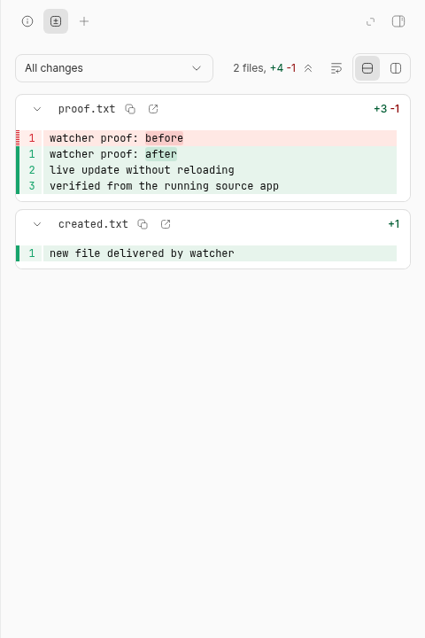
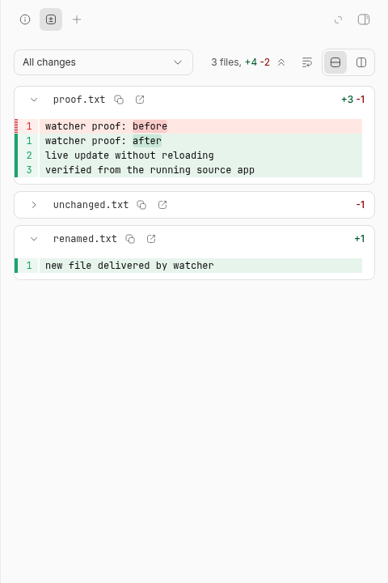

# Watcher IPC backpressure verification

Tested on Linux x64 (kernel `7.2.3-arch1-3`) against upstream
[`c3067feab59d588e192f11fe7d3210be26b8c1d5`](https://github.com/get-bb/bb/commit/c3067feab59d588e192f11fe7d3210be26b8c1d5).

## Reproduced defect

The upstream watcher child calls `process.send` for every event batch without
tracking outstanding sends. When its parent stops reading IPC, serialized
event messages accumulate in the child. A real forked-process benchmark
reproduces this with the production child handler and a synthetic event source.
This establishes an outgoing-IPC memory problem; it does not establish that
IPC was the sole cause of the original reported watcher OOM.

The fix budgets outstanding event messages at a conservative 4 MiB upper
estimate of serialized size. Node's send callback releases each reservation.
An overflowing batch requests the existing subscription-scoped recovery once
and suppresses more events for that subscription until it is removed. The
parent refreshes its consumer before and after restoring the watch. Other
subscriptions and control messages remain available.

This is consistent with Node's documented
[send-callback flow control](https://nodejs.org/api/child_process.html#subprocesssendmessage-sendhandle-options-callback).
It bounds outstanding event serialization, not total RSS, native watcher
allocations, or an arbitrary number of control messages. During overload,
consumers receive conservative refresh notifications in place of every detailed
event. Normal event paths, types, and ordering are preserved.

## Same-workload memory comparison

Each run creates a fresh child, subscribes through the production child
handler, and produces either 100 or 500 batches of 1,000 updates. Paths have
roughly 250 characters. The parent deliberately stalls its event loop until
the child records its metrics to a file, then drains IPC through a final pong.
Both modes produce the same callbacks and yield between batches. The baseline
uses the upstream unbounded send behavior; the fixed mode uses the production
message sender. There are three paired repetitions per workload and runtime.

Median child RSS increase during production, in MiB:

| Runtime      | Updates produced | Before | After |
| ------------ | ---------------: | -----: | ----: |
| Node 22.19.0 |          100,000 |  32.95 |  2.79 |
| Node 22.19.0 |          500,000 | 196.79 |  5.41 |
| Node 24.19.0 |          100,000 |  67.31 |  2.95 |
| Node 24.19.0 |          500,000 | 289.86 |  4.14 |
| Node 26.7.0  |          100,000 |  32.93 |  3.93 |
| Node 26.7.0  |          500,000 | 149.89 |  5.44 |

Raw measurements: [Node 22](node22.json), [Node 24](node24.json),
[Node 26](node26.json). RSS varies with allocation and garbage collection;
the test asserts message counts and recovery behavior rather than a flaky RSS
threshold. This is a deliberately stalled receiver, not a throughput benchmark
or a measurement of ordinary filesystem workload latency.

Before the fix, all 100 or 500 event sends remained outstanding while the
receiver was stalled. After the fix, only two event batches and one recovery
message remained outstanding, independent of workload size. Once drained, the
baseline delivered all 100,000 or 500,000 updates; the fix delivered 2,000
updates plus one targeted recovery request. Native integration tests below
verify that the recovery actually refreshes and restores the affected watch.

Run from the repository root with the chosen Node on `PATH`:

```bash
BB_WATCHER_IPC_BENCHMARK=1 \
BB_WATCHER_IPC_BENCHMARK_OUTPUT="$PWD/watcher-ipc-results.json" \
pnpm exec turbo run test typecheck --filter=@bb/host-watcher --env-mode=loose
```

## Regression and integration proof

Both new native integration tests were run with only `parcel-child-entry.ts`
replaced by its exact upstream version, then rerun with the fix restored:

```text
Before:
FAIL recovers an oversized native rescan and continues delivering file changes
AssertionError: expected false to be true // Object.is equality
FAIL automatically refreshes and resubscribes only the overloaded root
AssertionError: expected 2 to be 3 // Object.is equality
Tests  2 failed (2)

After:
Tests  2 passed (2)
```

The first test creates 4,000 real files with long filenames, requests an
oversized rescan, observes the targeted recovery message, then verifies a new
file event and heartbeat after resubscription. The second drives the real
proxy and host-watcher consumer with two native subscriptions: only the
overloaded root resubscribes, both recovery refreshes observe a file written
during recovery, subsequent events arrive on both roots, and the child never
restarts. The synthetic rescan is injected only once into the affected root.

Eight sender tests also cover escaped/non-ASCII size accounting, partial
budget release, repeated overload on multiple subscriptions, exact ordinary
event delivery, a single oversized batch, control messages under congestion,
and synchronous/asynchronous channel failures.

| Check                                       | Result                                                                 |
| ------------------------------------------- | ---------------------------------------------------------------------- |
| Watcher suite, Node 22.19.0                 | 60 passed, 1 optional benchmark skipped; typecheck passed              |
| Watcher suite, Node 24.19.0                 | 60 passed, 1 optional benchmark skipped                                |
| Watcher suite, Node 26.7.0                  | 60 passed, 1 optional benchmark skipped; direct Vitest exception below |
| Host workspace suite, Node 22               | 164 passed, 1 skipped                                                  |
| Host daemon suite, Node 22                  | 620 passed, 1 skipped                                                  |
| Host daemon dependency build and typechecks | Passed through Turbo                                                   |
| Full source `pnpm start:worktree --dryrun`  | 45 tasks passed; repeat had 44 cache hits                              |
| Built source server and host daemon         | Healthy; live browser verification below                               |

The existing root-recovery benchmark also passed with 57 and 100 roots under
idle and controlled CPU load, with one warmup and three measured iterations
per scenario. Every iteration used one targeted resubscription, two affected
consumer refreshes, no unaffected refreshes, and no child restart. Median
recovery latency was 335–358 ms. See [raw results](root-recovery-benchmark.json).
This existing fixture verifies recovery scope, separately from IPC retention.

```bash
pnpm exec turbo run test typecheck build --filter=@bb/host-daemon
pnpm exec turbo run test --filter=@bb/host-workspace
BB_WATCHER_ROOT_RECOVERY_BENCHMARK=1 \
BB_WATCHER_BENCHMARK_ITERATIONS=3 BB_WATCHER_BENCHMARK_WARMUPS=1 \
BB_WATCHER_BENCHMARK_OUTPUT="$PWD/watcher-root-recovery.json" \
pnpm exec turbo run test --filter=@bb/host-watcher --env-mode=loose -- root-recovery-benchmark.test.ts
pnpm start:worktree --dryrun
```

## Live source-app proof

A separate worktree, fresh migrated dev database, local daemon, and isolated
headless Chromium profile were used. A scratch Git project was created using
the built source CLI. Repository database helpers seeded an idle thread and
ready environment in that disposable store; no provider turn was submitted.
The thread and Diff panel were opened through actual browser clicks.

The clean panel initially showed no diff. Creating and modifying files updated
the visible panel without reloading. Renaming the untracked file and deleting
a tracked file updated it again. The source CLI's `environment diff-files`
agreed with the displayed paths and counts. Reloading retained the final diff.

| Clean fixture                  | Live create and edit                 | Live rename and delete                           |
| ------------------------------ | ------------------------------------ | ------------------------------------------------ |
|  |  |  |

Screenshots capture only the diff panel. The private dev processes and browser
profile were stopped after verification; the assigned ports had no listeners.
No production instance or home service was changed.

## Environment exceptions and limits

- This machine's `/tmp` user quota prevented unrelated daemon tests from
  creating fixtures. They passed in a private mount namespace with a writable
  `/tmp`. The watcher benchmark used a writable `TMPDIR`.
- User Git configuration set `diff.mnemonicPrefix=true`, breaking existing
  diff expectations and surrounding-context loading. Tests used an environment
  override, and the scratch repository used local `diff.mnemonicPrefix=false`.
  No global Git settings were changed.
- Node 26's Turbo prerequisite exited 137 while installing the unrelated
  `better-sqlite3` ABI. Its watcher suite and benchmark were therefore run
  directly with `node ../../node_modules/vitest/vitest.mjs run --config
vitest.config.ts` from `packages/host-watcher`. Full source-app verification
  used the pinned Node 22 runtime, not Node 26.
- The convenience QA launcher requires unavailable `screen` and `lsof` tools.
  The documented `pnpm start:worktree` entry point ran under an owned PTY after
  checking port ownership with `ss`. The verification inventory check also
  reports pre-existing `Unmapped CLI family: browser`; it was not rebased.
- Native macOS/Windows watchers, iOS, long-duration production workloads, and
  a reproduction of the original full OOM incident were not run. This fix is
  not a replacement for native watcher memory limits or sensible root scope.
