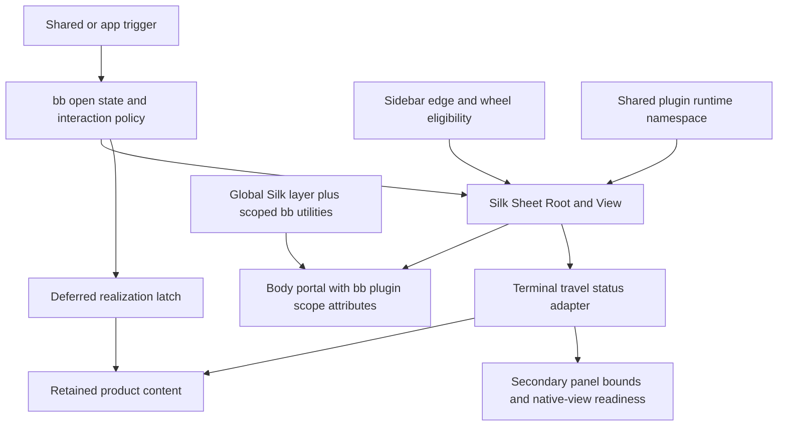
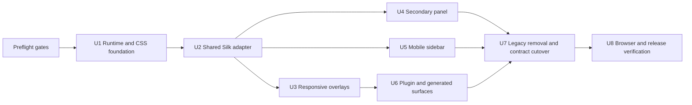

# Silk Mobile Sheets and Drawers Migration - Plan

## Goal Capsule

- **Objective:** Replace every compact web-app sheet/drawer presentation with `@silk-hq/components`, remove the inherited custom/Vaul/Radix-sheet implementations and runtime surfaces, and retain the current behavior and WebKit performance envelope.
- **Authority:** The Product Contract in this plan controls behavior and scope. The Planning Contract controls implementation mechanism. Official Silk v0.10.1 documentation controls library API details, subject to characterization on the browsers bb supports.
- **Execution profile:** Cross-cutting UI/runtime migration spanning shared UI, app-specific drawers, plugin bundling, generated component surfaces, package metadata, and browser QA.
- **Stop conditions:** Stop the migration if Silk cannot meet the required app-root, persistence, focus, lifecycle, nested-overlay, or sidebar swipe behavior without retaining a second drawer engine.
- **Tail ownership:** The implementing change owns dependency and lockfile cleanup, generated registry output, plugin artifact invalidation, focused automated coverage, iOS Safari verification, bundle checks, and fork-maintenance documentation.

---

## Product Contract

### Summary

Use Silk exclusively for compact/mobile web sheets and drawers while retaining Radix for desktop overlays and for the two explicitly anchored compact popovers. Preserve bb's current realization, persistence, accessibility, gesture, plugin-portal, native-browser, and WebKit performance contracts, then delete the superseded drawer/sheet/Vaul stack end to end.

### Problem Frame

Compact `Dialog`, `DropdownMenu`, and `Popover` currently converge on a hand-built persistent drawer in `packages/shared-ui/src/components/ui/responsive-overlay.tsx`. The mobile sidebar in `apps/app/src/components/ui/sidebar.tsx` independently implements a persistent horizontal drawer, while `apps/app/src/components/secondary-panel/SecondaryPanelLayout.tsx` directly consumes the shared persistent shell. These implementations carry product policy that is not represented by a generic component swap: they avoid app-root `inert` and `aria-hidden` mutations that cause full-tree WebKit style recalculation, defer heavy content until motion starts, retain mounted content, coordinate focus and nested portals, and expose lifecycle signals used to order native Electron browser views.

The repository also retains unused `sheet.tsx` and `drawer.tsx` primitives, a Vaul shared-runtime slot for plugins, committed component-registry output, generated scaffold/runtime manifests, package dependencies, comments, selectors, and tests. Replacing only the visible component would leave two mobile drawer systems, stale public surfaces, or old plugin bundles that fail at evaluation. The migration must therefore replace the implementation and contract surfaces as one clean change.

### Requirements

**Migration boundary**

- R1. Every compact/mobile web presentation that behaves as a sheet or drawer must use Silk as its only motion, gesture, backdrop, travel, and placement engine.
- R2. Desktop paths in `Dialog`, `DropdownMenu`, and `Popover` must remain Radix-backed and preserve their current public component contracts.
- R3. Direct Radix popovers in `MessageActionBar` and `TimelineSelectionMenu` must remain anchored on compact viewports and must not be converted to Silk sheets.
- R4. React Native sheets under `apps/mobile` and non-sheet Radix primitives such as alert dialogs and context menus are outside this migration.
- R5. No compatibility wrapper, dormant implementation, accepted-but-ignored prop, old selector, or legacy runtime slot may remain solely for the removed custom/Vaul/Radix-sheet stack.

**Behavior and lifecycle**

- R6. A normal compact overlay must create no portal nodes before first open, start Silk travel before realizing expensive children, realize after two animation frames with a 120 ms fallback, and retain the realized subtree across close/reopen.
- R7. A closed retained sheet must be offscreen, non-interactive, absent from sequential focus and the accessibility tree, while leaving the app root free of `inert`, `aria-hidden`, and document-wide pointer-event mutations.
- R8. Controlled open state must remain coherent during rapid open/close requests despite Silk v0.10.1's documented inability to interrupt entering or exiting travel.
- R9. Settled-open and settled-closed notifications must be derived from Silk terminal travel states and must fire once per settled state, including reduced-motion paths.
- R10. Bottom-sheet dismissal, nested-sheet ordering, backdrop dismissal, Escape handling, keyboard-input blur, safe-area spacing, and the current maximum-height behavior must remain available through the shared responsive overlay contract.

**Accessibility and portal behavior**

- R11. Compact dialogs must expose a labeled `role="dialog"`, preserve title/description relationships, trap or otherwise contain keyboard focus, and restore focus according to the interaction that opened them.
- R12. Touch-opened sidebar presentation must not force focus into the large sidebar subtree; keyboard or assistive-technology activation must move focus predictably and return it on close.
- R13. A nested portaled overlay marked through bb's portal-scope contract must remain styled, interactive, and able to handle focus, Tab, and Escape before its containing Silk sheet.
- R14. Plugin-rendered Silk portals must retain `data-bb-plugin`, `data-bb-plugin-root`, and `data-bb-portaled-overlay` semantics without introducing CSS `@scope`.

**Sidebar and secondary panel**

- R15. The compact sidebar must retain left/right placement, pinned-trigger interaction, edge-open and drag-close intent arbitration, browser-back-swipe protection, text-selection and horizontal-scroll exclusions, wheel opening, deferred boot realization, mounted content, and touch-versus-keyboard focus behavior, while Silk owns all panel travel and dismissal motion.
- R16. The compact secondary panel must retain its realized subtree and expose the native browser view only after Silk reaches the settled-open state, one subsequent animation frame completes, and `dispatchBrowserViewBoundsSync()` runs; close, breakpoint, and identity changes must revoke readiness before paint.

**Dependencies and removal**

- R18. The final dependency graph, plugin runtime, component registry, generated scaffold, package exports, tests, selectors, documentation, and lockfile must contain no Vaul, legacy sheet, or legacy drawer surface.
- R19. Previously built plugin frontend bundles that depend on the removed Vaul runtime must be rejected before evaluation with an explicit rebuild/update state rather than failing from a missing runtime slot.
- R20. The final shared adapter must not retain custom DOM transform, drag tracking, backdrop animation, or drawer travel code parallel to Silk; bb-owned code may retain only product policy that Silk does not own, such as realization timing, state serialization, focus exceptions, portal attributes, and native-view readiness.

### Key Flows

- F1. **Compact responsive overlay:** A compact trigger blurs an active keyboard input, presents Silk immediately, realizes content after two frames or fallback, settles open, supports nested content, dismisses through Silk, and restores focus without mutating the app tree.
- F2. **Compact sidebar:** Boot mounts only the lightweight Silk shell, idle or first-open realizes the sidebar once, an eligible edge/wheel/trigger interaction opens it through Silk, pinned trigger and sidebar controls remain reachable, and close leaves the subtree mounted and inert only within the sheet.
- F3. **Compact secondary panel:** Opening begins Silk travel before the heavy panel mounts, a settled-open callback schedules browser bounds synchronization, the native view becomes visible only after synchronization, and stale callbacks cannot expose it after close or identity change.
- F4. **Plugin overlay:** A vendored responsive component imports the shared Silk runtime, portals into the host, carries plugin scope attributes, receives global Silk low-level styles plus plugin-scoped utility styles, and participates in the same overlay stack as host drawers.
- F5. **Old plugin artifact:** The server identifies a pre-migration frontend artifact as incompatible, the app skips evaluation, and diagnostics tell the user to rebuild/update instead of attempting to provide Vaul compatibility.

### Acceptance Examples

- AE1. **First compact open:** Given a closed responsive dialog that has never opened, when it opens, then the Silk shell begins entering before the expensive dialog body appears; the body appears after two frames or 120 ms and remains the same DOM subtree after close/reopen. Covers R1, R6, R7, and R9.
- AE2. **WebKit root isolation:** Given a long timeline under the app root, when any compact sheet opens and closes, then no ancestor or sibling app subtree gains `inert`, `aria-hidden`, or global pointer-event styling. Covers R7, R13, and R20.
- AE3. **Desktop preservation:** Given a viewport wider than the compact breakpoint, when a shared Dialog, DropdownMenu, or Popover opens, then its Radix portal, positioning, keyboard semantics, and public props remain in use and no Silk sheet is created. Covers R2.
- AE4. **Anchored mobile exception:** Given the message action overflow or timeline selection menu on a compact viewport, when it opens, then it remains anchored to its trigger or virtual selection anchor and no Silk sheet is created. Covers R3.
- AE5. **Sidebar gesture arbitration:** Given a compact closed sidebar, when a horizontal gesture starts outside the browser back-swipe guard and not in a horizontal scroller, selection, input, slider, or opted-out region, then Silk tracks the opening motion; an ineligible gesture leaves the page interaction untouched and does not force a layout read until horizontal intent exists. Covers R15 and R20.
- AE6. **Sidebar focus mode:** Given a touch trigger opens the compact sidebar, then the panel is not synchronously focused; given keyboard focus-visible activation opens it, then focus enters the sheet and cycles through the pinned trigger and sidebar controls before returning on close. Covers R12 and R15.
- AE7. **Native secondary view ordering:** Given a compact secondary panel containing an Electron browser tab, when it opens, then the native view remains hidden until settled-open, the next frame, and bounds synchronization; closing or changing `resetKey` before that point prevents stale exposure. Covers R9 and R16.
- AE8. **Plugin compatibility boundary:** Given a plugin frontend bundle built against the pre-Silk runtime, when the host inventories it, then it is reported as needing an update and its JavaScript is not imported. Covers R19.
- AE9. **Clean removal:** Given the completed source tree and generated output, when searched for Vaul packages, Vaul selectors, shared `drawer`/`sheet` exports, or persistent custom-drawer symbols, then no runtime, source, generated registry, scaffold, test, or documentation reference remains. Covers R5 and R18.

### Success Criteria

- All compact web sheets/drawers use `@silk-hq/components` v0.10.1 through one shared bb adapter or a direct app-specific Silk composition.
- Desktop Radix overlay behavior and the two anchored compact Radix popovers pass regression coverage.
- Representative iOS Safari interactions meet the existing visual responsiveness and avoid app-root style-recalculation spikes.
- Responsive overlay, sidebar, secondary panel, plugin runtime, registry/scaffold, typecheck, bundle, and generated-output gates pass.
- Project-wide search finds no Vaul dependency or selector and no deleted `sheet`/`drawer` public surface.

### Scope Boundaries

**In scope**

- `packages/shared-ui/src/components/ui/responsive-overlay.tsx` and the compact branches in `dialog.tsx`, `dropdown-menu.tsx`, and `popover.tsx`.
- `apps/app/src/components/ui/sidebar.tsx` and its mobile visibility/command integrations.
- `apps/app/src/components/secondary-panel/SecondaryPanelLayout.tsx` and native-browser readiness ordering.
- Silk dependency/CSS integration, plugin runtime singleton sharing, plugin SDK artifact compatibility, component registry, scaffold generation, builtin plugin manifests, tests, selectors, docs, and lockfile.
- Deletion of `packages/shared-ui/src/components/ui/drawer.tsx`, `packages/shared-ui/src/components/ui/sheet.tsx`, their exports, committed registry entries, and all Vaul wiring.

**Non-goals**

- Migrating desktop Dialog, DropdownMenu, Popover, AlertDialog, ContextMenu, Select, Tooltip, or other Radix families to Silk.
- Converting `apps/app/src/components/thread/timeline/MessageActionBar.tsx` or `apps/app/src/components/thread/timeline/TimelineSelectionMenu.tsx` to sheets.
- Replacing `@gorhom/bottom-sheet` or other React Native UI under `apps/mobile`.
- Redesigning sheet visuals, changing the compact breakpoint, adding detents, or introducing background scaling.
- Preserving old Vaul imports, generated component names, runtime slots, selectors, or pre-migration plugin frontend execution.

---

## Planning Contract

### Key Technical Decisions

- KTD1. **Mobile-only Silk ownership.** `(session-settled: user-directed — chosen over migrating desktop overlays too: the request limits Silk to compact sheets/drawers and retains established desktop Radix behavior.)` Silk owns compact sheet/drawer travel, gestures, backdrop, placement, and lifecycle; desktop branches remain structurally Radix-backed. Governs R1-R5 and R20.
- KTD3. **Pin Silk 0.10.1 exactly during migration.** Silk is pre-1.0 and its changelog includes minor-version breaking changes. Use an exact version until browser characterization and the full migration suite qualify a newer release; do not float on a caret range during the swap.
- KTD4. **One canonical shared adapter, no second drawer engine.** Keep the generic `ResponsiveDrawerShell` entry point as the current shared contract, replace its internals with Silk, and remove `PersistentResponsiveDrawerShell`. The adapter may own bb policy but may not retain custom portal creation, transforms, pointer-drag travel, backdrop animation, or a parallel Escape stack. Governs R1, R5, R6-R10, and R20.
- KTD5. **Disable Silk outside inerting.** Configure `Sheet.View` with `inertOutside={false}` and prove through DOM observation that Silk does not mutate the app root or body in a way that recreates the WebKit regression. Preserve modal interaction with a blocking Silk backdrop, `aria-modal`, Silk overlay propagation, and a narrowly scoped bb focus policy where Silk's documented hooks are insufficient. Do not use `Island` to make most of the app interactive while retaining root inerting; that still pays the mutation cost. Governs R7 and R11-R14.
- KTD6. **Serialize controlled travel.** Maintain the latest requested presented state in the shared adapter and apply it only when Silk reports `idleInside` or `idleOutside`. Use terminal `onTravelStatusChange` values as the authoritative settled signal; do not treat `onPresentedChange` or `onTravelEnd` as settled because the former is logical state and the latter runs before Silk's last `onTravel` callback. Governs R8, R9, and R16.
- KTD7. **Preserve realization outside Silk presence assumptions.** Retain the two-frame/120 ms latch for normal compact overlays and the idle/two-frame/1 s latch for the sidebar. Characterization must prove Silk keeps the rendered View/Content subtree mounted while dismissed; if it does not and offers no supported persistent composition, stop rather than reconstructing an offscreen custom drawer shell. Governs R6, R7, R15, and R16.
- KTD8. **Use Silk's overlay model before custom focus code.** Prefer `onPresentAutoFocus`, `onDismissAutoFocus`, `onEscapeKeyDown`, `onClickOutside`, `ExternalOverlay`, and normal body-portal detection. Retain only the focus exceptions required by R11-R13, including touch-versus-keyboard sidebar behavior and the pinned trigger. The two R3 anchored Radix popovers are test-only compatibility fixtures: do not wrap, convert, or otherwise modify their source. If automatic body-portal handling cannot preserve their focus and Escape behavior, the compatibility gate fails rather than expanding their scope.
- KTD9. **Silk must drive sidebar motion.** The app may keep edge-zone eligibility, horizontal-scroll/selection arbitration, wheel intent, and deferred realization, but it must not write transforms or opacity to drawer DOM. The feasibility spike must identify a supported Silk composition for tracked edge opening and closing; inability to preserve F2 without direct DOM motion is a launch blocker. Governs R15 and R20.
- KTD10. **Global low-level CSS, scoped product styles.** Import `@silk-hq/components/layered-styles.css` before Tailwind in `apps/app/src/components/ui/theme.css`. Share the Silk JavaScript namespace through the plugin runtime so host and plugins use one overlay world. Apply plugin portal attributes to the Silk View/Content/Backdrop DOM that carries bb utility classes; continue the `:where()` selector-prefix strategy and never add CSS `@scope`. Governs R13, R14, and R18.
- KTD11. **Clean plugin incompatibility via SDK major.** Removing the Vaul runtime slot and replacing generated responsive components is a breaking plugin frontend runtime change. Bump `PLUGIN_SDK_VERSION` to `1.0.0`, rebuild current plugins, and use the existing major compatibility gates rather than preserving a Vaul slot or lazy fallback. This is an end-to-end SDK break: major-0 engine ranges and stale app, server, and host artifacts become incompatible, so update the canonical SDK package version, compatibility assumptions, builtin manifests, and artifact expectations together. Governs R5, R18, and R19.
- KTD12. **App-owned stable selectors only.** Replace `data-persistent-drawer-*`, `data-responsive-drawer-*`, and `data-vaul-*` selectors with explicit `data-bb-*` selectors only where production integrations need a stable hook. Tests should prefer role, accessible name, Silk travel state, and app-owned state over Silk's undocumented internal attributes.

### High-Level Technical Design

The ownership boundaries are fixed; exact component composition must use the qualified Silk v0.10.1 public API.

### Preflight Gates

Implementation may begin after package access is confirmed and the following technical checks are recorded in the implementation thread or associated issue:

1. **Package access:** `@silk-hq/components@0.10.1` installs in developer, CI, plugin scaffold, and release environments.
2. **DOM and WebKit behavior:** A minimal v0.10.1 sheet with `inertOutside={false}` is observed in iOS Safari and desktop Safari during enter, idle, exit, nesting, and unmount. It must not add `inert`/`aria-hidden` to the app root, perform unacceptable body/style mutations, or regress style-recalculation latency.
3. **Persistence and lifecycle:** Dismissed content retains DOM identity and local React state; terminal travel callbacks are reliable for enter/exit, reduced motion, snap-back, and rapid controlled requests.
4. **Focus and nested overlays:** Focus containment/return, touch-open focus suppression, Radix portals, plugin portals, and topmost Escape behavior can satisfy R11-R14 using Silk APIs plus policy code, without modifying the two R3 anchored-popover components or retaining a second modal engine.
5. **Sidebar gestures:** A supported Silk composition can drive interactive edge-open and drag-close travel while bb retains only eligibility arbitration. Silk's undocumented distance/velocity thresholds are acceptable only if device tests show no material regression from the current 33% open, 25% close, and 450 px/s fling behavior.

Package-access failure blocks dependency adoption. Failure of gates 2-5 blocks the migration design and requires an explicit product decision to change requirements or choose another library; it must not be bypassed with retained legacy drawer code.

### Dependencies and Package Access

- **New dependency:** `@silk-hq/components@0.10.1`, exact-pinned in the host/shared/plugin build graph after the package-access check.
- **Peers:** Official npm metadata supports React and React DOM 17, 18, and 19; the repository uses React 19.
- **Styles:** Silk v0.9+ requires an explicit low-level stylesheet import. Tailwind v4 projects must load Silk's layered stylesheet before Tailwind's layer declaration.
- **Root declaration:** Use the free-plan `license="non-commercial"` value required by each `Sheet.Root`; this is configuration, not a preflight gate.
- **Removed dependency:** `vaul@^1.1.2` from the app, shared UI peer/dev dependencies, plugin registry, affected builtin plugins, runtime manifest, generated scaffold dependency set, and lockfile.

### Portal and Plugin CSS Integration

- Import Silk low-level CSS once in the host CSS graph, before `@import "tailwindcss"`, so host and plugin runtime instances share identical base behavior.
- Keep visual tokens and layout utilities in bb classes. Do not duplicate Silk's global low-level stylesheet into each plugin's `app.css`.
- Expose `@silk-hq/components` through `RUNTIME_SLOT_BY_SPECIFIER`, the generated runtime export manifest, `installPluginRuntime()`, scaffold type dependencies, and runtime documentation. Replace the Vaul slot; do not add Silk as a bundled-per-plugin fallback.
- Apply `usePortalScopeProps()` to the highest Silk DOM element that encloses the portaled Backdrop and Content, and apply it directly to any styled portal sibling that is not a descendant. Characterization must prove arbitrary `data-*`, ARIA, class, event, and ref forwarding.
- Extend plugin registry/build tests to verify Silk resolves through `globalThis.__bbPluginRuntime`, portal utility styles match both descendant and self scope arms, and compiled plugin CSS contains no `@scope`.
- Preserve `data-bb-portaled-overlay` for Electron drag-region hit testing and nested focus arbitration. Do not depend on Silk's private `data-*` attributes.

### Accessibility, Focus, and Inert Behavior

- Set `sheetRole="dialog"` on `Sheet.Root`, preserve explicit title/description linkage through `Sheet.Title`/`Sheet.Description` or equivalent app-owned IDs, and keep `aria-modal` semantics aligned with the adapter's actual focus policy.
- Set `inertOutside={false}` on `Sheet.View` and verify body scroll behavior explicitly because Silk's modal default also locks body scroll and adds scrollbar compensation. The bb shell already owns root scrolling; no new document-level lock may alter layout.
- Use `onPresentAutoFocus={{ focus: false }}` for touch-open sidebar paths. For keyboard/focus-visible activation, focus an `AutoFocusTarget.Root` or the panel after Silk reaches the documented autofocus phase.
- Use `onDismissAutoFocus={{ focus: false }}` where bb must restore the exact trigger manually. Normal compact overlays should restore their captured trigger; sidebar restoration occurs only when keyboard/assistive activation moved focus.
- Keep the pinned sidebar trigger in the allowed Tab cycle without making the full app an Island. If Silk cannot express this with non-modal outside behavior and a focused app policy, the focus gate fails.
- Wrap or register third-party Radix overlays with `ExternalOverlay.Root` only where automatic body-portal detection does not preserve topmost focus/Escape behavior. Do not apply this fallback to the two R3 anchored exceptions; avoid broad wrappers that change desktop behavior.

### iOS Safari and WebKit Performance Contract

- Measure style recalculation by invalidating a root custom property and timing a forced `getComputedStyle` before, during, and after sheet travel on a representative long timeline.
- Confirm no `@scope`, app-root `inert`, app-root `aria-hidden`, document-wide `pointer-events`, retained full-viewport backdrop filter, or inherited per-frame custom-property mutation is introduced.
- Start compositor-visible Silk travel before mounting expensive responsive overlay content. Keep sidebar realization off the boot critical path and retain content after first realization.
- Test Safari tab and standalone PWA viewport/safe-area behavior, soft keyboard open/close, native back-swipe guard, nested perpendicular scrolling, and rapid repeated controls.
- Treat jsdom assertions as structural protection only; iOS Simulator Safari and a representative physical-device pass are release gates for interaction latency and gesture correctness.

### Sequencing and Dependencies

No intermediate release may ship with both drawer engines. Temporary coexistence needed to keep the implementation branch buildable must be removed in U7 before release verification.

### System-Wide Impact

- **Shared UI:** Compact wrapper behavior changes behind stable public Dialog/DropdownMenu/Popover APIs; `PersistentResponsiveDrawerShell`, `drawer`, and `sheet` exports disappear.
- **App:** Sidebar and secondary panel lifecycle code moves from DOM animation ownership to Silk state/lifecycle integration. Command modal detection and DnD visibility gates must read app-owned open state, not legacy selectors.
- **Plugins:** Generated component source gains Silk, the frontend shared runtime changes, current plugin manifests and artifacts move to SDK major 1, and major-0 plugins or stale app/server/host artifacts fail the existing compatibility gates.
- **CSS:** One global Silk layer enters the host cascade. Plugin utilities remain selector-prefixed and theme-token-driven.
- **Performance:** The highest risk is reintroducing full-tree WebKit style recalculation or mounting heavy content before travel. Bundle growth is a second risk because a whole runtime namespace can reduce tree-shaking.
- **Protocol:** No host-daemon session, WebSocket, RPC command, or RPC result changes are planned, so `HOST_DAEMON_PROTOCOL_VERSION` does not change. Reassess only if implementation unexpectedly alters a host-daemon payload.

---

## Implementation Units

### U1. Establish the Silk dependency, global styles, and shared plugin runtime

**Goal:** Add the pinned Silk version to the dependency graph, load its low-level styles once, and provide one host runtime namespace to app and plugin components without changing visible overlay behavior yet.

**Requirements:** R14, R19, R20.

**Dependencies:** All Preflight Gates.

**Files:**

- `apps/app/package.json`
- `packages/shared-ui/package.json`
- `packages/plugin-registry/package.json`
- `packages/plugin-build/src/build-plugin-app.ts`
- `packages/plugin-build/scripts/generate-runtime-export-manifest.mjs`
- `packages/templates/scripts/generate-plugin-scaffold.mjs`
- `packages/templates/test/plugin-scaffold-external.test.ts`
- `apps/app/src/lib/plugin-frontend.ts`
- `apps/app/src/components/ui/theme.css`
- `apps/app/src/components/ui/theme.test.ts`
- `apps/app/src/lib/plugin-frontend.test.ts`
- `packages/plugin-build/src/build-plugin-app.test.ts`
- `apps/cli/src/__tests__/plugin-build.test.ts`
- `apps/cli/src/__tests__/plugin-scaffold-dependencies.test.ts`
- `pnpm-lock.yaml`

**Approach:** Exact-pin Silk, import `layered-styles.css` before Tailwind, add a Silk runtime slot and generated export-manifest entry, and classify Silk as a scaffold type/runtime dependency. Keep any temporary Vaul declarations only until U7 so the branch can compile; do not publish or document dual-runtime support.

**Test Scenarios:**

1. The runtime installer exposes the exact Silk namespace before plugin module import, and a plugin bundle importing `@silk-hq/components` resolves to that namespace rather than bundling its own copy.
2. The generated external scaffold installs enough Silk types to typecheck vendored Dialog source, while its production bundle reads Silk from the host runtime.
3. `apps/app/src/components/ui/theme.test.ts` proves the Silk layer import precedes Tailwind and no unlayered Silk import can outrank bb utility layers accidentally.
4. Plugin build output contains the Silk runtime slot and no duplicate Silk package code; the host bundle budget records the namespace cost.

**Verification:** U1 is complete when generation, focused runtime/build/scaffold tests, shared/app/plugin-build typechecks, and the app bundle budget pass with the exact dependency version.

### U2. Replace the shared persistent drawer engine with a Silk-backed responsive adapter

**Goal:** Make `ResponsiveDrawerShell` the single Silk-backed bottom-sheet implementation and remove the custom motion/drag/portal stack from the shared module.

**Requirements:** R1, R5-R14, R20.

**Dependencies:** U1.

**Files:**

- `packages/shared-ui/src/components/ui/responsive-overlay.tsx`
- `packages/shared-ui/src/components/ui/overlay-trigger.ts`
- `apps/app/src/components/ui/responsive-overlay.test.tsx`
- `apps/app/src/lib/portal-scope.ts`
- `packages/shared-ui/src/lib/portal-scope.ts`
- `apps/app/src/lib/portal-scope.test.tsx`
- `apps/app/src/components/commands/AppCommandProvider.tsx`
- `apps/app/src/components/commands/AppCommandProvider.test.tsx`

**Approach:** Compose controlled `Sheet.Root`, `Sheet.Portal`, `Sheet.View`, `Sheet.Backdrop`, `Sheet.Content`, and `Sheet.Handle` under the current generic responsive API. Add bb-owned state serialization, realization, terminal-state deduplication, focus capture/return, stable app markers, and portal attributes. Remove `PersistentResponsiveDrawerShell`, `createPortal`, custom transform/backdrop styles, custom drag tracking, and the WeakMap Escape stack once Silk tests cover the equivalent behavior.

**Test Scenarios:**

1. Closed-before-first-open creates no Silk portal nodes; first open begins presentation with a placeholder, realizes after two frames or 120 ms, and preserves child DOM identity and local state across close/reopen.
2. Open/close and reduced-motion travel each emit one settled boolean from `idleInside`/`idleOutside`; snap-back and intermediate travel do not emit a false settled state.
3. Rapid open-close-open requests serialize to the latest requested state without a controlled-state feedback loop or stale focus restoration.
4. No app-root/sibling receives `inert`, `aria-hidden`, global pointer events, or scrollbar compensation; only closed sheet-owned content is non-interactive and hidden.
5. A nested Silk sheet closes top-first; a nested Radix/body portal handles Escape and Tab before the parent; trigger focus is restored after parent close.
6. Plugin context adds all portal-scope attributes to the rendered Silk portal and host context adds only `data-bb-portaled-overlay`.
7. Backdrop dismissal, handle swipe dismissal, safe-area spacing, `92dvh` cap, accessible naming, keyboard-input blur, and current callback props remain observable through shared Dialog-facing tests.

**Verification:** U2 is complete when no custom drawer travel code remains in `responsive-overlay.tsx` and focused tests prove R6-R14 against public/app-owned DOM contracts.

### U3. Migrate compact Dialog, DropdownMenu, and Popover while protecting desktop and anchored exceptions

**Goal:** Route all shared compact overlay branches through the Silk adapter without changing desktop Radix paths or direct anchored compact popovers.

**Requirements:** R1-R4, R10-R14.

**Dependencies:** U2.

**Files:**

- `packages/shared-ui/src/components/ui/dialog.tsx`
- `packages/shared-ui/src/components/ui/dropdown-menu.tsx`
- `packages/shared-ui/src/components/ui/popover.tsx`
- `apps/app/src/components/ui/responsive-overlay.test.tsx`
- `apps/app/src/components/pickers/ModelReasoningPicker.test.tsx`
- `apps/app/src/components/ui/compact-long-press-menu.test.tsx`
- `apps/app/src/components/thread/timeline/MessageActionBar.test.tsx`
- `apps/app/src/components/thread/timeline/TimelineSelectionMenu.test.tsx`

**Approach:** Preserve each wrapper's controlled/default state, `asChild`, title/description IDs, mobile labels/classes, animation callback, item/checkbox selection semantics, and DOM prop forwarding. Add explicit compact DropdownMenu and Popover coverage. Do not modify the two anchored component sources. Keep direct app-level `@radix-ui/react-popover` imports limited to those components plus host runtime wiring, with a source-policy assertion if needed; the shared desktop Radix wrapper remains expected.

**Test Scenarios:**

1. Compact Dialog renders a Silk dialog labeled by custom/default title and description IDs, forwards DOM/ARIA/data handlers, and closes through DialogClose, backdrop, Escape, and swipe.
2. Compact DropdownMenu preserves item, disabled, checkbox, `preventDefault()` selection, and close behavior inside Silk, including its screen-reader mobile title.
3. Compact Popover preserves `mobileTitle`, `mobileClassName`, `onMobileContentAnimationEnd`, safe-area spacing, and stripped Radix positioning props.
4. Non-compact Dialog, DropdownMenu, and Popover render Radix roots/portals and never create Silk content.
5. Message actions stay anchored above their trigger on compact viewports; selection menus retain virtual-anchor geometry and dismiss when geometry is stale; neither creates a Silk sheet.

**Verification:** U3 is complete when shared compact branches use only the Silk adapter, desktop tests remain Radix-specific, and direct Radix popover imports match the documented allowlist.

### U4. Move the compact secondary panel to Silk terminal lifecycle signals

**Goal:** Preserve the retained secondary panel and native Electron browser-view ordering while replacing its direct persistent-shell dependency.

**Requirements:** R6-R10 and R16.

**Dependencies:** U2.

**Files:**

- `apps/app/src/components/secondary-panel/SecondaryPanelLayout.tsx`
- `apps/app/src/components/secondary-panel/SecondaryPanelLayout.test.tsx`
- `apps/app/src/views/RootComposeSecondaryContent.test.tsx`
- `apps/app/src/components/secondary-panel/ThreadSecondaryPanel.collapseControl.test.tsx`
- `apps/app/src/components/secondary-panel/BrowserTabDeck.browser-view-ordering.test.tsx`

**Approach:** Replace direct `PersistentResponsiveDrawerShell` use with the canonical Silk adapter. Keep panel realization and native-view readiness as separate latches. Drive readiness from a deduplicated settled-open signal, then one animation frame, then `dispatchBrowserViewBoundsSync()`. Revoke readiness in layout timing on close, compact-mode exit, `resetKey` change, or unmount.

**Test Scenarios:**

1. Opening renders the lightweight Silk shell and fallback before the heavy panel; the heavy panel is retained after first realization.
2. `idleInside` schedules exactly one next-frame bounds sync and only then sets `canShowNativeBrowserView=true`.
3. Close, breakpoint transition, or `resetKey` change before the scheduled frame cancels the generation and prevents native-view exposure.
4. A stale settled-open callback from the previous identity cannot realize the new panel or expose its browser view.
5. Desktop resizable split/collapse behavior remains unchanged and does not instantiate Silk.

**Verification:** U4 is complete when compact browser-view ordering tests pass without timing against CSS transition events or custom motion durations.

### U5. Replace the bespoke mobile sidebar drawer with Silk

**Goal:** Use Silk for the compact sidebar's horizontal drawer while preserving sidebar-specific realization, gestures, focus, trigger, DnD, and performance behavior.

**Requirements:** R1, R5, R7-R9, R12-R15, and R20.

**Dependencies:** U2 and the sidebar portion of the Preflight Gates.

**Files:**

- `apps/app/src/components/ui/sidebar.tsx`
- `apps/app/src/components/ui/sidebar.test.tsx`
- `apps/app/src/components/ui/sidebar-mobile-drawer-visibility.ts`
- `apps/app/src/components/sidebar/useSidebarReorderDnd.ts`
- `apps/app/src/components/commands/AppCommandProvider.tsx`
- `apps/app/src/components/commands/AppCommandProvider.test.tsx`

**Approach:** Replace `SidebarMobilePanel` markup and all direct transform/opacity writes with a left/right Silk composition. Keep app-owned gesture eligibility and visibility stores, but hand accepted travel to Silk. Configure touch-open autofocus suppression and keyboard-open targets, include the pinned trigger in the allowed focus cycle, and preserve the idle/two-frame/1 s realization latch. Replace Vaul-shaped selectors with `data-bb-sidebar-sheet-*` only where production gesture or DnD code requires a stable element lookup.

**Test Scenarios:**

1. Compact boot mounts the lightweight closed Silk sidebar without children, realizes at idle or 1 s, and opening before idle realizes once without remounting thereafter.
2. Trigger open/close, backdrop, Escape, accepted edge swipe, drag close, and wheel open settle to the correct controlled state without app-authored transforms.
3. The 24 px browser-edge guard, 72 px intent zone, passive deep-content touch path, non-passive edge path, vertical-intent cancellation, horizontal-scroll exclusion, text-selection exclusion, and detached-target guard remain effective.
4. Eligibility probing performs no `getComputedStyle`/layout read on tap and exactly one deferred horizontal-scroll probe after intent.
5. Touch opening does not focus the panel; keyboard/focus-visible opening does; Tab cycles between pinned trigger and sidebar controls; close restores focus only when it was moved.
6. The app inset remains free of `inert`/`aria-hidden`, the Silk backdrop blocks tap-through during travel, and the closed retained sidebar is unavailable to focus and pointer input.
7. `setCompactSidebarDrawerShowing` continues to disable touch DnD listeners only while the compact sidebar is actually presented.
8. Desktop sidebar width, resize, rendering, and state behavior remain unchanged and never use Silk.

**Verification:** U5 is complete when `SidebarMobilePanel`, direct motion helpers, Vaul-shaped selectors, and legacy swipe-to-transform code are gone, while the sidebar behavior suite and iOS gesture checks pass.

### U6. Regenerate plugin component, scaffold, and builtin-plugin surfaces for Silk

**Goal:** Make plugin-vendored responsive components and generated starter projects compile and run against the shared Silk runtime.

**Requirements:** R1, R5, R14, R18-R20.

**Dependencies:** U1 and U3.

**Files:**

- `packages/plugin-registry/registry.json`
- `packages/plugin-registry/r/index.json`
- `packages/plugin-registry/r/dialog.json`
- `packages/plugin-registry/r/dropdown-menu.json`
- `packages/plugin-registry/r/popover.json`
- `packages/plugin-registry/r/responsive-overlay.json`
- `packages/plugin-registry/src/__tests__/vendor-all-items.test.ts`
- `packages/templates/scripts/generate-plugin-scaffold.mjs`
- `packages/templates/test/plugin-scaffold-external.test.ts`
- `packages/plugin-build/scripts/generate-runtime-export-manifest.mjs`
- `plugins/automations/package.json`
- `plugins/connect/package.json`
- `plugins/docs/package.json`
- `plugins/github/package.json`
- `plugins/memory/package.json`
- `plugins/tasks/package.json`
- `plugins/tasks/views/list/sorting.test.tsx`
- `plugins/tasks/views/list/row.test.tsx`
- `plugins/tasks/views/list/list-preference.persistence.test.tsx`

**Approach:** Rebuild the committed registry from shared source, remove `drawer` and `sheet` items, update dependency classification and builtin manifests, regenerate uncommitted scaffold/runtime modules through Turbo, and verify representative plugin compact overlays. Generated modules under `packages/templates/src/generated`, `packages/plugin-build/src/generated`, and `packages/plugin-sdk/bundled-types` remain uncommitted.

**Test Scenarios:**

1. Every committed registry item vendors and builds externally, and responsive items declare/resolve Silk while `drawer` and `sheet` are absent from the index.
2. The default `bb plugin new --app` scaffold typechecks and tests outside the monorepo with Dialog's transitive Silk dependency.
3. Built plugin JavaScript reads the Silk runtime slot, contains no Vaul runtime access, and plugin CSS styles portaled Silk content through the existing selector-prefix roots without `@scope`.
4. Tasks plugin list dialogs/menus preserve sorting, row actions, and preferences on compact and desktop paths after regeneration.

**Verification:** U6 is complete when registry `--check`, scaffold generation, external scaffold tests, plugin build tests, and affected builtin plugin typechecks/tests pass with no committed ignored generated modules.

### U7. Cut over the plugin artifact contract and remove every legacy implementation surface

**Goal:** Cut the plugin SDK/runtime contract cleanly and delete Vaul, old sheet/drawer primitives, obsolete symbols/selectors, stale docs, and generated entries end to end.

**Requirements:** R5, R18, and R19.

**Dependencies:** U3-U6.

**Files:**

- `packages/domain/src/plugin-sdk-version.ts`
- `packages/plugin-sdk/package.json`
- `packages/plugin-sdk/src/__tests__/version.test.ts`
- `apps/server/src/services/plugins/app-bundle.ts`
- `apps/server/test/services/plugins/plugin-app-bundle.test.ts`
- `apps/server/test/services/plugins/plugin-install.test.ts`
- `apps/server/test/services/plugins/sdk-compat.test.ts`
- `apps/app/src/lib/plugin-frontend.ts`
- `apps/app/src/lib/plugin-frontend-lazy.ts`
- `apps/app/src/lib/plugin-sdk-app-impl.tsx`
- `apps/app/src/lib/plugin-frontend.test.ts`
- `packages/plugin-build/src/build-plugin-app.ts`
- `packages/plugin-build/src/build-plugin-app.test.ts`
- `packages/plugin-build/scripts/generate-runtime-export-manifest.mjs`
- `packages/templates/scripts/generate-plugin-scaffold.mjs`
- `packages/templates/src/templates/bb-guide-plugins.md`
- `packages/templates/test/plugin-scaffold-external.test.ts`
- `packages/plugin-sdk/src/app-contract.ts`
- `packages/plugin-registry/scripts/build-registry.mjs`
- `apps/cli/src/__tests__/docs-official-plugin-bundle.test.ts`
- `apps/cli/src/__tests__/github-official-plugin-bundle.test.ts`
- `apps/server/src/services/skills/builtin-skills/bb-plugin-authoring/SKILL.md`
- `packages/shared-ui/src/components/ui/drawer.tsx`
- `packages/shared-ui/src/components/ui/sheet.tsx`
- `packages/shared-ui/package.json`
- `packages/plugin-registry/registry.json`
- `packages/plugin-registry/r/drawer.json`
- `packages/plugin-registry/r/sheet.json`
- `packages/plugin-registry/r/index.json`
- `apps/app/src/components/ui/scroll-to-bottom-button.test.tsx`
- `apps/app/src/components/thread/timeline/MessageActionBar.test.tsx`
- `AGENTS.md`
- `docs/fork-maintenance.md`
- `docs/plugin-sidebar-thread-list.md`
- `pnpm-lock.yaml`

**Approach:** Use the canonical SDK bump script so `packages/domain/src/plugin-sdk-version.ts` and `packages/plugin-sdk/package.json` move to 1.0.0 together. Update pre-1.0 compatibility assumptions, builtin engine ranges, and app/server/host artifact expectations; remove the Vaul runtime namespace everywhere; delete the old shared files/exports and registry files; regenerate committed output and lockfile; replace selectors/tests with Silk or app-owned contracts; update guidance and the fork delta ledger. Do not add a runtime alias, shim, ignored package field, or migration bridge.

**Test Scenarios:**

1. A major-0 plugin manifest or stale app, server, or host artifact is rejected by the existing major gates before activation or evaluation; a freshly rebuilt major-1 plugin loads with the Silk runtime.
2. The canonical SDK version, package version, scaffold engine range, builtin engine ranges, and artifact metadata all agree on 1.0.0 with no hard-coded pre-1.0 compatibility assertion.
3. Malformed or mismatched metadata still fails with the established explicit diagnostic behavior.
4. Project-wide search returns no `vaul`, `data-vaul`, `PersistentResponsiveDrawerShell`, `data-persistent-drawer`, `data-responsive-drawer`, shared `./drawer`, or shared `./sheet` runtime/source/generated reference.
5. Package exports reject removed drawer/sheet subpaths, registry index omits them, and scaffold dependency output omits Vaul.
6. The anchored MessageActionBar assertion checks anchored behavior directly rather than the absence of a Vaul selector.
7. Guidance names Silk and the retained WebKit/deferred-realization rules; the fork ledger records the core/runtime migration and compatibility cut.

**Verification:** U7 is complete when all removals are reflected in source, committed generated output, package metadata, tests, docs, and lockfile, and major-0 plugins or stale artifacts fail closed before activation or evaluation.

### U8. Verify browser behavior, performance, bundles, and release readiness

**Goal:** Prove the clean migration on representative user flows and browsers after all legacy code is gone.

**Requirements:** R1-R16, R18-R20, and AE1-AE9.

**Dependencies:** U7.

**Files:**

- `apps/app/src/components/ui/responsive-overlay.test.tsx`
- `apps/app/src/components/ui/sidebar.test.tsx`
- `apps/app/src/components/secondary-panel/SecondaryPanelLayout.test.tsx`
- `apps/app/src/components/commands/AppCommandProvider.test.tsx`
- `apps/app/src/lib/portal-scope.test.tsx`
- `packages/plugin-registry/src/__tests__/vendor-all-items.test.ts`
- `packages/templates/test/plugin-scaffold-external.test.ts`
- `apps/app/bundle-budget.json`
- `docs/debugging-and-qa.md`

**Approach:** Run the full targeted Turbo gates, perform browser QA with representative host and plugin drawers, record iOS Safari timing observations, and adjust only the migrated implementation or tests. Update the bundle budget only when the measured Silk namespace cost is justified and documented, not merely to silence a failure.

**Test Scenarios:**

1. iOS Simulator Safari in a browser tab and standalone PWA opens/closes a large responsive Dialog, ModelReasoningPicker, sidebar, and secondary browser panel without visible first-frame stalls or app-root mutations.
2. Physical iOS Safari validates edge/back gestures, vertical scrolling inside sheets, soft keyboard fields, reduced motion, safe areas, and rapid repeated open/close.
3. Desktop Safari, Chromium, Electron, and Firefox validate desktop Radix preservation, compact breakpoint transitions, nested host/plugin overlays, command suppression only while modal content is open, and Electron drag-region hit testing.
4. A representative external plugin opens compact Dialog/DropdownMenu/Popover with correct plugin utilities and shared overlay ordering.
5. Style-recalculation measurements remain near the pre-open floor and do not regress toward the prior hundreds-of-milliseconds full-tree cost; any measurable regression is investigated before release.
6. Bundle analysis confirms one Silk runtime copy, no Vaul code, and an accepted app boot-payload delta.

**Verification:** U8 is complete when automated gates, clean-source searches, browser/device scenarios, performance observations, and bundle checks satisfy the Definition of Done.

---

## Verification Contract

| Gate | Command or method | Covers | Done signal |
| --- | --- | --- | --- |
| Registry generation | `node packages/plugin-registry/scripts/build-registry.mjs` | U6-U7 | Committed registry output is regenerated; drawer/sheet entries are removed and Silk dependencies are present. |
| Generated runtime/scaffold | `pnpm exec turbo run generate --filter=@bb/plugin-build` and `pnpm exec turbo run generate:plugin-scaffold --filter=@bb/templates` | U1, U6-U7 | Runtime export and starter modules regenerate locally with Silk and without Vaul; ignored outputs remain uncommitted. |
| App tests | `pnpm exec turbo run test --filter=@bb/app` | U2-U5, U7-U8 | Responsive overlay, sidebar, secondary-panel, command, portal, and anchored-exception scenarios pass. |
| Plugin/runtime tests | `pnpm exec turbo run test --filter=@bb/plugin-build --filter=@bb/plugin-registry --filter=@bb/templates --filter=@bb/cli --filter=@bb/server` | U1, U6-U7 | Runtime slot, artifact compatibility, registry vendoring, scaffold, and CLI build scenarios pass. |
| Builtin plugin tests | `pnpm exec turbo run test --filter=bb-plugin-automations --filter=bb-plugin-connect --filter=bb-plugin-simple-notes --filter=bb-plugin-github --filter=bb-plugin-memory --filter=bb-plugin-tasks` | U6-U8 | Affected plugin UI behavior passes against the regenerated/shared Silk runtime. |
| Typecheck | `pnpm exec turbo run typecheck --filter=@bb/shared-ui --filter=@bb/app --filter=@bb/plugin-build --filter=@bb/plugin-registry --filter=@bb/templates --filter=@get-bb/plugin-sdk --filter=@bb/domain --filter=@bb/server --filter=@bb/cli` plus affected plugin filters | U1-U7 | All changed contracts and generated consumers typecheck through Turbo. |
| App build and bundle | `pnpm exec turbo run build --filter=@bb/app` and `pnpm exec turbo run check:bundle --filter=@bb/app` | U1, U8 | Production build succeeds, one Silk copy is present, Vaul is absent, and budget is met or intentionally rebaselined with evidence. |
| Legacy removal | Project-wide content and file search for the terms listed in U7 | U7 | No legacy runtime, selector, export, file, dependency, generated entry, test assumption, or stale documentation remains. |
| iOS/WebKit QA | iOS Simulator Safari plus representative physical-device scenarios in U8 | U2, U4-U5, U8 | No app-root inert/style regression, unacceptable recalculation spike, gesture conflict, focus failure, or native-view ordering error. |
| Desktop regression QA | Desktop Safari, Chromium/Electron, and Firefox | U3-U5, U8 | Desktop Radix and sidebar/panel behavior remain unchanged; compact Silk behavior works at breakpoint transitions. |

---

## Definition of Done

- Every R-ID is implemented and covered by at least one U-ID and an automated or device-level scenario.
- `@silk-hq/components@0.10.1` is the sole compact web sheet/drawer engine and appears once in production runtime analysis.
- Desktop Radix overlays remain retained, and the two anchored compact popovers remain untouched and out of scope as defined.
- Shared responsive overlays, sidebar, and secondary panel satisfy realization, persistence, accessibility, portal, focus, nested-overlay, gesture, and lifecycle requirements.
- The native browser view cannot appear before settled-open bounds synchronization or after stale close/identity transitions.
- Major-0 plugins and stale app/server/host artifacts are rejected before activation or evaluation, and current plugins/scaffolds build against SDK major 1 and the Silk runtime.
- `drawer.tsx`, `sheet.tsx`, Vaul, old runtime slots, old exports, old registry items, old selectors, and obsolete test assumptions are removed end to end.
- Committed registry output is current; ignored generated modules are not committed.
- Turbo test/typecheck/build/bundle gates and iOS/desktop browser QA pass.
- `AGENTS.md` and `docs/fork-maintenance.md` describe the Silk-backed invariant and retained WebKit constraints.
- No abandoned spike code, temporary dual-runtime wiring, compatibility shim, commented legacy path, or dead experiment remains in the final diff.

---

## Appendix

### Requirements Traceability

| Requirement | Implementation units | Primary verification |
| --- | --- | --- |
| R1-R5 | U2, U3, U5, U7 | Compact/desktop/anchored tests and legacy search |
| R6-R10 | U2, U4 | Responsive realization, persistence, rapid-state, and lifecycle tests |
| R11-R14 | U2, U3, U5-U6 | Accessibility, portal scope, nested overlay, plugin CSS tests |
| R15 | U5, U8 | Sidebar unit suite and iOS gesture QA |
| R16 | U4, U8 | Secondary panel lifecycle and browser-view ordering tests |
| R18 | U6-U7 | Registry generation, dependency graph, lockfile, and clean-source search |
| R19 | U7 | Server artifact and frontend skip diagnostics tests |
| R20 | U2, U5, U7 | Source inspection, absence search, and Silk-driven gesture tests |

### Official Silk Sources

- [Getting Started and required styles](https://silkhq.com/docs/getting-started) - v0.10.1 installation, required Root declaration, and layered/unlayered CSS imports.
- [Sheet API](https://silkhq.com/docs/sheet) - controlled presentation, tracks, portal container, swipe, lifecycle, focus hooks, outside inerting, accessibility roles, and reduced-motion behavior.
- [Controlled Sheet guide](https://silkhq.com/docs/controlled-sheet) - `presented`/`onPresentedChange` and detent control.
- [Third-Party Overlays guide](https://silkhq.com/docs/third-party-overlays) - automatic body-portal detection and `ExternalOverlay` integration.
- [SheetStack API](https://silkhq.com/docs/sheet-stack) - nested/sibling sheet coordination and current frontmost-dismissal limitation.
- [Tailwind v4 integration](https://silkhq.com/docs/usage-with-tailwind-v4) - required stylesheet layer ordering.
- [Silk changelog](https://silkhq.com/docs/changelog) - v0.10.1 current release and pre-1.0 breaking-change history.
- [npm package](https://www.npmjs.com/package/@silk-hq/components) - registry package; queried metadata and the published v0.10.1 declarations confirm React/React DOM 17-19 peers and the documented Root/View/Portal/travel/focus prop names used above.

### Planning Assumptions and Blocking Decisions

- **Confirmed:** Silk applies only to compact/mobile web sheets and drawers; desktop Radix remains.
- **Confirmed:** The two direct compact anchored Radix popovers remain untouched and out of scope, with tests/import policy protecting the exception.
- **Blocking technical dependency:** Silk's docs do not promise dismissed-content persistence, app-root mutation behavior, focus trapping/trigger return, configurable swipe thresholds, handle-only drag, or tracked edge-open. The Preflight Gates must prove these behaviors on v0.10.1 before the migration proceeds.
- **Assumption:** Sharing one Silk runtime namespace remains the correct way to keep one overlay/focus world across host and plugin surfaces.
- **Assumption:** The plugin SDK 1.0 major cut is acceptable for this fork because old frontend artifacts cannot run correctly without the removed Vaul slot and backwards compatibility is explicitly not required.
